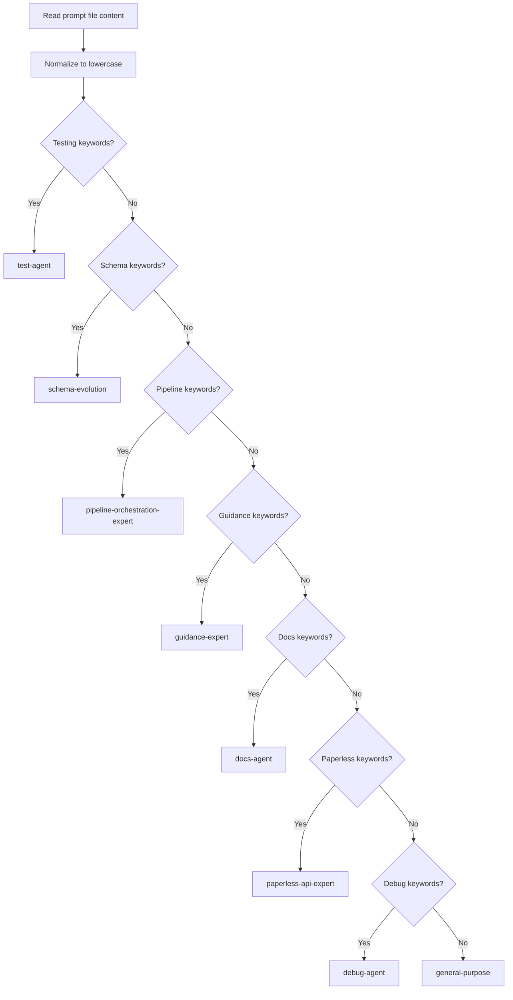

<context>
## Execution Context

**Git Status:**
!`git status --short`

**Recent Prompts:**
!`ls -t ./prompts/*.md | head -10`

**Directory Structure:**
- ./prompts/ - Active prompts
- ./prompts/completed/ - Executed prompts with metadata

## Available Specialized Agents

**Domain Specialists:**
- @test-agent: Testing, Mocha, chai, coverage analysis
- @pipeline-orchestration-expert: Workflows, LLM chains, orchestration
- @schema-evolution: Migrations, constraints, compatibility
- @guidance-expert: Guidance gen/select/regex, local patches, templates
- @docs-agent: Documentation, API docs, guides
- @paperless-api-expert: Paperless-ngx REST API integration
- @debug-agent: Error diagnosis, recovery strategies

**Orchestration:**
- @general-purpose: Coordination, planning, intelligent routing
</context>

<process>

## Execution Overview

```mermaid
flowchart TD
  A([Start]) --> B[Parse Arguments]
  B --> C[Resolve Prompt Files]
  C --> D[Classify Domains]
  D --> E{--orchestrate?}
  E -- Yes --> F[@general-purpose Orchestration]
  E -- No --> G[Direct Routing]
  F --> H{--parallel?}
  G --> H
  H -- Yes --> I[Parallel: Spawn all Task calls in one message]
  H -- No --> J[Sequential: Execute in dependency order]
  I --> K[Consolidate & Archive]
  J --> L{Failure?}
  L -- Yes --> M[@debug-agent Recovery]
  M --> N{Recovered?}
  N -- Yes --> J
  N -- No --> O[Stop for safety]
  L -- No --> K
  K --> P[Git Commit]
  P --> Q[Final Report]
  Q --> R([End])
```

## STEP 0: Parse Arguments

Parse `$ARGUMENTS` for:
1. Prompt identifiers (numbers, names, or empty for latest)
2. Execution flags: `--parallel`, `--sequential` (default: sequential)
3. Orchestration flag: `--orchestrate` (optional)

Examples:
- `005` → Single prompt #005
- `005 006 007 --parallel` → Three prompts in parallel
- `--orchestrate` → Use @general-purpose coordinator
- (empty) → Latest prompt only

```bash
#!/bin/bash
set -euo pipefail

# ═══════════════════════════════════════════════════════════════
# VALIDATION: Environment & Prerequisites
# ═══════════════════════════════════════════════════════════════

# Validate prompts directory exists
if [ ! -d "./prompts" ]; then
  echo "❌ Error: ./prompts directory not found"
  echo "💡 Create it with: mkdir -p ./prompts"
  exit 1
fi

# Validate prompts directory is writable
if [ ! -w "./prompts" ]; then
  echo "❌ Error: ./prompts directory is not writable"
  exit 1
fi

# Validate git repository (warning only, not fatal)
if ! git rev-parse --git-dir >/dev/null 2>&1; then
  echo "⚠️  Warning: Not a git repository - archival will work but commits will fail"
fi

# ═══════════════════════════════════════════════════════════════

# Extract flags
ORCHESTRATE=false
PARALLEL=false

# Check for orchestrate flag
if [[ "$ARGUMENTS" == *"--orchestrate"* ]]; then
  ORCHESTRATE=true
  ARGUMENTS=${ARGUMENTS//--orchestrate/}
fi

# Check for parallel flag
if [[ "$ARGUMENTS" == *"--parallel"* ]]; then
  PARALLEL=true
  ARGUMENTS=${ARGUMENTS//--parallel/}
fi

# Remaining args are prompt identifiers
# Use word splitting safely with read into array
read -ra PROMPT_IDS <<< "${ARGUMENTS}"

# If no prompts specified, use latest
if [ ${#PROMPT_IDS[@]} -eq 0 ]; then
  LATEST=$(ls -t ./prompts/*.md 2>/dev/null | head -1)
  if [ -z "$LATEST" ]; then
    echo "❌ No prompts found in ./prompts/"
    exit 1
  fi
  PROMPT_IDS=("$LATEST")
fi
```

## STEP 1: Resolve Prompt Files

Resolution rules:
- If path exists: use as-is
- If number (e.g., `5`): match `005-*.md`
- If text (e.g., `user-auth`): match `*user-auth*.md`
- Else: error and list available prompts

```bash
resolve_prompt_file() {
  local identifier=$1
  local prompt_dir="./prompts"

  # If already a file path
  if [ -f "$identifier" ]; then
    # Verify path is within prompts directory (prevent traversal)
    local abs_identifier abs_prompts
    abs_identifier=$(cd "$(dirname "$identifier")" 2>/dev/null && pwd)/$(basename "$identifier")
    abs_prompts=$(cd "$prompt_dir" 2>/dev/null && pwd)

    if [[ "$abs_identifier" != "$abs_prompts"/* ]]; then
      echo "❌ Security: Path '$identifier' is outside ./prompts/ directory"
      return 1
    fi

    echo "$identifier"
    return 0
  fi

  # If number: pad with zeros and search
  if [[ $identifier =~ ^[0-9]+$ ]]; then
    local padded
    padded=$(printf "%03d" "$identifier")

    local matches
    matches=$(ls -1 "$prompt_dir"/${padded}-*.md 2>/dev/null | head -5)

    if [ -z "$matches" ]; then
      echo "❌ No prompt found matching #$identifier"
      ls -1 "$prompt_dir"/*.md 2>/dev/null | head -5 || true
      return 1
    fi

    local count
    count=$(echo "$matches" | wc -l | tr -d ' ')

    if [ "$count" -gt 1 ]; then
      echo "⚠️  Multiple matches for #$identifier:"
      echo "$matches"
      return 1
    fi

    echo "$matches" | head -1
    return 0
  fi

  # If text: search in filenames
  local matches
  matches=$(ls -1 "$prompt_dir"/*${identifier}*.md 2>/dev/null | head -5)

  if [ -z "$matches" ]; then
    echo "❌ No prompt found matching '$identifier'"
    return 1
  fi

  local count
  count=$(echo "$matches" | wc -l | tr -d ' ')

  if [ "$count" -gt 1 ]; then
    echo "⚠️  Multiple matches for '$identifier':"
    echo "$matches"
    return 1
  fi

  echo "$matches" | head -1
  return 0
}

# Resolve all prompt files
declare -a PROMPT_FILES
for id in "${PROMPT_IDS[@]}"; do
  file=$(resolve_prompt_file "$id") || exit 1
  PROMPT_FILES+=("$file")
done

echo "✓ Resolved prompts: ${#PROMPT_FILES[@]} file(s)"
```

## STEP 2: Domain Classification

Keyword reference:

| Domain | Keywords (examples) | Agent |
|---|---|---|
| Testing | test, mocha, chai, jasmine, coverage, spy, mock, fixture, describe, it, expect | @test-agent |
| Pipeline | pipeline, orchestrate, workflow, chain, batch, streaming, retry | @pipeline-orchestration-expert |
| Schema | schema, migrate, database, table, alter, constraint, foreign key, index | @schema-evolution |
| Guidance | guidance, gen(), select(), regex, local patch, template | @guidance-expert |
| Documentation | docs, documentation, readme, guide, tutorial, api-doc, markdown | @docs-agent |
| Paperless | paperless, paperless-ngx, rest api, endpoint, ocr, 401, 403 | @paperless-api-expert |
| Debug | debug, error, bug, issue, crash, failing, root cause | @debug-agent |



```bash
classify_domain() {
  local prompt_file=$1
  local content
  content=$(cat "$prompt_file")
  local content_lower
  content_lower=$(echo "$content" | tr '[:upper:]' '[:lower:]')

  # Testing detection (highest specificity)
  if [[ $content_lower =~ (test|mocha|chai|jasmine|coverage|spy|mock|fixture|describe|it\ |expect|assertion|test\ suite) ]]; then
    echo "test-agent"
    return 0
  fi

  # Schema detection (foundation layer)
  if [[ $content_lower =~ (schema|migrat|database|table|alter|constraint|foreign\ key|index|column|field) ]]; then
    echo "schema-evolution"
    return 0
  fi

  # Pipeline/Orchestration detection
  if [[ $content_lower =~ (pipeline|orchestrat|workflow|chain|implement|batch|streaming|validation|retry) ]]; then
    echo "pipeline-orchestration-expert"
    return 0
  fi

  # Guidance Framework detection
  if [[ $content_lower =~ (guidance|gen\(\)|select\(\)|regex|local\ patch|patch|template|structured\ output|constraint) ]]; then
    echo "guidance-expert"
    return 0
  fi

  # Documentation detection
  if [[ $content_lower =~ (docs|documentation|readme|guide|tutorial|api-doc|markdown|docstring) ]]; then
    echo "docs-agent"
    return 0
  fi

  # Paperless detection
  if [[ $content_lower =~ (paperless|paperless-ngx|rest\ api|endpoint|ocr|consumption|403|401) ]]; then
    echo "paperless-api-expert"
    return 0
  fi

  # Error/Debug detection
  if [[ $content_lower =~ (debug|error|bug|issue|crash|failing|root\ cause|diagnos) ]]; then
    echo "debug-agent"
    return 0
  fi

  # Fallback
  echo "general-purpose"
  return 0
}

# Classify all prompts
declare -A PROMPT_DOMAINS
declare -A PROMPT_CONFIDENCE

for file in "${PROMPT_FILES[@]}"; do
  domain=$(classify_domain "$file")
  PROMPT_DOMAINS["$file"]=$domain

  # Assess confidence (count keyword matches)
  content=$(cat "$file" | tr '[:upper:]' '[:lower:]')

  case $domain in
    test-agent)
      count=$(echo "$content" | grep -o -i 'test\|mocha\|chai\|coverage' | wc -l | tr -d ' ')
      ;;
    schema-evolution)
      count=$(echo "$content" | grep -o -i 'schema\|migrat\|database' | wc -l | tr -d ' ')
      ;;
    *)
      count=1
      ;;
  esac

  if [ "$count" -ge 3 ]; then
    PROMPT_CONFIDENCE["$file"]="HIGH"
  elif [ "$count" -ge 2 ]; then
    PROMPT_CONFIDENCE["$file"]="MEDIUM"
  else
    PROMPT_CONFIDENCE["$file"]="LOW"
  fi
done

echo "✓ Domain classification complete"
```

## STEP 3: Execution Mode Decision

```bash
if [ "$ORCHESTRATE" = true ]; then
  echo "📋 ORCHESTRATED MODE: @general-purpose will coordinate"
  EXECUTION_MODE="orchestrated"
else
  echo "📋 DIRECT MODE: Routing directly to specialists"
  EXECUTION_MODE="direct"
fi

if [ "$PARALLEL" = true ]; then
  echo "⚡ PARALLEL EXECUTION: All tasks in single batch"
  EXECUTION_STRATEGY="parallel"
else
  echo "🔄 SEQUENTIAL EXECUTION: Tasks in dependency order"
  EXECUTION_STRATEGY="sequential"
fi
```

## STEP 4: Build Execution Plan

```bash
declare -A SPECIALIST_GROUPS
declare -a EXECUTION_ORDER

# Group by specialist
for file in "${PROMPT_FILES[@]}"; do
  specialist=${PROMPT_DOMAINS["$file"]}
  if [ -z "${SPECIALIST_GROUPS[$specialist]}" ]; then
    SPECIALIST_GROUPS[$specialist]="$file"
    EXECUTION_ORDER+=("$specialist")
  else
    SPECIALIST_GROUPS[$specialist]="${SPECIALIST_GROUPS[$specialist]} $file"
  fi
done

# Recommended order (schema → pipeline → test → guidance → docs → paperless → debug)
declare -a ORDERED_SPECIALISTS
for specialist in \
  "schema-evolution" \
  "pipeline-orchestration-expert" \
  "test-agent" \
  "guidance-expert" \
  "docs-agent" \
  "paperless-api-expert" \
  "debug-agent"
do
  if [ -n "${SPECIALIST_GROUPS[$specialist]}" ]; then
    ORDERED_SPECIALISTS+=("$specialist")
  fi
done

if [ "$EXECUTION_STRATEGY" = "sequential" ] && [ "$EXECUTION_MODE" = "direct" ]; then
  EXECUTION_ORDER=("${ORDERED_SPECIALISTS[@]}")
fi

echo "✓ Execution plan ready:"
for specialist in "${EXECUTION_ORDER[@]}"; do
  echo "  - $specialist: ${SPECIALIST_GROUPS[$specialist]}"
done
```

## STEP 5: Execute Prompts

```mermaid
flowchart TD
  A[Execute Prompts] --> B{Execution mode}
  B -- Orchestrated --> C[@general-purpose orchestrates]
  B -- Direct --> D{Strategy}
  D -- Parallel --> E[Build one batch with all Task calls]
  D -- Sequential --> F[Execute specialist-by-specialist]
  F --> G{Failure?}
  G -- Yes --> H[@debug-agent recovery]
  H --> I{Recovered?}
  I -- Yes --> F
  I -- No --> J[Stop (safety)]
  C --> K[Proceed to Consolidation]
  E --> K
  F --> K
```

### Branch A: Orchestrated Execution

```bash
if [ "$EXECUTION_MODE" = "orchestrated" ]; then
  echo ""
  echo "🎯 Invoking @general-purpose as orchestrator..."

  ORCHESTRATION_PROMPT="You are the orchestrator for executing multiple prompts with specialized domain routing.

Your role:
1. Analyze each prompt using PRECISE DOMAIN DETECTION
2. Plan execution accounting for dependencies
3. Delegate to appropriate specialists
4. Handle error recovery via @debug-agent if needed

PROMPTS TO EXECUTE:
"

  # SECURITY NOTE: File content is embedded directly in prompts below.
  # Ensure prompt files are from trusted sources only. Malicious content
  # in prompt files (e.g., containing 'EOF' or heredoc terminators) could
  # break script execution. Consider validating file content if accepting
  # user-uploaded prompts.

  for file in "${PROMPT_FILES[@]}"; do
    domain=${PROMPT_DOMAINS["$file"]}
    confidence=${PROMPT_CONFIDENCE["$file"]}
    ORCHESTRATION_PROMPT+="
---
FILE: $file
DOMAIN: $domain (confidence: $confidence)
CONTENT:
$(cat "$file")
---
"
  done

  ORCHESTRATION_PROMPT+="

EXECUTION STRATEGY: $EXECUTION_STRATEGY
DOMAIN DETECTION RULES:
- Testing keywords → @test-agent
- Pipeline keywords → @pipeline-orchestration-expert
- Schema keywords → @schema-evolution
- Guidance keywords → @guidance-expert
- Documentation keywords → @docs-agent
- Paperless keywords → @paperless-api-expert
- Error keywords → @debug-agent

Begin orchestration now. For each prompt:
1. Confirm domain classification
2. Invoke appropriate specialist via Task tool
3. Wait for completion
4. If failure: invoke @debug-agent for recovery
5. Continue to next prompt"

  cat << TASK
Task to @general-purpose:
subagent_type: "general-purpose"
description: "Orchestrate $EXECUTION_STRATEGY execution of ${#PROMPT_FILES[@]} prompts"
prompt: """$ORCHESTRATION_PROMPT"""
TASK

  # Note: In orchestrated mode, @general-purpose handles execution and the main
  # agent context will handle archival. The bash script exits here because
  # steps 6-8 (archival, git commit) should occur in the main agent context
  # after @general-purpose completes, not in this bash subprocess.
  echo ""
  echo "✓ Orchestration delegation complete"
  echo "📌 Archival and git commit will be handled by main agent after orchestrator completes"
  exit 0
fi
```

### Branch B: Direct Execution (Parallel)

```bash
if [ "$EXECUTION_MODE" = "direct" ] && [ "$EXECUTION_STRATEGY" = "parallel" ]; then
  echo ""
  echo "⚡ PARALLEL EXECUTION: Spawning all tasks in single batch"
  echo ""

  TASKS=""

  for specialist in "${EXECUTION_ORDER[@]}"; do
    files=${SPECIALIST_GROUPS[$specialist]}

    SPECIALIST_PROMPT="Execute the following prompts using your specialized expertise.

SPECIALIST TYPE: $specialist
EXECUTION MODE: Parallel batch

PROMPTS:
"

    for file in $files; do
      confidence=${PROMPT_CONFIDENCE["$file"]}
      SPECIALIST_PROMPT+="
---
PROMPT FILE: $file
CONFIDENCE: $confidence
---
$(cat "$file")
---
"
    done

    case $specialist in
      test-agent)
        SPECIALIST_PROMPT+="

TESTING CONTEXT:
You are @test-agent. Your expertise:
- Mocha, chai, jasmine frameworks
- Test generation and coverage analysis
- Test fixtures, mocks, stubs, assertions
- Edge case identification
- Test suite organization

Execute these prompts and generate comprehensive test suites."
        ;;
      pipeline-orchestration-expert)
        SPECIALIST_PROMPT+="

PIPELINE CONTEXT:
You are @pipeline-orchestration-expert. Your expertise:
- Workflow orchestration and LLM chains
- Pipeline implementation patterns
- Batch processing and streaming
- Validation logic and retry strategies
- Error handling in pipelines

Implement these pipeline solutions."
        ;;
      schema-evolution)
        SPECIALIST_PROMPT+="

SCHEMA CONTEXT:
You are @schema-evolution. Your expertise:
- Safe database migrations
- Schema changes and compatibility
- Constraint management (foreign keys, indexes)
- Rollback strategies
- Version compatibility

Create safe migrations for these schema updates."
        ;;
      guidance-expert)
        SPECIALIST_PROMPT+="

GUIDANCE FRAMEWORK CONTEXT:
You are @guidance-expert. Your expertise:
- Guidance framework: gen(), select(), regex()
- Local patch development
- Custom guidance templates
- Enhanced functionality implementations
- Constraint-based generation
- JSON schema and structured output

Implement these Guidance framework enhancements."
        ;;
      docs-agent)
        SPECIALIST_PROMPT+="

DOCUMENTATION CONTEXT:
You are @docs-agent. Your expertise:
- API documentation generation
- README and guide creation
- Code/documentation sync
- Tutorial writing
- API reference documentation

Generate documentation for these prompts."
        ;;
      paperless-api-expert)
        SPECIALIST_PROMPT+="

PAPERLESS-NGX CONTEXT:
You are @paperless-api-expert. Your expertise:
- Paperless-ngx REST API
- Endpoint integration
- OCR and document consumption
- Error handling (403, 401, etc.)
- Task automation

Implement these Paperless-ngx solutions."
        ;;
      debug-agent)
        SPECIALIST_PROMPT+="

DEBUG CONTEXT:
You are @debug-agent. Your expertise:
- Error diagnosis and root cause analysis
- Retry strategies and recovery
- Issue reproduction
- Deterministic problem-solving

Diagnose and fix these issues."
        ;;
    esac

    TASKS+="Task to @$specialist:
subagent_type: \"$specialist\"
description: \"$specialist: Execute $(echo $files | wc -w) prompts (parallel batch)\"
prompt: \"\"\"$SPECIALIST_PROMPT\"\"\"

"
  done

  echo "$TASKS"
  echo ""
  echo "⏳ Waiting for all specialists to complete..."
fi
```

### Branch C: Direct Execution (Sequential)

```bash
if [ "$EXECUTION_MODE" = "direct" ] && [ "$EXECUTION_STRATEGY" = "sequential" ]; then
  echo ""
  echo "🔄 SEQUENTIAL EXECUTION: Respecting dependency order"
  echo ""

  declare -A EXECUTION_RESULTS
  declare -a FAILED_PROMPTS
  RECOVERY_COUNT=0

  for specialist in "${EXECUTION_ORDER[@]}"; do
    files=${SPECIALIST_GROUPS[$specialist]}

    echo ""
    echo "━━━━━━━━━━━━━━━━━━━━━━━━━━━━━━━━━━━━━━━━━━━━━"
    echo "📌 Executing: $specialist"
    echo "━━━━━━━━━━━━━━━━━━━━━━━━━━━━━━━━━━━━━━━━━━━━━"

    SPECIALIST_PROMPT="Execute the following prompts using your specialized expertise.

SPECIALIST TYPE: $specialist
EXECUTION MODE: Sequential (respecting dependencies)

PROMPTS:
"

    for file in $files; do
      confidence=${PROMPT_CONFIDENCE["$file"]}
      SPECIALIST_PROMPT+="
---
PROMPT FILE: $file
CONFIDENCE: $confidence
---
$(cat "$file")
---
"
    done

    case $specialist in
      test-agent)
        SPECIALIST_PROMPT+="

TESTING CONTEXT:
You are @test-agent. Your expertise:
- Mocha, chai, jasmine frameworks
- Test generation and coverage analysis
- Test fixtures, mocks, stubs, assertions
- Edge case identification
- Test suite organization

Execute these prompts and generate comprehensive test suites."
        ;;
      pipeline-orchestration-expert)
        SPECIALIST_PROMPT+="

PIPELINE CONTEXT:
You are @pipeline-orchestration-expert. Your expertise:
- Workflow orchestration and LLM chains
- Pipeline implementation patterns
- Batch processing and streaming
- Validation logic and retry strategies
- Error handling in pipelines

Implement these pipeline solutions."
        ;;
      schema-evolution)
        SPECIALIST_PROMPT+="

SCHEMA CONTEXT:
You are @schema-evolution. Your expertise:
- Safe database migrations
- Schema changes and compatibility
- Constraint management (foreign keys, indexes)
- Rollback strategies
- Version compatibility

Create safe migrations for these schema updates."
        ;;
      guidance-expert)
        SPECIALIST_PROMPT+="

GUIDANCE FRAMEWORK CONTEXT:
You are @guidance-expert. Your expertise:
- Guidance framework: gen(), select(), regex()
- Local patch development
- Custom guidance templates
- Enhanced functionality implementations
- Constraint-based generation
- JSON schema and structured output

Implement these Guidance framework enhancements."
        ;;
      docs-agent)
        SPECIALIST_PROMPT+="

DOCUMENTATION CONTEXT:
You are @docs-agent. Your expertise:
- API documentation generation
- README and guide creation
- Code/documentation sync
- Tutorial writing
- API reference documentation

Generate documentation for these prompts."
        ;;
      paperless-api-expert)
        SPECIALIST_PROMPT+="

PAPERLESS-NGX CONTEXT:
You are @paperless-api-expert. Your expertise:
- Paperless-ngx REST API
- Endpoint integration
- OCR and document consumption
- Error handling (403, 401, etc.)
- Task automation

Implement these Paperless-ngx solutions."
        ;;
      debug-agent)
        SPECIALIST_PROMPT+="

DEBUG CONTEXT:
You are @debug-agent. Your expertise:
- Error diagnosis and root cause analysis
- Retry strategies and recovery
- Issue reproduction
- Deterministic problem-solving

Diagnose and fix these issues."
        ;;
    esac

    echo "📤 Invoking Task tool..."
    cat << TASK
Task to @$specialist:
subagent_type: "$specialist"
description: "$specialist: Execute $(echo $files | wc -w) prompts (sequential)"
prompt: """$SPECIALIST_PROMPT"""
TASK

    echo ""
    echo "⏳ Waiting for $specialist to complete..."

    # NOTE: This is a bash-based skill that outputs Task invocations for the main agent to execute.
    # Actual result tracking requires integration with Claude Code's Task execution system.
    # For now, we'll mark this as a limitation that error recovery is manual.

    # TODO: When this skill is converted to be executed by main agent context,
    # replace this section with actual Task result inspection
    EXECUTION_RESULTS["$specialist"]="success"  # LIMITATION: Cannot detect failures in bash context

    # Error recovery code below is currently unreachable due to above limitation
    # It serves as documentation for future Task-integrated implementation
    if [ "${EXECUTION_RESULTS[$specialist]}" = "failed" ]; then
      echo "❌ FAILURE detected in $specialist"
      FAILED_PROMPTS+=("$files")

      echo ""
      echo "🆘 Invoking @debug-agent for error recovery..."

      RECOVERY_PROMPT="A domain specialist failed during execution.

FAILED SPECIALIST: @$specialist
FAILED PROMPTS: $files

Failed prompt details:
"
      for file in $files; do
        RECOVERY_PROMPT+="
---
FILE: $file
---
$(cat "$file")
---
"
      done

      RECOVERY_PROMPT+="

Your role as @debug-agent:
1. Analyze the failure
2. Diagnose root cause
3. Develop retry strategy (max 3 attempts)
4. Execute retry strategy
5. Report results"

      cat << TASK
Task to @debug-agent:
subagent_type: "debug-agent"
description: "Recovery: Fix failed $specialist execution"
prompt: """$RECOVERY_PROMPT"""
TASK

      RECOVERY_COUNT=$((RECOVERY_COUNT + 1))

      echo "⏳ Waiting for @debug-agent recovery..."
      echo "❌ Recovery failed - stopping sequential execution for safety"
      break
    else
      echo "✓ $specialist completed successfully"
    fi
  done

  echo ""
  echo "━━━━━━━━━━━━━━━━━━━━━━━━━━━━━━━━━━━━━━━━━━━━━"
fi
```

## STEP 6: Consolidate Results & Archive

```bash
echo ""
echo "📊 CONSOLIDATION & ARCHIVAL"
echo ""

mkdir -p ./prompts/completed

for file in "${PROMPT_FILES[@]}"; do
  filename=$(basename "$file")
  domain=${PROMPT_DOMAINS["$file"]}
  confidence=${PROMPT_CONFIDENCE["$file"]}

  {
    echo "---"
    echo "execution_mode: $EXECUTION_MODE"
    echo "execution_strategy: $EXECUTION_STRATEGY"
    echo "primary_executor: $domain"
    echo "domain_classification: $domain"
    echo "domain_confidence: $confidence"
    echo "error_recovery_used: ${RECOVERY_USED:-false}"
    echo "error_recovery_agent: ${RECOVERY_AGENT:-none}"
    echo "recovery_successful: ${RECOVERY_SUCCESS:-n/a}"
    echo "recovery_attempts: ${RECOVERY_COUNT:-0}"
    echo "parallel: $([ "$EXECUTION_STRATEGY" = "parallel" ] && echo "true" || echo "false")"
    echo "timestamp: $(date -u +"%Y-%m-%dT%H:%M:%SZ")"
    echo "status: ${EXECUTION_STATUS:-success}"
    echo "note: Error recovery is currently non-functional due to bash execution context limitation"
    echo "---"
    echo ""
    cat "$file"
  } > "./prompts/completed/${filename%.md}-executed.md"

  echo "✓ Archived: ./prompts/completed/${filename%.md}-executed.md"
done
```

## STEP 7: Git Commit

```bash
echo ""
echo "📝 GIT COMMIT"
echo ""

echo "🔄 Staging files..."
git add ./prompts/completed/ 2>/dev/null || true
git add .gitignore 2>/dev/null || true

COMMIT_TYPE="chore"

DOMAIN_LIST=$(printf '%s\n' "${PROMPT_DOMAINS[@]}")

if echo "$DOMAIN_LIST" | grep -q "test-agent"; then
  COMMIT_TYPE="test"
elif echo "$DOMAIN_LIST" | grep -q -E "pipeline-orchestration-expert|guidance-expert|docs-agent"; then
  COMMIT_TYPE="feat"
elif echo "$DOMAIN_LIST" | grep -q "schema-evolution"; then
  COMMIT_TYPE="refactor"
elif [ "${RECOVERY_COUNT:-0}" -gt 0 ]; then
  COMMIT_TYPE="fix"
fi

DOMAIN_DIST=""
for specialist in "${EXECUTION_ORDER[@]}"; do
  count=$(echo ${SPECIALIST_GROUPS[$specialist]} | wc -w | tr -d ' ')
  spec_short=${specialist//-agent/}
  spec_short=${spec_short//-orchestration-expert/orch}
  DOMAIN_DIST+="$spec_short:$count,"
done
DOMAIN_DIST=${DOMAIN_DIST%,}

if [ "${RECOVERY_COUNT:-0}" -gt 0 ]; then
  COMMIT_MSG="$COMMIT_TYPE: execute ${#PROMPT_FILES[@]} prompts ($DOMAIN_DIST) with error recovery (via specialists, @debug-agent)"
else
  COMMIT_MSG="$COMMIT_TYPE: execute ${#PROMPT_FILES[@]} prompts ($DOMAIN_DIST) via specialized agents"
fi

if [ "$EXECUTION_MODE" = "orchestrated" ]; then
  COMMIT_MSG+=" [orchestrated via @general-purpose]"
else
  COMMIT_MSG+=" [$EXECUTION_STRATEGY]"
fi

echo "📌 Commit Message:"
echo "   $COMMIT_MSG"
echo ""

git commit -m "$COMMIT_MSG" 2>/dev/null && echo "✓ Commit successful" || echo "⚠️  No changes to commit"

echo ""
echo "📊 FINAL STATUS"
echo "━━━━━━━━━━━━━━━━━━━━━━━━━━━━━━━━━━━━━━━━━━━━━"
git log -1 --oneline 2>/dev/null || echo "No commits yet"
echo ""
git status --short 2>/dev/null || echo "Git not available"
```

## STEP 8: Final Report

```bash
echo ""
echo "━━━━━━━━━━━━━━━━━━━━━━━━━━━━━━━━━━━━━━━━━━━━━"
echo "✅ EXECUTION COMPLETE"
echo "━━━━━━━━━━━━━━━━━━━━━━━━━━━━━━━━━━━━━━━━━━━━━"
echo ""
echo "📈 FINAL REPORT:"
echo ""
echo "  Execution Mode:     $EXECUTION_MODE"
echo "  Execution Strategy: $EXECUTION_STRATEGY"
echo "  Total Prompts:      ${#PROMPT_FILES[@]}"
echo "  Specialists Used:   ${#EXECUTION_ORDER[@]}"
echo "  Error Recoveries:   ${RECOVERY_COUNT:-0}"
echo "  Status:             ✓ SUCCESS"
echo ""
echo "📁 Outputs:"
echo "  Completed Prompts:  ./prompts/completed/"
echo "  Recent Commit:      $(git log -1 --oneline 2>/dev/null || echo 'N/A')"
echo ""
echo "━━━━━━━━━━━━━━━━━━━━━━━━━━━━━━━━━━━━━━━━━━━━━"
```

</process>
