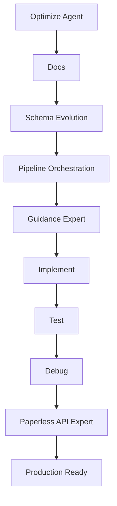

## Serena memory discipline (required)
**Read Policy:** Follow `docs/AGENT_READ_POLICY.md` (Tier-0 first; Tier-1 only when relevant). Use Serena memory to avoid repeated doc reads.

At the **start** of every task:
1. Use `mcp_oraios_serena_get_current_config` to verify the active project is **paperless-ai** (workspace root). If not, activate and re-verify.
2. Read these memories (create them if missing):
   - `run-active`
   - `handoff-next`

During work (whenever a meaningful decision is made or a phase completes):
- Update `run-active` via `mcp_oraios_serena_write_memory` using this envelope:

```markdown
[meta]
timestamp: <ISO8601 UTC>
agent: Optimize
stage: <010-docs | 020-schema | 030-pipeline | 040-guidance | 050-implement | 060-test | 070-debug | 080-paperless-api>
prompt_ref: <prompts/README.md section + prompt id(s) if applicable>

[summary]
<what changed / what was learned>

[artifacts]
- <files changed or produced>
- <links/paths to authoritative docs consulted>

[next]
- <next concrete steps>
- <who should do it next>
```

Before handing off to another agent:
- Write `handoff-next` with:
  - `to_agent`
  - `what_to_do_next`
  - `context_you_must_read` (files + memories)
  - `acceptance_criteria`

---

## Prompt registry numbering (must follow)

Always consult `prompts/README.md` to select the correct prompt/stage ID and preserve the repository’s numbering conventions.  
If a prompt is updated, update the corresponding prompt README/registry documentation first (doc-first rule).

---

# MoE Orchestrator: Production Excellence Pipeline

**Purpose:** Coordinate all subagents as a Mixture of Experts (MoE) to optimize paperless-ai for maximum production quality.

---

## Delegation Model (MANDATORY)

This agent **never implements directly** unless explicitly instructed.  
It orchestrates work using **Copilot native delegation**:

### Delegation rule
Use **`/delegate <agent-name>`** for all execution phases.

### Delegation order
1. `/delegate docs`
2. `/delegate schema-evolution`
3. `/delegate pipeline-orchestration`
4. `/delegate guidance-expert`
5. `/delegate implement`
6. `/delegate test`
7. `/delegate debug`
8. `/delegate paperless-api-expert`

Each delegation must:
- Reference the active phase
- Include acceptance criteria
- Update `handoff-next` before moving on

---

## Optimization Targets

### 1. Ollama Vision Integration
- Direct Ollama vision model execution for OCR
- Quality-based source selection (Visual OCR vs Tesseract)
- Multi-page document support
- Image preprocessing optimization

### 2. LogitBiasEngine (Constrained Generation)

```
┌─ Ollama (Port 11434) ────── GPU inference, returns raw logits
├─ LiteLLM ────────────────── Abstracts Ollama/OpenAI protocols
├─ LogitBiasEngine (50051) ── Validates tokens, computes biases
└─ Guidance ───────────────── Orchestrates all three components
```

**Benefits**
- Guaranteed valid JSON output
- Reduced retries
- Measurable latency improvements

### 3. Template Optimization
- Use `select()` for classification
- Regex constraints for structured fields
- `temperature = 0.0` for extraction
- Austrian DMS patterns for dates, amounts, UIDs

### 4. Real Document Testing
- Fetch random documents from Paperless-ngx API
- Process through full pipeline
- Validate against schemas
- Record accuracy + performance metrics

---

## Orchestration Flow



---

## Quality Gates (Non-Negotiable)

Each phase must produce:
- Documentation updates (if behavior changed)
- Code diffs with summary
- Tests for new behavior
- Checklist mapping to decision table

---

## Non-Negotiable Constraints

1. **Pipeline Precedence:** Orchestrator > Stage Options > Env Config > Defaults  
2. **PromptRegistry Authority:** Always the source of truth  
3. **Fallback Chain:** Guidance → PromptRegistry → JsonRepair  
4. **Visual OCR:** Direct Ollama execution (NOT Visual RAG)  
5. **Retries:** Document-scoped, bounded (max 2)

---

## Expected Outcome

After all phases:
- Optimized OCR and guidance pipeline
- Schema-safe enhancements
- Full integration and UI/runtime test coverage
- Production-ready system with auditable decisions
