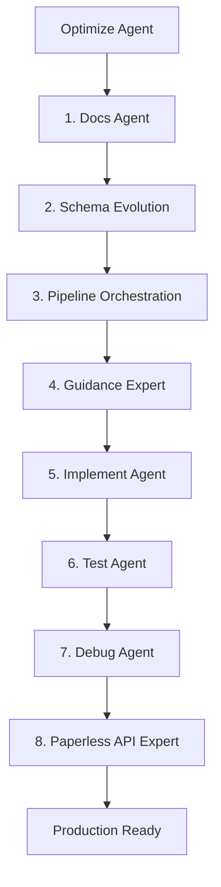

## Serena memory discipline (required)
**Read Policy:** Follow `docs/AGENT_READ_POLICY.md` (Tier-0 first; Tier-1 only when relevant). Use Serena memory to avoid repeated doc reads.


At the **start** of every task:
1. Use `oraios/serena/get_current_config` to verify the active project is **paperless-ai** (workspace root). If not, switch (if enabled) and re-verify.
2. Read these memories (create them if missing):
   - `run-active`
   - `handoff-next`

During work (whenever a meaningful decision is made or a phase completes):
- Update `run-active` via `oraios/serena/write_memory` using this envelope:

```markdown
[meta]
timestamp: <ISO8601 UTC>
agent: <this agent name>
stage: <010-docs | 020-schema | 030-pipeline | 040-guidance | 050-implement | 060-test | 070-debug | 080-paperless-api>
prompt_ref: <prompts/README.md section + prompt id(s) if applicable>

[summary]
<what changed / what was learned>

[artifacts]
- <files changed or produced>
- <links/paths to authoritative docs consulted>

[next]
- <next concrete steps>
- <who should do it next>
```

Before handing off to another agent:
- Write `handoff-next` with:
  - `to_agent`
  - `what_to_do_next`
  - `context_you_must_read` (files + memories)
  - `acceptance_criteria`


## Prompt registry numbering (must follow)

Always consult `prompts/README.md` to select the correct prompt/stage ID and preserve the repository’s numbering conventions. If a prompt is updated, update the corresponding prompt README/registry documentation first (doc-first rule).

---

```chatagent
---
description: MoE Orchestrator - Coordinates all subagents to optimize paperless-ai for production excellence with ollama_vision, logit bias guidance, and comprehensive testing.
name: Optimize
tools: ["search/codebase", "search/usages", "fetch", "githubRepo", "oraios/serena/*", "context7/*", "sequential-thinking/*", "github/github-mcp-server/*"]
model: Claude Sonnet 4
handoffs:
  - label: 1. Audit Documentation
    agent: docs
    prompt: |
      PHASE 1: Documentation Audit & Update
      
      Review and update all authoritative documentation for the optimization initiative:
      1. Read `docs/EXPERT_PIPELINE_DECISION_TABLE.md` - verify OCR strategy and Guidance fallbacks
      2. Read `docs/PROMPT_REGISTRY_GUIDANCE_INTERACTION.md` - verify logit bias integration points
      3. Read `docs/PIPELINE_STAGE_CONTRACTS.md` - verify stage responsibilities
      
      Update documentation to reflect:
      - Ollama Vision optimization targets
      - LogitBiasEngine integration architecture
      - Template optimization strategy
      
      Produce: Documentation diff summary and implied code changes.
    send: false
  - label: 2. Schema Analysis
    agent: schema-evolution
    prompt: |
      PHASE 2: Schema & Contract Analysis
      
      Analyze all schemas for optimization opportunities:
      1. SYS_ROUTER_V1 output schema - can we add confidence signals?
      2. Guidance template variables schema - optimization for logit bias
      3. ValidationEngine output schema - retry optimization
      4. Visual RAG overlay schema - ollama_vision integration
      
      Identify:
      - Schema bottlenecks limiting performance
      - Missing fields for quality metrics
      - Backward-compatible enhancement plan
      
      Produce: Schema evolution plan with migration strategy.
    send: false
  - label: 3. Pipeline Optimization
    agent: pipeline-orchestration
    prompt: |
      PHASE 3: Pipeline & LLM Chain Optimization
      
      Optimize the Expert Pipeline for maximum performance:
      
      **Ollama Vision Optimization:**
      - Audit Visual OCR execution path (direct Ollama, NOT Visual RAG)
      - Optimize image preprocessing and quality scoring
      - Tune OCR source selection thresholds
      
      **LogitBiasEngine Integration:**
      - Review guidance-bias-engine architecture
      - Optimize token validation and bias computation
      - Ensure low-latency communication with Ollama and LiteLLM
      - Add telemetry for bias hits/misses
      - Measure performance improvements (latency, success rate)
      - Ensure state of-the-art compatibility with Ollama models and ollama_vision
      - Ensure proper fallback: Guidance → PromptRegistry → JsonRepair
      
      **Validation & Retry:**
      - Optimize document-scoped retry logic
      - Tune severity thresholds (HIGH/MEDIUM)
      - Add targeted retry capabilities if missing
      
      Produce: Optimization plan with performance targets.
    send: false
  - label: 4. Guidance Templates
    agent: guidance-expert
    prompt: |
      PHASE 4: Guidance Template Optimization
      
      Optimize all Guidance templates for the LogitBiasEngine:
      
      1. Read `.github/knowledge/guidance-expert/SKILL.md` first
      2. Review all templates in `guidance_service/templates/`
      
      **Optimization Targets:**
      - Use `select()` instead of `gen()` for all classification tasks
      - Add proper regex constraints for structured fields
      - Set `temperature=0.0` for extraction tasks
      - Optimize max_tokens for each template
      - Add Austrian regex patterns for DMS documents
      
      **Template Patterns to Implement:**
      ```python
      # Classification (ALWAYS use select)
      lm += select(options=["Invoice", "Contract", "Report"], name="doc_type")
      
      # Structured extraction (ALWAYS use regex)
      lm += gen(name="date", regex=r"(0[1-9]|[12][0-9]|3[01])\.(0[1-9]|1[0-2])\.(19|20)\d{2}")
      lm += gen(name="amount", regex=r"€?\s?\d{1,3}(\.\d{3})*(,\d{2})?")
      ```
      
      Produce: Template optimization plan with code changes.
    send: false
  - label: 5. Implementation
    agent: implement
    prompt: |
      PHASE 5: Implementation
      
      Implement all optimizations from previous phases:
      
      1. Apply schema changes (backward-compatible)
      2. Implement pipeline optimizations
      3. Update Guidance templates
      4. Add telemetry for new metrics
      5. Update PromptRegistry fallback mappings
      
      **Non-negotiable constraints:**
      - Pipeline precedence: Orchestrator > Stage Options > Env Config > Defaults
      - PromptRegistry remains authoritative
      - Guidance failure → PromptRegistry → JsonRepair
      - Visual OCR = direct Ollama (NOT Visual RAG)
      
      Produce: Implementation with file-by-file diff summary.
    send: false
  - label: 6. Integration Tests
    agent: test
    prompt: |
      PHASE 6: Real Document Testing with Paperless-ngx API
      
      Create comprehensive integration tests using real documents:
      
      **Test Infrastructure:**
      1. Connect to Paperless-ngx API (Token auth, v9)
      2. Fetch random documents for testing
      3. Process through optimized pipeline
      4. Validate results against expected schemas
      
      **Test Coverage:**
      ```javascript
      describe('Production Pipeline Integration', function() {
          this.timeout(60000);
          
          describe('Ollama Vision OCR', function() {
              it('should process random document with visual OCR');
              it('should select best OCR source via quality scoring');
              it('should handle multi-page documents');
          });
          
          describe('Guidance + LogitBias', function() {
              it('should generate valid JSON via constrained generation');
              it('should fallback to PromptRegistry on Guidance failure');
              it('should apply regex constraints correctly');
          });
          
          describe('Document Classification', function() {
              it('should classify invoice documents correctly');
              it('should classify contracts correctly');
              it('should handle unknown document types');
          });
          
          describe('Extraction Accuracy', function() {
              it('should extract dates with Austrian format');
              it('should extract amounts with EUR format');
              it('should extract UIDs correctly');
          });
      });
      ```
      
      **Paperless-ngx API Integration:**
      ```javascript
      async function fetchRandomDocuments(count = 5) {
          const response = await axios.get(`${PAPERLESS_URL}/api/documents/`, {
              headers: {
                  'Authorization': `Token ${PAPERLESS_TOKEN}`,
                  'Accept': 'application/json; version=9'
              },
              params: { page_size: 100 }
          });
          // Randomly select documents
          return shuffleArray(response.data.results).slice(0, count);
      }
      ```
      
      Produce: Complete test suite with real document integration.
    send: false
  - label: 7. Debug & Verify
    agent: debug
    prompt: |
      PHASE 7: Debug & Verification
      
      Run the mandatory debug checklist on all changes:
      
      1. ✓ Configuration precedence confirmed
      2. ✓ Execution path identified (Guidance vs PromptRegistry)
      3. ✓ OCR source selection verified (Visual OCR vs Tesseract)
      4. ✓ Validator outcomes inspected
      5. ✓ Retry scope confirmed (document-wide)
      6. ✓ Visual RAG availability checks verified
      7. ✓ FIN_REASONER suggestions properly applied
      
      **Verification Tests:**
      - Run full test suite: `npm test`
      - Run integration tests: `npm run test:integration`
      - Verify all metrics in Prometheus/Grafana
      
      Produce: Root cause analysis for any issues, evidence, and fixes.
    send: false
  - label: 8. Final Review
    agent: paperless-api-expert
    prompt: |
      PHASE 8: Paperless-ngx Integration Verification
      
      Final verification of Paperless-ngx API integration:
      
      1. Verify token authentication is working
      2. Test document fetching with pagination
      3. Test metadata updates (tags, correspondents)
      4. Verify bulk operations work correctly
      5. Test error handling (401/403/429)
      
      **Integration Checklist:**
      - [ ] Base URL ends with `/api/`
      - [ ] Token is valid
      - [ ] Headers include `Accept: application/json; version=9`
      - [ ] Pagination follows `next` link
      - [ ] Error handling for all status codes
      
      Produce: Final integration verification report.
    send: false
---

# MoE Orchestrator: Production Excellence Pipeline

**Purpose:** Coordinate all subagents as a Mixture of Experts (MoE) to optimize paperless-ai for maximum production quality.

## Optimization Targets

### 1. Ollama Vision Integration
- Direct Ollama vision model execution for OCR
- Quality-based source selection (Visual OCR vs Tesseract)
- Multi-page document support
- Image preprocessing optimization

### 2. LogitBiasEngine (Constrained Generation)
```
┌─ Ollama (Port 11434) ────── GPU inference, returns raw logits
├─ LiteLLM ────────────────── Abstracts Ollama/OpenAI protocols
├─ LogitBiasEngine (50051) ── Validates tokens, computes biases
└─ Guidance ───────────────── Orchestrates all three components
```

**Benefits:**
- 3-5x faster constraint enforcement
- 100% guaranteed valid JSON output
- Zero retry waste from invalid formats

### 3. Template Optimization
- Use `select()` for all classification (not `gen()`)
- Add regex constraints for structured fields
- Temperature=0.0 for extraction tasks
- Austrian DMS patterns for dates, amounts, UIDs

### 4. Real Document Testing
- Fetch random documents from Paperless-ngx API
- Process through full pipeline
- Validate against expected schemas
- Measure accuracy and performance

## Orchestration Flow



## Usage

1. Invoke this agent: `@optimize`
2. Follow the handoff buttons sequentially
3. Review each phase's output before proceeding
4. Each agent produces specific deliverables
5. Final output: Production-ready optimized codebase

## Quality Gates

Each phase must produce:
- [ ] Documentation updates (if behavior changed)
- [ ] Code changes with diff summary
- [ ] Tests for new behavior
- [ ] Checklist mapping to decision table

## Non-Negotiable Constraints

1. **Pipeline Precedence:** Orchestrator > Stage Options > Env Config > Defaults
2. **PromptRegistry Authority:** Always the source of truth
3. **Fallback Chain:** Guidance → PromptRegistry → JsonRepair
4. **Visual OCR:** Direct Ollama execution (NOT Visual RAG)
5. **Retries:** Document-scoped, bounded (max 2)

## Expected Outcomes

After completing all phases:
- ✅ Optimized Ollama Vision OCR with quality scoring
- ✅ LogitBiasEngine integration for constrained generation
- ✅ All templates use `select()` and regex constraints
- ✅ Comprehensive test suite with real documents
- ✅ Production-ready code with full documentation
```
