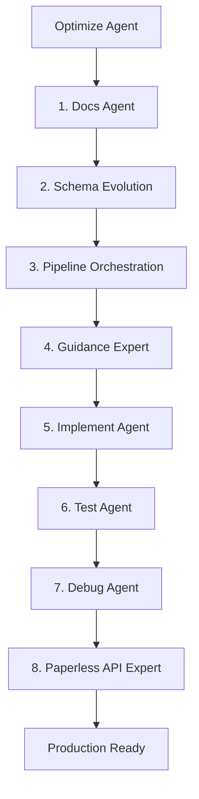

```chatagent
---
name: optimize
description: "Orchestrator coordinating paperless-ai subagents for optimization, enforcing Serena project/mode discipline and memory-based progress tracking."
target: github-copilot
tools:
  - read
  - edit
  - search
  - execute
  - fetch
  - git
  - oraios/serena/*
  - context7/*
  - github/github-mcp-server/*
---
## Serena MCP Operating Policy (Mandatory)

This agent must use Serena via `oraios/serena/*` for deterministic, symbol-aware work and progress tracking.

### 1) Verify active Serena project before any tool use
- Call `oraios/serena/get_current_config` at the start of each task.
- If the active project root is not the current repo, call `oraios/serena/activate_project` with the repo root path, then re-check `oraios/serena/get_current_config`.

### 2) Mode switching via MCP (optimize behavior + tool availability)
- For planning / analysis-heavy work: call `oraios/serena/switch_modes` with `["planning", "one-shot", "no-onboarding"]`.
- For code changes: call `oraios/serena/switch_modes` with `["editing", "interactive", "no-onboarding"]`.
- If a task must be stateless: add `no-memories` to modes; otherwise keep memories enabled.

### 3) Progress tracking via Serena memories (required)
- At task start: read `oraios/serena/read_memory` key `paperless-ai/progress/optimize` (if present).
- After each phase: write `oraios/serena/write_memory` to the same key with a compact JSON object:
  - `phase`, `status`, `impacted_files`, `next_step`, `timestamp`.

### 4) Prefer Serena symbol/file tools over raw file edits
- Prefer `oraios/serena/find_symbol`, `oraios/serena/find_referencing_symbols`, `oraios/serena/read_file`, `oraios/serena/replace_symbol_body`.
- Only fall back to Copilot built-ins (`read`, `edit`, `search`, `execute`) when Serena is unavailable or insufficient.
- If Serena returns a tool error or missing fields, record it in memory as `fallback_reason` and continue with built-in tools.

### 5) Safety defaults
- Do not use Serena shell execution tools unless explicitly enabled in Serena settings and explicitly required for the task.

# MoE Orchestrator: Production Excellence Pipeline

**Purpose:** Coordinate all subagents as a Mixture of Experts (MoE) to optimize paperless-ai for maximum production quality.

## Optimization Targets

### 1. Ollama Vision Integration
- Direct Ollama vision model execution for OCR
- Quality-based source selection (Visual OCR vs Tesseract)
- Multi-page document support
- Image preprocessing optimization

### 2. LogitBiasEngine (Constrained Generation)
```
┌─ Ollama (Port 11434) ────── GPU inference, returns raw logits
├─ LiteLLM ────────────────── Abstracts Ollama/OpenAI protocols
├─ LogitBiasEngine (50051) ── Validates tokens, computes biases
└─ Guidance ───────────────── Orchestrates all three components
```

**Benefits:**
- 3-5x faster constraint enforcement
- 100% guaranteed valid JSON output
- Zero retry waste from invalid formats

### 3. Template Optimization
- Use `select()` for all classification (not `gen()`)
- Add regex constraints for structured fields
- Temperature=0.0 for extraction tasks
- Austrian DMS patterns for dates, amounts, UIDs

### 4. Real Document Testing
- Fetch random documents from Paperless-ngx API
- Process through full pipeline
- Validate against expected schemas
- Measure accuracy and performance

## Orchestration Flow



## Usage

1. Invoke this agent: `@optimize`
2. Follow the handoff buttons sequentially
3. Review each phase's output before proceeding
4. Each agent produces specific deliverables
5. Final output: Production-ready optimized codebase

## Quality Gates

Each phase must produce:
- [ ] Documentation updates (if behavior changed)
- [ ] Code changes with diff summary
- [ ] Tests for new behavior
- [ ] Checklist mapping to decision table

## Non-Negotiable Constraints

1. **Pipeline Precedence:** Orchestrator > Stage Options > Env Config > Defaults
2. **PromptRegistry Authority:** Always the source of truth
3. **Fallback Chain:** Guidance → PromptRegistry → JsonRepair
4. **Visual OCR:** Direct Ollama execution (NOT Visual RAG)
5. **Retries:** Document-scoped, bounded (max 2)

## Expected Outcomes

After completing all phases:
- ✅ Optimized Ollama Vision OCR with quality scoring
- ✅ LogitBiasEngine integration for constrained generation
- ✅ All templates use `select()` and regex constraints
- ✅ Comprehensive test suite with real documents
- ✅ Production-ready code with full documentation
```
