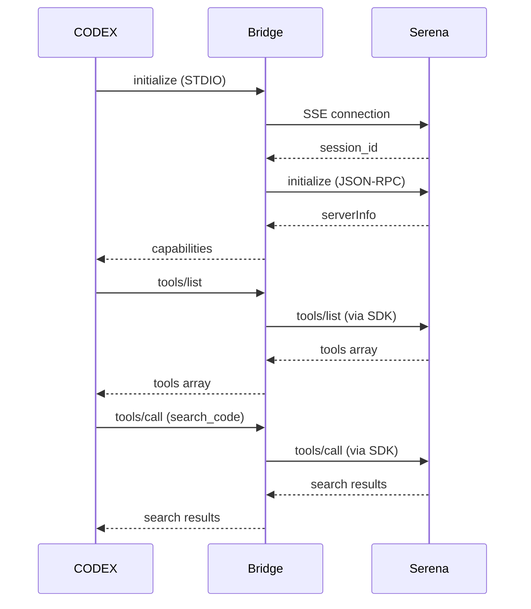

# CODEX Serena Bridge

## Overview

The CODEX-Serena Bridge adapts MCP STDIO requests from CODEX to the Serena SSE
transport. It uses the official MCP Python SDK for both the STDIO server and
SSE client session, ensuring protocol-compliant forwarding.

Key behaviors:
- CODEX speaks MCP JSON-RPC over STDIO.
- The bridge connects to Serena over SSE.
- The bridge forwards MCP methods through the SDK and returns results to CODEX.

## Architecture

- **STDIO MCP server:** `mcp.server.lowlevel.Server` + `stdio_server` to handle
  STDIO requests and serve dynamic tools/resources/prompts.
- **Connection manager:** Maintains the SSE connection, initializes the
  MCP session, and performs reconnection with backoff.
- **Request router:** Forwards MCP requests with per-operation timeouts.
- **Response orderer:** Preserves request ordering for pipelined concurrency.

## Request Flow

1. CODEX spawns `bridge/codex-serena-bridge.py` via STDIO.
2. The bridge returns its MCP capabilities immediately.
3. The bridge connects to Serena at `/sse` and runs `initialize` as an MCP
   client.
4. CODEX sends `tools/list` and other MCP requests over STDIO.
5. The bridge forwards these requests with the MCP SDK and returns the results.

## Configuration

Defaults live in `bridge/config.py`. Environment variables can override the
defaults when needed for testing or deployment.

Defaults:
- `SERENA_BASE` = `http://127.0.0.1:9121`
- `PROJECT_DIR` = `C:\Users\pwalc\MyApps\paperless-ai`
- `LOG_FILE` = Not set by default; set `CODEX_BRIDGE_LOG_FILE` to enable file logging, otherwise logs go to stderr.
- `SSE_TIMEOUT` = `30` seconds
- `SSE_READ_TIMEOUT` = `300` seconds
- `REQUEST_TIMEOUT_DEFAULT` = `60` seconds
- `MAX_RECONNECT_ATTEMPTS` = `10`
- `RECONNECT_BACKOFF_BASE` = `2`
- `RECONNECT_BACKOFF_MAX` = `30`
- `HEALTH_CHECK_INTERVAL` = `15` seconds

Environment overrides:
- `SERENA_BASE`
- `SERENA_SSE_URL`
- `SERENA_API_KEY`
- `PROJECT_DIR`
- `CODEX_BRIDGE_LOG_FILE`
- `LOG_LEVEL`
- `SSE_TIMEOUT`
- `SSE_READ_TIMEOUT`
- `REQUEST_TIMEOUT_DEFAULT`
- `REQUEST_TIMEOUT_LIST`
- `REQUEST_TIMEOUT_READ`
- `REQUEST_TIMEOUT_INIT`
- `REQUEST_TIMEOUT_SEARCH`
- `MAX_RECONNECT_ATTEMPTS`
- `RECONNECT_BACKOFF_BASE`
- `RECONNECT_BACKOFF_MAX`
- `HEALTH_CHECK_INTERVAL`
- `RETRY_MAX_ATTEMPTS`
- `RETRY_BACKOFF_BASE`
- `RETRY_BACKOFF_MAX`

## Troubleshooting

- **No tools listed:** Check bridge logs (stderr or set `CODEX_BRIDGE_LOG_FILE` to enable file logs) and confirm Serena is running
  on `SERENA_BASE`.
- **Repeated reconnects:** Verify `SERENA_BASE` and SSE connectivity.
- **Timeouts:** Increase `REQUEST_TIMEOUT_*` values or check Serena latency.
- **Logging:** The bridge logs to stderr by default; set `CODEX_BRIDGE_LOG_FILE` to enable file logging.

## Sequence Diagram

