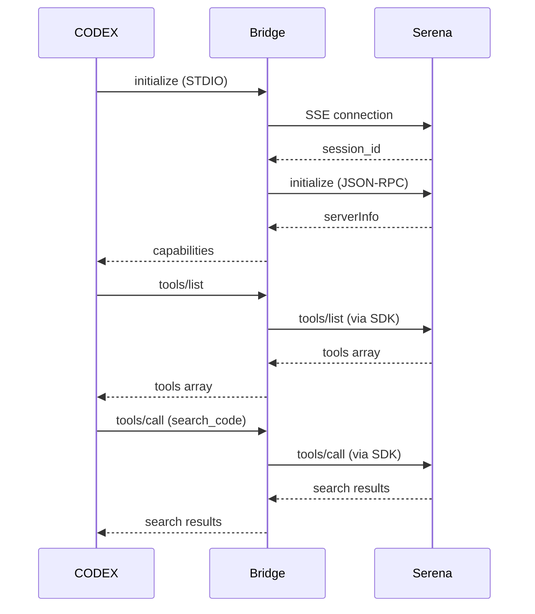

# CODEX Serena Bridge

## Overview

The CODEX Serena Bridge adapts MCP STDIO requests from CODEX to the
Serena SSE transport. It uses the official MCP Python SDK to manage
SSE connectivity, MCP session initialization, and protocol compliance.

Key behaviors:
- CODEX speaks JSON-RPC over STDIO.
- The bridge connects to Serena over SSE.
- The bridge forwards MCP methods through the SDK and returns JSON-RPC
  responses back to CODEX.

## Architecture

- **STDIO handler:** Reads JSON-RPC lines from stdin and writes responses
  to stdout.
- **SSE connection manager:** Maintains the SSE connection, initializes
  the MCP session, and performs reconnection with backoff.
- **Request worker:** Queues tool and resource requests while the SSE
  connection is recovering.
- **Connection monitor:** Periodically validates the session and triggers
  reconnection when the transport is unhealthy.

## Request Flow

1. CODEX sends `initialize` to the bridge via STDIO.
2. The bridge returns its MCP server capabilities immediately.
3. The bridge connects to Serena at `/sse` and runs `initialize` as an MCP
   client.
4. CODEX sends `tools/list` and other MCP requests over STDIO.
5. The bridge forwards these requests with the MCP SDK and returns the
   results to CODEX.

## Configuration

Defaults live in `codex-serena-bridge.py`. Environment variables can override
the defaults when needed for testing or deployment.

Defaults:
- `SERENA_BASE` = `http://127.0.0.1:9121`
- `PROJECT_DIR` = `C:\Users\pwalc\MyApps\paperless-ai`
- `LOG_FILE` = `bridge_debug.log` (in `PROJECT_DIR`)
- `SSE_TIMEOUT` = `30` seconds
- `REQUEST_TIMEOUT` = `60` seconds
- `MAX_RECONNECT_ATTEMPTS` = `10`
- `RECONNECT_BACKOFF_BASE` = `2`
- `RECONNECT_BACKOFF_MAX` = `30`
- `HEALTH_CHECK_INTERVAL` = `15` seconds

Environment overrides:
- `SERENA_BASE`
- `PROJECT_DIR`
- `CODEX_BRIDGE_LOG_FILE`
- `SSE_TIMEOUT`
- `REQUEST_TIMEOUT`
- `MAX_RECONNECT_ATTEMPTS`
- `RECONNECT_BACKOFF_BASE`
- `RECONNECT_BACKOFF_MAX`
- `HEALTH_CHECK_INTERVAL`

## Troubleshooting

- **No tools listed:** Check `bridge_debug.log` and confirm Serena is
  running on `SERENA_BASE`.
- **Repeated reconnects:** Verify `SERENA_BASE` and SSE connectivity.
- **Timeouts:** Increase `REQUEST_TIMEOUT` or check Serena latency.
- **Logging:** The bridge logs to `bridge_debug.log` and stderr with
  request/response excerpts capped at 200 characters.

## Sequence Diagram

