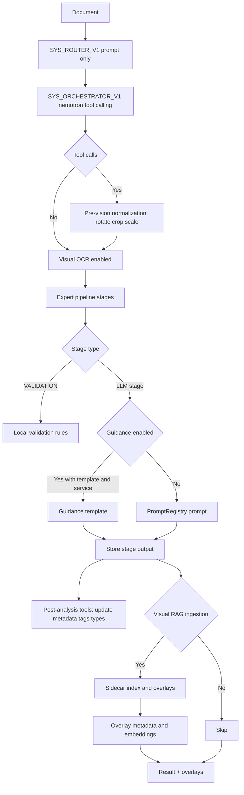
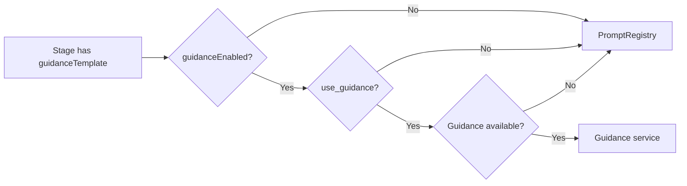
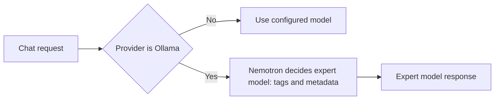

# Expert Pipeline Flow (Guidance vs Prompt)

Purpose: document the execution flow and where Guidance templates are used
versus PromptRegistry prompts, so we can tune cost, latency, JSON validity, and
tooling decisions (normalization, metadata updates, Visual RAG ingestion).

Sources of truth:
- `services/experts/ExpertPipelineExecutor.js`
- `services/experts/pipelines/*.js`
- `services/guidance/GuidanceClient.js`
- `guidance_service/app/__init__.py`
- `services/prompts/PromptRegistry.js`
- `services/tools/paperlessApiTools.js`
- `services/integration/DocumentProcessor.js`
- `services/visual-rag/IngestionManager.js`

## High-level flow

1) **Router classification (prompt-only)**
   - Prompt: `SYS_ROUTER_V1`
   - Model: `MODEL_NAMES.router` (default `qwen3-vl:8b`)
   - File: `services/experts/ExpertPipelineExecutor.js` (`classifyDocument`)

2) **System orchestrator (prompt + tool-calling)**
   - Prompt: `SYS_ORCHESTRATOR_V1`
   - Model: `MODEL_NAMES.orchestrator` (default `nemotron-orchestrator:8b`)
   - Output: `selected_pipeline`, `use_guidance`, `requires_visual_analysis`,
     `use_visual_ocr`, `use_visual_rag_ingestion`, `use_visual_rag_retrieval`,
     and a tool call plan for normalization + metadata actions.
   - Tooling is allowed to auto-run; human-in-the-loop is fallback only.
   - File: `services/experts/ExpertPipelineExecutor.js` (orchestrator section)

3) **Pre-vision normalization (tool-driven)**
   - Triggered by orchestrator tool plan when visual OCR or Visual RAG needs
     a readable document.
   - Actions: rotate, crop, scale/normalize DPI.
   - Output: normalized images + normalization metadata for downstream steps.

4) **Visual OCR (conditional)**
   - Enabled when orchestrator sets `use_visual_ocr=true` and images exist.
   - Uses normalized images when available.

5) **Pipeline selection**
   - Uses orchestrator override if present, else `ExpertRegistry.route()`       
   - File: `services/experts/ExpertRegistry.js`

6) **Pipeline stage execution**
   - For each stage:
     - `StageType.VALIDATION` = local validation only (no LLM)
     - Else, LLM stage:
       - Guidance path if enabled + template exists + service available
       - Prompt path otherwise (PromptRegistry)
       - If Guidance errors, it falls back to prompt path

7) **Post-analysis tooling (auto-run)**
   - Tools run after expert analysis to update Paperless metadata:
     tags, correspondents, document types, storage paths, custom fields.
   - Human-in-the-loop only if validation or policy requires it.

8) **Visual RAG ingestion and overlays (conditional)**
   - Sidecar visual indexing + overlay extraction, based on orchestration gates.
   - Colored overlays require positions stored as metadata AND embeddings.

## Diagrams

## Tooling and normalization

- Orchestrator emits a tool call plan and is allowed to auto-run tools by
  default; human-in-the-loop is a last-resort fallback only.
- Pre-vision normalization runs before visual OCR and Visual RAG ingestion when
  needed. Actions: rotate, crop, scale/normalize DPI.
- Post-analysis tools update Paperless metadata (tags, correspondents, document
  types, storage paths, custom fields) and can optionally trigger reprocess.

## Visual RAG overlay requirements

- Colored overlays require bounding boxes stored as metadata and embeddings to
  be available for retrieval; without both, overlays will not render reliably.

## Ollama chat routing

- When the user selects Ollama as provider, nemotron chooses the expert model
  for chat responses using tags and document metadata (domain, document type,
  extracted entities).
- Fallback: use the configured default model if nemotron does not return a
  decision.

## Guidance enablement rules

Guidance is used when **all** are true:
- `stage.guidanceTemplate` is set
- `context.options.guidanceEnabled` (default true)
- `context.options.orchestration.use_guidance` OR `useGuidance` (default true)
- Guidance service is available (`guidanceClient.isAvailable()`)

If any check fails, the prompt path is used.

## Guidance fallback prompt mapping

Fallback prompt IDs come from `services/guidance/GuidanceClient.js`:

- `medical_classifier` -> `MED_RADIOLOGY_V1`
- `medical_extractor` -> `MED_DOCTOR_V1`
- `medical_integrator` -> `MED_INTEGRATOR_V1`
- `financial_extractor` -> `FIN_EXTRACT_V1`
- `financial_reasoner` -> `FIN_REASONER_V1`
- `vat_expert_analyzer` -> `FIN_VAT_EXPERT_V1`
- `legal_classifier` -> `LEGAL_ORCHESTRATOR_V1`
- `legal_extractor` -> `LEGAL_EXTRACTOR_V1`
- `legal_validator` -> `LEGAL_EXTRACTOR_V1`
- `general_classifier` -> `GEN_FALLBACK_V1`
- `general_extractor` -> `GEN_FALLBACK_V1`
- `cross_pipeline_router` -> `SYS_ROUTER_V1`

## Guidance templates registered

Registered in `guidance_service/app/__init__.py`:
- `medical_classifier`, `medical_extractor`, `medical_integrator`
- `financial_extractor`, `financial_reasoner`, `vat_expert_analyzer`
- `legal_classifier`, `legal_extractor`, `legal_validator`
- `general_classifier`, `general_extractor`, `cross_pipeline_router`

Note: `general_classifier` is registered but not used by the pipeline stages.

## Pipeline stage map (Guidance vs Prompt)

### Medical pipeline (`PIPELINE_MEDICAL_V1`)

| Stage | Type | Guidance template | Prompt fallback | Model | Notes |
| --- | --- | --- | --- | --- | --- |
| `medical_visual` | VISUAL_ANALYSIS | `medical_classifier` | `MED_RADIOLOGY_V1` | `llava-med-v1.6` | Conditional (visual only) |
| `medical_text` | TEXT_EXTRACTION | `medical_extractor` | `MED_DOCTOR_V1` | `medtext-llama3` | Guidance preferred |
| `medical_integration` | INTEGRATION | `medical_integrator` | `MED_INTEGRATOR_V1` | `medtext-llama3` | Guidance preferred |
| `medical_validation` | VALIDATION | n/a | n/a | n/a | Local rules only |
| `medical_recovery` | RECOVERY | n/a | `GEN_FALLBACK_V1` | `sauerkraut-llama3.1:8b` | Prompt only |

### Financial pipeline (`PIPELINE_FINANCIAL_V1`)

| Stage | Type | Guidance template | Prompt fallback | Model | Notes |
| --- | --- | --- | --- | --- | --- |
| `financial_visual` | VISUAL_ANALYSIS | `financial_extractor` | `SYS_ROUTER_V1` | `qwen3-vl:8b` | Conditional (visual only) |
| `financial_extraction` | TEXT_EXTRACTION | `financial_extractor` | `FIN_EXTRACT_V1` | `llm-pro-finance-8b` | Guidance preferred |
| `financial_reasoning` | REASONING | `financial_reasoner` | `FIN_REASONER_V1` | `fino1-8b` | Guidance preferred |
| `financial_vat_analysis` | REASONING | `vat_expert_analyzer` | `FIN_VAT_EXPERT_V1` | `llm-pro-finance-8b` | Guidance preferred |

### Legal pipeline (`PIPELINE_LEGAL_V1`)

| Stage | Type | Guidance template | Prompt fallback | Model | Notes |
| --- | --- | --- | --- | --- | --- |
| `legal_orchestrator` | CLASSIFICATION | `legal_classifier` | `LEGAL_ORCHESTRATOR_V1` | `nemotron-orchestrator:8b` | Text-only routing inside legal |
| `legal_extraction` | TEXT_EXTRACTION | `legal_extractor` | `LEGAL_EXTRACTOR_V1` | `llm-pro-finance-8b` | Guidance preferred |
| `legal_validation` | VALIDATION | `legal_validator` | n/a | n/a | Local rules only (Guidance not invoked) |

### General pipeline (`PIPELINE_GENERAL_V1`)

| Stage | Type | Guidance template | Prompt fallback | Model | Notes |
| --- | --- | --- | --- | --- | --- |
| `general_extraction` | TEXT_EXTRACTION | `general_extractor` | `GEN_FALLBACK_V1` | `sauerkraut-llama3.1:8b` | Guidance preferred |
| `cross_pipeline_router` | REASONING | `cross_pipeline_router` | `SYS_ROUTER_V1` | `sauerkraut-llama3.1:8b` | Guidance preferred |

## Optimization levers

- **Guidance toggle**: orchestration plan can set `use_guidance=false` for speed.
- **Stage-type control**: `StageType.VALIDATION` never uses Guidance; change to
  a non-validation type if you want `legal_validator` to call Guidance.
- **Model selection**: per-stage `model` is passed to Guidance; tune models per
  stage to balance cost vs correctness.
- **Fallback behavior**: if Guidance fails, PromptRegistry is used automatically.
- **Normalization gates**: orchestrator tool calls decide when rotation/crop/
  scale run before visual OCR or Visual RAG ingestion.
- **Overlay quality**: overlays only render if bounding boxes are stored as
  metadata and embeddings are available for retrieval.
