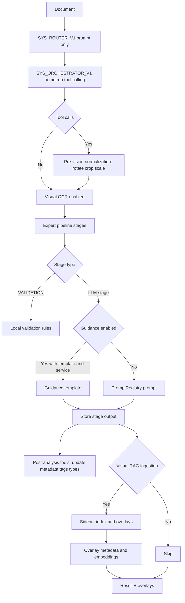
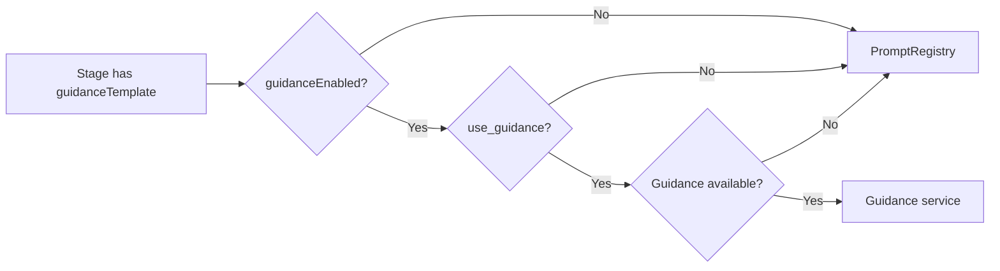
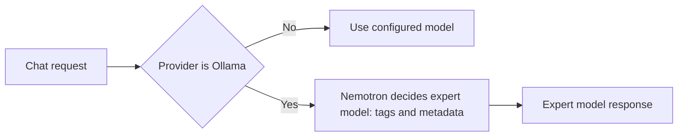

# Expert Pipeline Flow (Guidance vs Prompt)

Purpose: document the execution flow and where Guidance templates are used
versus PromptRegistry prompts, so we can tune cost, latency, JSON validity, and
tooling decisions (normalization, metadata updates, Visual RAG ingestion).

Sources of truth:
- `services/experts/ExpertPipelineExecutor.js`
- `services/experts/pipelines/*.js`
- `services/guidance/GuidanceClient.js`
- `guidance_service/app/__init__.py`
- `services/prompts/PromptRegistry.js`
- `services/tools/paperlessApiTools.js`
- `services/integration/DocumentProcessor.js`
- `services/visual-rag/IngestionManager.js`

## High-level flow

1) **Router classification (prompt-only)**
   - Prompt: `SYS_ROUTER_V1`
   - Model: `MODEL_NAMES.router` (default `qwen3-vl:8b`)
   - File: `services/experts/ExpertPipelineExecutor.js` (`classifyDocument`)

2) **System orchestrator (prompt + tool-calling)**
   - Prompt: `SYS_ORCHESTRATOR_V1`
   - Model: `MODEL_NAMES.orchestrator` (default `nemotron-orchestrator:8b`)
   - Output: `selected_pipeline`, `use_guidance`, `requires_visual_analysis`,
     `use_visual_ocr`, `use_visual_rag_ingestion`, `use_visual_rag_retrieval`,
     and a tool call plan for normalization + metadata actions.
   - Tooling is allowed to auto-run; human-in-the-loop is fallback only.
   - File: `services/experts/ExpertPipelineExecutor.js` (orchestrator section)

3) **Pre-vision normalization (tool-driven)**
   - Triggered by orchestrator tool plan when visual OCR or Visual RAG needs
     a readable document.
   - Actions: rotate, crop, scale/normalize DPI.
   - Output: normalized images + normalization metadata for downstream steps.

4) **Parallel OCR + Visual Element Detection (conditional)**
   - Enabled when orchestrator sets `use_visual_ocr=true` and images exist.     
   - Executes Visual OCR + Tesseract OCR + Visual Element Detection in parallel via `ParallelOcrExecutor`.
   - Persists `document.enhanced_ocr_text` + `document._ocr_metadata` for downstream stages.

5) **Pipeline selection**
   - Uses orchestrator override if present, else `ExpertRegistry.route()`       
   - File: `services/experts/ExpertRegistry.js`

6) **Pipeline stage execution**
   - For each stage:
     - `StageType.VALIDATION` = local validation only (no LLM)
     - Else, LLM stage:
       - Guidance path if enabled + template exists + service available
       - Prompt path otherwise (PromptRegistry)
       - If Guidance errors, it falls back to prompt path

7) **Post-analysis tooling (auto-run)**
   - Tools run after expert analysis to update Paperless metadata:
     tags, correspondents, document types, storage paths, custom fields.
   - Human-in-the-loop only if validation or policy requires it.
   - Tag updates should follow governance rules (existing-only vs. review).

8) **Visual RAG ingestion and overlays (conditional)**
   - Sidecar visual indexing + overlay extraction, based on orchestration gates.
   - Colored overlays require positions stored as metadata AND embeddings.

9) **Retrieval & answering (Visual-first, V2)**
   - Query router selects visual retrieval by default.
   - Visual hits + OCR snippets + metadata → Context Pack → Guidance response.
   - Text retrieval is optional for validation and fallback.

## Diagrams



```mermaid
flowchart TD
  Q[User Query] --> R[Query Router]
  R --> V[Visual Retrieval (default)]
  R --> T[Text Retrieval (optional)]
  V --> C[Context Pack Builder]
  T --> C
  C --> G[Guidance Response Generator]
  G --> A[Action Orchestrator]
  A --> L[Audit Log + Human-in-loop]
```





## Tooling and normalization

- Orchestrator emits a tool call plan and is allowed to auto-run tools by
  default; human-in-the-loop is a last-resort fallback only.
- Pre-vision normalization runs before visual OCR and Visual RAG ingestion when
  needed. Actions: rotate, crop, scale/normalize DPI.
- Post-analysis tools update Paperless metadata (tags, correspondents, document
  types, storage paths, custom fields) and can optionally trigger reprocess.

## Paperless API contract (for autonomous actions)

- Base URL must include `/api/`.
- Headers: `Authorization: Token <token>` and `Accept: application/json; version=<server_version>`.
- Resolve names to IDs before PATCH/bulk:
  `/tags/`, `/correspondents/`, `/document_types/`, `/storage_paths/`.
- Use PATCH `/api/documents/{id}/` for single updates, `/api/documents/bulk_edit/` for bulk.
- Custom fields: fetch `/custom_fields/` first, then PATCH with
  `custom_fields: { "cf_<id>": <value> }`. For bulk, use
  `method=modify_custom_fields` with
  `parameters: { add_custom_fields: { "cf_<id>": <value> }, remove_custom_fields: ["cf_<id>"] }`.
- Uploads and reprocess create tasks; track via `/api/tasks/` and acknowledge when required.

## Visual RAG overlay requirements

- Colored overlays require bounding boxes stored as metadata and embeddings to
  be available for retrieval; without both, overlays will not render reliably.

## Ollama chat routing

- When the user selects Ollama as provider, nemotron chooses the expert model
  for chat responses using tags and document metadata (domain, document type,
  extracted entities).
- Fallback: use the configured default model if nemotron does not return a
  decision.

## Guidance-assisted tag management (proposed)

What to keep from the Guidance Engineer plan:

- **Structured tag output**: Guidance templates can enforce JSON schemas for
  tags (`suggested_tags`, `missing_tags`, `confidence`, `domain`, `source`),
  keeping outputs machine-safe.
- **Domain context**: templates can take `primary_domain`, `document_type`, and
  existing tags to bias suggestions toward the correct taxonomy.
- **Validation gate**: keep new tags separate from existing tags; only auto-
  apply tags that already exist in Paperless unless a human review approves.
- **Stats-aware hints**: lightweight frequency/co-occurrence hints can improve
  precision without heavy ML dependencies.

What to skip for now (overkill or mismatched to the current stack):

- Large multi-expert consensus loops that require stateful orchestration across
  multiple Guidance sessions.
- Full statistical ML stacks (KMeans, Bayesian ranking, SciPy/NumPy) in the
  core pipeline; these add heavy dependencies and operational cost.
- Custom Docker services for tag statistics unless you explicitly want a
  separate persistence layer.

Suggested minimal Guidance template output:

```json
{
  "suggested_tags": ["<existing tags only>"],
  "missing_tags": ["<new tag candidates>"],
  "confidence": { "overall": 0.0, "tags": { "tag": 0.0 } },
  "domain": "medical|financial|legal|general",
  "source": "guidance_tagger"
}
```

Governance rules to manage tags over time:

- **Existing-only auto-apply**: only auto-apply tags that already exist in      
  Paperless (`RESTRICT_TO_EXISTING_TAGS=yes`).
- **New tags queued**: treat `missing_tags` as review candidates (manual or     
  scheduled approval).
- **Pipeline staging**: when tags are missing, store them in the `ai_missing_tags` custom field and log the review queue entry.
- **Normalization**: lowercase, trim, and map aliases before persistence.       
- **Namespace**: reserve a prefix for AI-only tags (e.g., `ai:`) to support
  pruning or replacement without touching user-managed tags.
- **Confidence thresholds**: require a minimum confidence to auto-apply.

### Guidance adoption plan audit (proposed)

What to adopt now (low risk, aligned with current architecture):

- **Tag-level metrics**: extend the Guidance metrics layer with tag events
  (domain, template, JSON validity, latency, missing tags). Keep it passive.
- **Failure ledger**: structured logging for Guidance exceptions, tied to
  template name and model for fast triage.
- **Baseline scripts**: document size distribution and tag set size; source data
  should be fetched via Paperless API or existing service methods.
- **Fallback mapping verification**: keep the verification checklist plus a
  script for CI or manual checks.

What to defer (requires additional support or risks complexity creep):

- **Streaming generation**: only enable if the Guidance service exposes streaming
  responses; otherwise document it as optional and keep non-streaming fallback.
- **Stats-driven tag suggestions**: only after you have 500+ tagged documents
  and a stable taxonomy; keep it hint-only at first.
- **Canary rollout logic**: useful, but keep it optional until metrics confirm
  improvements and there is a clear rollback plan.

### Streaming policy (proposed)

- Enable streaming only when Guidance service supports it and token counts are
  high (example threshold: 2000 tokens).
- Persist partial results only if you have a staging field or review queue;
  otherwise keep streaming read-only for UX.

### Canary policy (proposed)

- Use a feature flag or rollout percentage per stage and per template version.
- Gates: JSON validity rate >= 95% and error rate <= 2% on baseline metrics.

### Guidance template composition for domains (proposed)

Composable template parts reduce duplication across domains and keep tag
schemas consistent:

```python
@guidance(stateless=True)
def confidence_block(lm):
    lm += '"confidence": ' + gen("conf", regex=r'0\.\d+|1\.0')
    return lm

@guidance(stateless=True)
def tag_entry(lm, tag_str, domain):
    lm += '{"tag": "' + tag_str + '", "domain": "' + domain + '", '
    lm += confidence_block(lm)
    lm += '}'
    return lm
```

Each domain template can then reuse these components to assemble tag outputs
without repeating JSON structure rules.

### Guidance streaming for long documents

Guidance calls enable streaming when token count exceeds `GUIDANCE_STREAMING_THRESHOLD`
(default: 2000) and `GUIDANCE_STREAMING_ENABLED=yes` is set. If the service does
not support streaming, the client falls back to non-streaming automatically.

### Domain-aware template routing

Guidance templates receive explicit domain context for biasing:

- Executor injects `domain`, `existing_tags`, and `model` into Guidance variables.
- Templates include the domain context in `system()` prompts to bias taxonomy and
  reduce cross-domain contamination.

### Guidance fallback template verification

Maintain a tested mapping table for Guidance fallback templates and record the  
last validation date. This keeps the fallback path auditable.

Validation script: `scripts/verify-guidance-fallbacks.js`

| Template | Fallback prompt | Last verified | Status |
| --- | --- | --- | --- |
| `medical_classifier` | `MED_RADIOLOGY_V1` | 2025-12-29 | ok |
| `financial_extractor` | `FIN_EXTRACT_V1` | 2025-12-29 | ok |
| `legal_classifier` | `LEGAL_ORCHESTRATOR_V1` | 2025-12-29 | ok |
| `general_extractor` | `GEN_FALLBACK_V1` | 2025-12-29 | ok |
| `cross_pipeline_router` | `SYS_ROUTER_V1` | 2025-12-29 | ok |

## Guidance enablement rules

Guidance is used when **all** are true:
- `stage.guidanceTemplate` is set
- `context.options.guidanceEnabled` (default true)
- `context.options.orchestration.use_guidance` OR `useGuidance` (default true)
- Guidance service is available (`guidanceClient.isAvailable()`)

If any check fails, the prompt path is used.

## Guidance fallback prompt mapping

Fallback prompt IDs come from `services/guidance/GuidanceClient.js`:

- `medical_classifier` -> `MED_RADIOLOGY_V1`
- `medical_extractor` -> `MED_DOCTOR_V1`
- `medical_integrator` -> `MED_INTEGRATOR_V1`
- `financial_extractor` -> `FIN_EXTRACT_V1`
- `financial_reasoner` -> `FIN_REASONER_V1`
- `vat_expert_analyzer` -> `FIN_VAT_EXPERT_V1`
- `legal_classifier` -> `LEGAL_ORCHESTRATOR_V1`
- `legal_extractor` -> `LEGAL_EXTRACTOR_V1`
- `legal_validator` -> `LEGAL_EXTRACTOR_V1`
- `general_classifier` -> `GEN_FALLBACK_V1`
- `general_extractor` -> `GEN_FALLBACK_V1`
- `cross_pipeline_router` -> `SYS_ROUTER_V1`

Fallback verification checklist:
- Run `node scripts/verify-guidance-fallbacks.js` after template or model changes.
- Update the fallback verification table with date and status.

## Guidance templates registered

Registered in `guidance_service/app/__init__.py`:
- `medical_classifier`, `medical_extractor`, `medical_integrator`
- `financial_extractor`, `financial_reasoner`, `vat_expert_analyzer`
- `legal_classifier`, `legal_extractor`, `legal_validator`
- `general_classifier`, `general_extractor`, `cross_pipeline_router`

Note: `general_classifier` is now executed in the General pipeline before extraction.

## Pipeline stage map (Guidance vs Prompt)

### Medical pipeline (`PIPELINE_MEDICAL_V1`)

| Stage | Type | Guidance template | Prompt fallback | Model | Notes |
| --- | --- | --- | --- | --- | --- |
| `medical_visual` | VISUAL_ANALYSIS | `medical_classifier` | `MED_RADIOLOGY_V1` | `llava-med-v1.6` | Conditional (visual only) |
| `medical_text` | TEXT_EXTRACTION | `medical_extractor` | `MED_DOCTOR_V1` | `medtext-llama3` | Guidance preferred |
| `medical_integration` | INTEGRATION | `medical_integrator` | `MED_INTEGRATOR_V1` | `medtext-llama3` | Guidance preferred |
| `medical_validation` | VALIDATION | n/a | n/a | n/a | Local rules only |
| `medical_recovery` | RECOVERY | n/a | `GEN_FALLBACK_V1` | `sauerkraut-llama3.1:8b` | Prompt only |

### Financial pipeline (`PIPELINE_FINANCIAL_V1`)

| Stage | Type | Guidance template | Prompt fallback | Model | Notes |
| --- | --- | --- | --- | --- | --- |
| `financial_visual` | VISUAL_ANALYSIS | `financial_extractor` | `SYS_ROUTER_V1` | `qwen3-vl:8b` | Conditional (visual only) |
| `financial_extraction` | TEXT_EXTRACTION | `financial_extractor` | `FIN_EXTRACT_V1` | `llm-pro-finance-8b` | Guidance preferred |
| `financial_reasoning` | REASONING | `financial_reasoner` | `FIN_REASONER_V1` | `llm-pro-finance-8b` | Guidance preferred |
| `financial_vat_analysis` | REASONING | `vat_expert_analyzer` | `FIN_VAT_EXPERT_V1` | `llm-pro-finance-8b` | Guidance preferred |

### Legal pipeline (`PIPELINE_LEGAL_V1`)

| Stage | Type | Guidance template | Prompt fallback | Model | Notes |
| --- | --- | --- | --- | --- | --- |
| `legal_orchestrator` | CLASSIFICATION | `legal_classifier` | `LEGAL_ORCHESTRATOR_V1` | `nemotron-orchestrator:8b` | Text-only routing inside legal |
| `legal_extraction` | TEXT_EXTRACTION | `legal_extractor` | `LEGAL_EXTRACTOR_V1` | `gpt-oss` | Guidance preferred |
| `legal_validation` | VALIDATION | `legal_validator` | n/a | n/a | Local rules only (Guidance not invoked) |

### General pipeline (`PIPELINE_GENERAL_V1`)

| Stage | Type | Guidance template | Prompt fallback | Model | Notes |
| --- | --- | --- | --- | --- | --- |
| `general_classifier` | CLASSIFICATION | `general_classifier` | `GEN_FALLBACK_V1` | `sauerkraut-llama3.1:8b` | Pre-classification for routing |
| `general_extraction` | TEXT_EXTRACTION | `general_extractor` | `GEN_FALLBACK_V1` | `sauerkraut-llama3.1:8b` | Guidance preferred |
| `cross_pipeline_router` | REASONING | `cross_pipeline_router` | `SYS_ROUTER_V1` | `sauerkraut-llama3.1:8b` | Guidance preferred |

## Optimization levers

- **Guidance toggle**: orchestration plan can set `use_guidance=false` for speed.
- **Stage-type control**: `StageType.VALIDATION` never uses Guidance; change to
  a non-validation type if you want `legal_validator` to call Guidance.
- **Model selection**: per-stage `model` is passed to Guidance; tune models per
  stage to balance cost vs correctness.
- **Fallback behavior**: if Guidance fails, PromptRegistry is used automatically.
- **Normalization gates**: orchestrator tool calls decide when rotation/crop/
  scale run before visual OCR or Visual RAG ingestion.
- **Overlay quality**: overlays only render if bounding boxes are stored as
  metadata and embeddings are available for retrieval.
- **Tag governance**: limit auto-applied tags to the existing taxonomy and keep
  new tag candidates for review to avoid tag sprawl.
- **Guidance fast-forwarding**: predictable JSON tokens can be auto-completed by
  the grammar without additional LLM passes (lower latency).
- **Token healing**: grammar constraints can repair tokenization boundaries at
  schema edges (reduces malformed key/value emission).
- **KV cache reuse**: within a single stage, consecutive Guidance generations
  can reuse caches to reduce repeated compute.
