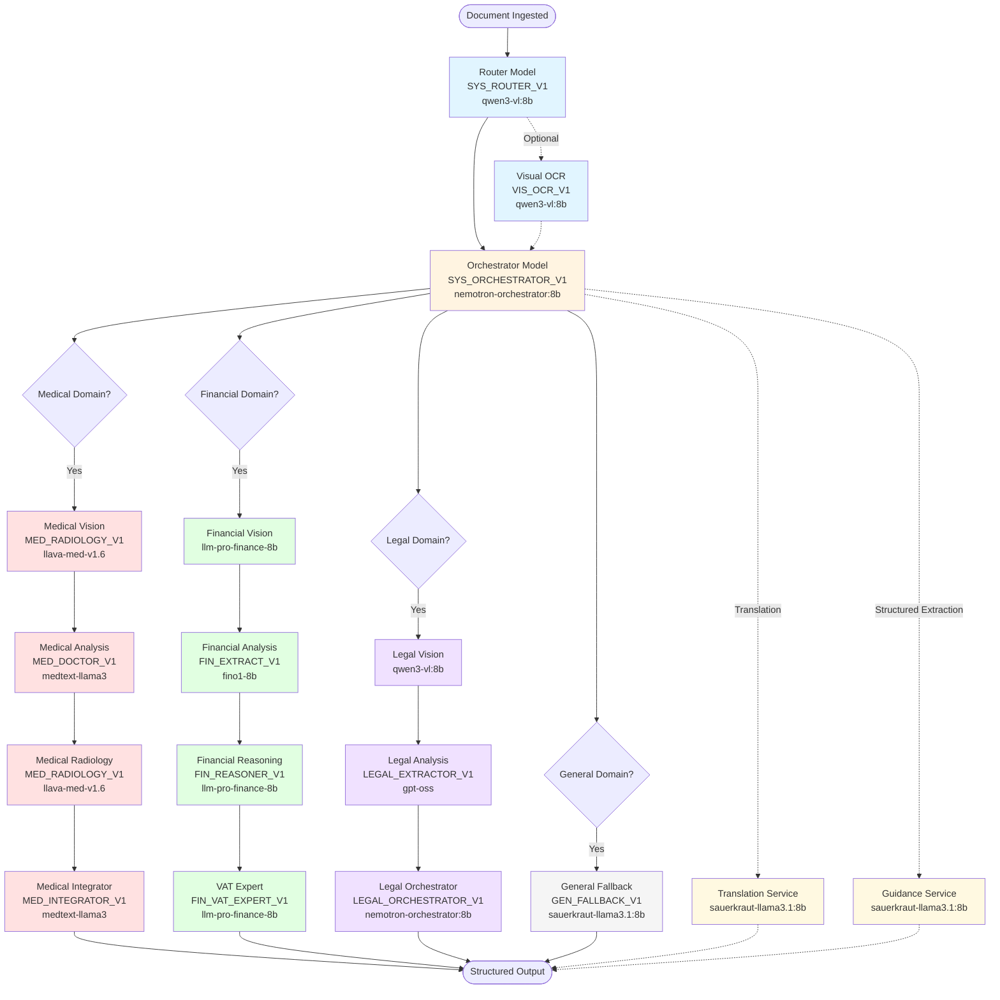

# Ollama Model Reference

**Authoritative Model Architecture Documentation for Paperless-AI Expert Pipeline**

This document maps every Ollama model to its pipeline stage, purpose, associated prompt template, and default configuration values. It serves as the single source of truth for understanding how models are orchestrated across the expert document processing pipeline.

---

## Table of Contents

1. [Pipeline Flow Diagram](#pipeline-flow-diagram)
2. [Model Reference Table](#model-reference-table)
3. [Token Limit Tiers](#token-limit-tiers)
4. [Settings UI Reference](#settings-ui-reference)
5. [Environment Variable Reference](#environment-variable-reference)

---

## Pipeline Flow Diagram

The following Mermaid diagram illustrates the complete document processing pipeline, showing how documents flow through router, planner, domain-specific experts, and orchestration stages.



---

## Model Reference Table

This table maps every model role to its environment variable, default value, associated prompt template, token tier, and purpose.

| Role | Env Var | Default Value | Prompt ID(s) | Tier | Purpose |
|------|---------|---------------|-------------|------|---------|
| **Base Models** |
| Default Text | `OLLAMA_MODEL` | `sauerkraut-llama3.1:8b` | `GEN_FALLBACK_V1` | text | General-purpose text model for fallback processing |
| Default Vision | `OLLAMA_VISION_MODEL` | `qwen3-vl:8b` | `VIS_OCR_V1`, `VIS_SIGNAL_ANALYZER_V1` | vision | Multimodal document analysis and OCR |
| **Pipeline Control** |
| Router | `ROUTER_MODEL` | `qwen3-vl:8b` | `SYS_ROUTER_V1` | expert | Document classification and routing |
| Planner | `PLANNER_MODEL` | `qwen3-vl:8b` | *(orchestrated, no dedicated prompt)* | planner | Extraction strategy planning |
| Orchestrator | `ORCHESTRATOR_MODEL` | `nemotron-orchestrator:8b` | `SYS_ORCHESTRATOR_V1` | expert | Pipeline coordination and service routing |
| **Medical Domain** |
| Medical Vision | `MEDICAL_VISION_MODEL` | `llava-med-v1.6` | `MED_RADIOLOGY_V1` | vision | Medical imaging analysis (X-ray, CT, MRI) |
| Medical Analysis | `MEDICAL_ANALYSIS_MODEL` | `medtext-llama3` | `MED_DOCTOR_V1` | expert | Clinical text extraction and medical coding |
| Medical Radiology | `MEDICAL_RADIOLOGY_MODEL` | `llava-med-v1.6` | `MED_RADIOLOGY_V1` | vision | Radiology-specialized imaging interpretation |
| Medical Integrator | *(uses Medical Analysis model)* | `medtext-llama3` | `MED_INTEGRATOR_V1` | expert | Cross-reference and conflict resolution |
| **Financial Domain** |
| Financial Vision | `FINANCIAL_VISION_MODEL` | `llm-pro-finance-8b` | *(initial vision pass)* | vision | Financial document image analysis |
| Financial Analysis | `FINANCIAL_ANALYSIS_MODEL` | `fino1-8b` | `FIN_EXTRACT_V1` | expert | Structured financial data extraction |
| Financial Reasoning | `FINANCIAL_REASONING_MODEL` | `llm-pro-finance-8b` | `FIN_REASONER_V1` | expert | Math-heavy reasoning and validation |
| Financial VAT Expert | `FINANCIAL_VAT_EXPERT` | `llm-pro-finance-8b` | `FIN_VAT_EXPERT_V1` | expert | VAT compliance and tax analysis |
| **Legal Domain** |
| Legal Vision | `LEGAL_VISION_MODEL` | `qwen3-vl:8b` | *(initial vision pass)* | vision | Legal document image preprocessing |
| Legal Analysis | `LEGAL_ANALYSIS_MODEL` | `gpt-oss` | `LEGAL_EXTRACTOR_V1` | expert | Legal clause extraction and risk analysis |
| Legal Orchestrator | `LEGAL_ORCHESTRATOR_MODEL` | `nemotron-orchestrator:8b` | `LEGAL_ORCHESTRATOR_V1` | expert | Legal workflow coordination |
| **Services** |
| Translation | `TRANSLATION_MODEL` | `sauerkraut-llama3.1:8b` | *(no dedicated prompt)* | translation | Document translation service |
| Guidance | `GUIDANCE_MODEL` | `sauerkraut-llama3.1:8b` | *(deterministic JSON extraction)* | *(no tier)* | Structured extraction via Guidance templates |

---

## Token Limit Tiers

Token limits are grouped into tiers that apply to sets of models based on their role. Each tier has configurable context window and max response token limits.

### Tier Overview

| Tier | Context Window Var | Default | Max Response Var | Default | Image Overhead | Models Using This Tier |
|------|-------------------|---------|------------------|---------|----------------|------------------------|
| **Text (Base)** | `OLLAMA_CONTEXT_WINDOW` | 128000 | `OLLAMA_MAX_RESPONSE_TOKENS` | 4096 | N/A | Default Text (`OLLAMA_MODEL`) |
| **Vision** | `OLLAMA_VISION_CONTEXT_WINDOW` | 32768 (capped) | `OLLAMA_VISION_MAX_RESPONSE_TOKENS` | 2048 | 1024 | Default Vision, Medical Vision, Medical Radiology, Financial Vision, Legal Vision |
| **Planner** | `OLLAMA_PLANNER_CONTEXT_WINDOW` | 32768 (capped) | `OLLAMA_PLANNER_MAX_RESPONSE_TOKENS` | 2048 | N/A | Planner Model |
| **Expert** | `OLLAMA_EXPERT_CONTEXT_WINDOW` | 128000 | `OLLAMA_EXPERT_MAX_RESPONSE_TOKENS` | 4096 | N/A | Router, Orchestrator, Medical Analysis, Financial Analysis, Financial Reasoning, Financial VAT Expert, Legal Analysis, Legal Orchestrator |
| **Translation** | `TRANSLATION_CONTEXT_WINDOW` | 128000 | *(none)* | *(inherited from text tier)* | N/A | Translation Model |

### Vision-Specific Token Overhead

**Environment Variable**: `OLLAMA_VISION_IMAGE_TOKENS`
**Default**: 1024
**Purpose**: Accounts for per-image token overhead when calculating available context for vision models.

### Tier Mapping by Model

Each model is assigned to a tier based on its role. The tier determines which context window and response token limits apply.

**Vision Tier Models**:
- Default Vision (`OLLAMA_VISION_MODEL`)
- Medical Vision (`MEDICAL_VISION_MODEL`)
- Medical Radiology (`MEDICAL_RADIOLOGY_MODEL`)
- Financial Vision (`FINANCIAL_VISION_MODEL`)
- Legal Vision (`LEGAL_VISION_MODEL`)

**Expert Tier Models**:
- Router (`ROUTER_MODEL`)
- Orchestrator (`ORCHESTRATOR_MODEL`)
- Medical Analysis (`MEDICAL_ANALYSIS_MODEL`)
- Financial Analysis (`FINANCIAL_ANALYSIS_MODEL`)
- Financial Reasoning (`FINANCIAL_REASONING_MODEL`)
- Financial VAT Expert (`FINANCIAL_VAT_EXPERT`)
- Legal Analysis (`LEGAL_ANALYSIS_MODEL`)
- Legal Orchestrator (`LEGAL_ORCHESTRATOR_MODEL`)

**Planner Tier Models**:
- Planner (`PLANNER_MODEL`)

**Text (Base) Tier Models**:
- Default Text (`OLLAMA_MODEL`)

**Translation Tier Models**:
- Translation (`TRANSLATION_MODEL`)

---

## Settings UI Reference

The Settings UI provides a user-friendly interface for configuring all Ollama models and their token limits. This section describes where each setting is located and how it maps to the underlying architecture.

### UI Location

**Path**: `/settings` → AI Provider → Ollama tab

### Model Card Groups

The Ollama settings are organized into the following groups:

#### 1. Base Models
- **Default Text Model**: General-purpose text processing fallback
  - Model Selector: `OLLAMA_MODEL`
  - Token Limits: Text tier (context window, max response tokens)
  - Reset Button: Resets to `sauerkraut-llama3.1:8b`

- **Default Vision Model**: Multimodal document analysis
  - Model Selector: `OLLAMA_VISION_MODEL`
  - Token Limits: Vision tier (context window, max response tokens, image token overhead)
  - Reset Button: Resets to `qwen3-vl:8b`

#### 2. Pipeline Control
- **Router Model**: Document classification and routing
  - Model Selector: `ROUTER_MODEL`
  - Token Limits: Expert tier
  - Prompt Link: `SYS_ROUTER_V1`
  - Reset Button: Resets to `qwen3-vl:8b`

- **Planner Model**: Extraction strategy planning
  - Model Selector: `PLANNER_MODEL`
  - Token Limits: Planner tier (capped at 32768)
  - Reset Button: Resets to `qwen3-vl:8b`

- **Orchestrator Model**: Pipeline coordination
  - Model Selector: `ORCHESTRATOR_MODEL`
  - Token Limits: Expert tier
  - Prompt Link: `SYS_ORCHESTRATOR_V1`
  - Reset Button: Resets to `nemotron-orchestrator:8b`

#### 3. Medical Domain
- **Medical Vision Model**: Medical imaging analysis
  - Model Selector: `MEDICAL_VISION_MODEL`
  - Token Limits: Vision tier
  - Prompt Link: `MED_RADIOLOGY_V1`
  - Reset Button: Resets to `llava-med-v1.6`

- **Medical Analysis Model**: Clinical text extraction
  - Model Selector: `MEDICAL_ANALYSIS_MODEL`
  - Token Limits: Expert tier
  - Prompt Link: `MED_DOCTOR_V1`, `MED_INTEGRATOR_V1`
  - Reset Button: Resets to `medtext-llama3`

- **Medical Radiology Model**: Radiology-specialized imaging
  - Model Selector: `MEDICAL_RADIOLOGY_MODEL`
  - Token Limits: Vision tier
  - Prompt Link: `MED_RADIOLOGY_V1`
  - Reset Button: Resets to `llava-med-v1.6`

#### 4. Financial Domain
- **Financial Vision Model**: Financial document images
  - Model Selector: `FINANCIAL_VISION_MODEL`
  - Token Limits: Vision tier
  - Reset Button: Resets to `llm-pro-finance-8b`

- **Financial Analysis Model**: Financial data extraction
  - Model Selector: `FINANCIAL_ANALYSIS_MODEL`
  - Token Limits: Expert tier
  - Prompt Link: `FIN_EXTRACT_V1`
  - Reset Button: Resets to `fino1-8b`

- **Financial Reasoning Model**: Math-heavy reasoning
  - Model Selector: `FINANCIAL_REASONING_MODEL`
  - Token Limits: Expert tier
  - Prompt Link: `FIN_REASONER_V1`
  - Reset Button: Resets to `llm-pro-finance-8b`

- **Financial VAT Expert**: VAT and tax analysis
  - Model Selector: `FINANCIAL_VAT_EXPERT`
  - Token Limits: Expert tier
  - Prompt Link: `FIN_VAT_EXPERT_V1`
  - Reset Button: Resets to `llm-pro-finance-8b`

#### 5. Legal Domain
- **Legal Vision Model**: Legal document image preprocessing
  - Model Selector: `LEGAL_VISION_MODEL`
  - Token Limits: Vision tier
  - Reset Button: Resets to `qwen3-vl:8b`

- **Legal Analysis Model**: Legal clause extraction
  - Model Selector: `LEGAL_ANALYSIS_MODEL`
  - Token Limits: Expert tier
  - Prompt Link: `LEGAL_EXTRACTOR_V1`
  - Reset Button: Resets to `gpt-oss`

- **Legal Orchestrator Model**: Legal workflow coordination
  - Model Selector: `LEGAL_ORCHESTRATOR_MODEL`
  - Token Limits: Expert tier
  - Prompt Link: `LEGAL_ORCHESTRATOR_V1`
  - Reset Button: Resets to `nemotron-orchestrator:8b`

#### 6. Services
- **Translation Model**: Document translation
  - Model Selector: `TRANSLATION_MODEL`
  - Token Limits: Translation tier
  - Reset Button: Resets to `sauerkraut-llama3.1:8b`

- **Guidance Model**: Deterministic JSON extraction
  - Model Selector: `GUIDANCE_MODEL`
  - Token Limits: *(no dedicated tier; uses base text defaults)*
  - Reset Button: Resets to `sauerkraut-llama3.1:8b`

### UI Actions

- **Save All Settings**: Saves all model selections and token limits to `data/config.json`
- **Reset All to Defaults**: Resets all models and limits to their built-in defaults (with confirmation dialog)
- **Prompt Edit Link**: Opens the Prompts settings tab with the selected prompt pre-filtered (admin-only)
- **Inline Token Limit Editors**: Each model card displays editable context window and max response token fields

### Developer Settings Integration

Additional token limit settings are exposed in **Developer Settings** (`/settings` → Developer Settings):

- `OLLAMA_VISION_IMAGE_TOKENS`: Token overhead per image in vision context (default: 1024)
- `TRANSLATION_MAX_TOKENS`: *(deprecated; use `OLLAMA_MAX_RESPONSE_TOKENS` for translation tier)*

---

## Environment Variable Reference

This section provides a complete mapping of environment variables to their purpose, default values, and tier assignments.

### Base Model Variables

| Variable | Default | Description |
|----------|---------|-------------|
| `OLLAMA_API_URL` | `http://localhost:11434` | Ollama API endpoint |
| `OLLAMA_MODEL` | `sauerkraut-llama3.1:8b` | Default text model |
| `OLLAMA_VISION_MODEL` | `qwen3-vl:8b` | Default vision model |

### Pipeline Control Variables

| Variable | Default | Description |
|----------|---------|-------------|
| `ROUTER_MODEL` | `qwen3-vl:8b` | Router model for document classification |
| `PLANNER_MODEL` | `qwen3-vl:8b` | Planner model for extraction strategy |
| `ORCHESTRATOR_MODEL` | `nemotron-orchestrator:8b` | Orchestrator model for pipeline coordination |

### Medical Domain Variables

| Variable | Default | Description |
|----------|---------|-------------|
| `MEDICAL_VISION_MODEL` | `llava-med-v1.6` | Medical imaging analysis model |
| `MEDICAL_ANALYSIS_MODEL` | `medtext-llama3` | Clinical text extraction model |
| `MEDICAL_RADIOLOGY_MODEL` | `llava-med-v1.6` | Radiology-specialized model |

### Financial Domain Variables

| Variable | Default | Description |
|----------|---------|-------------|
| `FINANCIAL_VISION_MODEL` | `llm-pro-finance-8b` | Financial document vision model |
| `FINANCIAL_ANALYSIS_MODEL` | `fino1-8b` | Financial data extraction model |
| `FINANCIAL_REASONING_MODEL` | `llm-pro-finance-8b` | Financial reasoning model |
| `FINANCIAL_VAT_EXPERT` | `llm-pro-finance-8b` | VAT compliance expert model |

### Legal Domain Variables

| Variable | Default | Description |
|----------|---------|-------------|
| `LEGAL_VISION_MODEL` | `qwen3-vl:8b` | Legal document vision model |
| `LEGAL_ANALYSIS_MODEL` | `gpt-oss` | Legal clause extraction model |
| `LEGAL_ORCHESTRATOR_MODEL` | `nemotron-orchestrator:8b` | Legal workflow orchestrator |

### Service Variables

| Variable | Default | Description |
|----------|---------|-------------|
| `TRANSLATION_MODEL` | `sauerkraut-llama3.1:8b` | Translation service model |
| `GUIDANCE_MODEL` | `sauerkraut-llama3.1:8b` | Guidance service model |

### Token Limit Variables

#### Text Tier

| Variable | Default | Description |
|----------|---------|-------------|
| `OLLAMA_CONTEXT_WINDOW` | 128000 | Context window for text models |
| `OLLAMA_MAX_RESPONSE_TOKENS` | 4096 | Max response tokens for text models |

#### Vision Tier

| Variable | Default | Description |
|----------|---------|-------------|
| `OLLAMA_VISION_CONTEXT_WINDOW` | 32768 | Context window for vision models (capped at 32768) |
| `OLLAMA_VISION_MAX_RESPONSE_TOKENS` | 2048 | Max response tokens for vision models |
| `OLLAMA_VISION_IMAGE_TOKENS` | 1024 | Token overhead per image in vision context |

#### Planner Tier

| Variable | Default | Description |
|----------|---------|-------------|
| `OLLAMA_PLANNER_CONTEXT_WINDOW` | 32768 | Context window for planner model (capped at 32768) |
| `OLLAMA_PLANNER_MAX_RESPONSE_TOKENS` | 2048 | Max response tokens for planner model |

#### Expert Tier

| Variable | Default | Description |
|----------|---------|-------------|
| `OLLAMA_EXPERT_CONTEXT_WINDOW` | 128000 | Context window for expert models |
| `OLLAMA_EXPERT_MAX_RESPONSE_TOKENS` | 4096 | Max response tokens for expert models |

#### Translation Tier

| Variable | Default | Description |
|----------|---------|-------------|
| `TRANSLATION_CONTEXT_WINDOW` | 128000 | Context window for translation model |

### Model-Specific Token Limit Variables

The following environment variables provide per-model token limit overrides. These are auto-calculated based on tier assignment but can be overridden via environment variables.

**Router**:
- `ROUTER_CONTEXT_WINDOW` (default: expert tier)
- `ROUTER_MAX_RESPONSE_TOKENS` (default: expert tier)

**Orchestrator**:
- `ORCHESTRATOR_CONTEXT_WINDOW` (default: expert tier)
- `ORCHESTRATOR_MAX_RESPONSE_TOKENS` (default: expert tier)

**Medical Models**:
- `MEDICAL_VISION_CONTEXT_WINDOW` (default: vision tier)
- `MEDICAL_VISION_MAX_RESPONSE_TOKENS` (default: vision tier)
- `MEDICAL_ANALYSIS_CONTEXT_WINDOW` (default: expert tier)
- `MEDICAL_ANALYSIS_MAX_RESPONSE_TOKENS` (default: expert tier)
- `MEDICAL_RADIOLOGY_CONTEXT_WINDOW` (default: vision tier)
- `MEDICAL_RADIOLOGY_MAX_RESPONSE_TOKENS` (default: vision tier)

**Financial Models**:
- `FINANCIAL_VISION_CONTEXT_WINDOW` (default: vision tier)
- `FINANCIAL_VISION_MAX_RESPONSE_TOKENS` (default: vision tier)
- `FINANCIAL_ANALYSIS_CONTEXT_WINDOW` (default: expert tier)
- `FINANCIAL_ANALYSIS_MAX_RESPONSE_TOKENS` (default: expert tier)
- `FINANCIAL_VAT_EXPERT_CONTEXT_WINDOW` (default: expert tier)
- `FINANCIAL_VAT_EXPERT_MAX_RESPONSE_TOKENS` (default: expert tier)

**Legal Models**:
- `LEGAL_VISION_CONTEXT_WINDOW` (default: vision tier)
- `LEGAL_VISION_MAX_RESPONSE_TOKENS` (default: vision tier)
- `LEGAL_ANALYSIS_CONTEXT_WINDOW` (default: expert tier)
- `LEGAL_ANALYSIS_MAX_RESPONSE_TOKENS` (default: expert tier)
- `LEGAL_ORCHESTRATOR_CONTEXT_WINDOW` (default: expert tier)
- `LEGAL_ORCHESTRATOR_MAX_RESPONSE_TOKENS` (default: expert tier)

---

## Notes and Best Practices

### Fallback Chain

When a specific model environment variable is not set, the system follows a fallback chain defined in `services/prompts/PromptRegistry.js` and `routes/settings.js`. For example:

- `ROUTER_MODEL` → `OLLAMA_ROUTER_MODEL` → `PLANNER_MODEL` → `qwen3-vl:8b`
- `MEDICAL_VISION_MODEL` → `OLLAMA_VISION_MODEL` → `llava-med-v1.6`
- `FINANCIAL_REASONING_MODEL` → `FINANCIAL_ANALYSIS_MODEL` → `llm-pro-finance-8b`

### Vision Context Window Capping

Vision and Planner tier context windows are capped at 32768 tokens to prevent Zod validation errors. This is enforced in `routes/settings.js:315-320`:

```javascript
vision: {
  contextWindow: Math.min(Number(settingsConfig.OLLAMA_VISION_CONTEXT_WINDOW) || 32768, 32768),
  maxResponseTokens: Number(settingsConfig.OLLAMA_VISION_MAX_RESPONSE_TOKENS) || 2048,
},
planner: {
  contextWindow: Math.min(Number(process.env.OLLAMA_PLANNER_CONTEXT_WINDOW) || 32768, 32768),
  maxResponseTokens: Number(process.env.OLLAMA_PLANNER_MAX_RESPONSE_TOKENS) || 2048,
},
```

### Prompt Template Linkage

Each model role is linked to one or more prompt templates defined in `services/prompts/PromptRegistry.js`. These prompts define:

- **System Prompt**: Role and behavior instructions for the model
- **User Template**: Input format with `{{variable}}` placeholders
- **Config**: Temperature, max tokens, top-k, top-p parameters

To view or edit prompts, navigate to `/settings` → Prompts (admin-only).

### Model Resolution

The `ModelResolutionService` (`services/ModelResolutionService.js`) provides dynamic model discovery for the Settings UI. It:

1. Fetches available models from Ollama API (`/models` endpoint)
2. Falls back to configured models if API is unreachable
3. Caches results for 5 minutes to reduce API calls
4. Provides validation for model selections in the UI

---

## File Locations (Code Reference)

| Purpose | File Path |
|---------|-----------|
| Prompt Registry | `services/prompts/PromptRegistry.js` |
| Settings Route (env var reads) | `routes/settings.js:143-251, 295-367` |
| Model Resolution Service | `services/ModelResolutionService.js` |
| Zod Schema (TypeScript contract) | `src/ui/contracts/Settings.AIProvider.contract.ts` |
| Ollama Settings Island (UI) | `src/islands/AIProviderIsland.tsx` |
| Prompts Settings Island (UI) | `src/islands/PromptsSettingsIsland.tsx` |

---

## Changelog

| Version | Date | Changes |
|---------|------|---------|
| 1.0.0 | 2026-02-08 | Initial documentation created with comprehensive model mapping, pipeline flow diagram, and token tier reference |

---

**Document Status**: Authoritative Reference
**Last Updated**: 2026-02-08
**Maintained By**: Docs Agent (Documentation-First Workflow)
