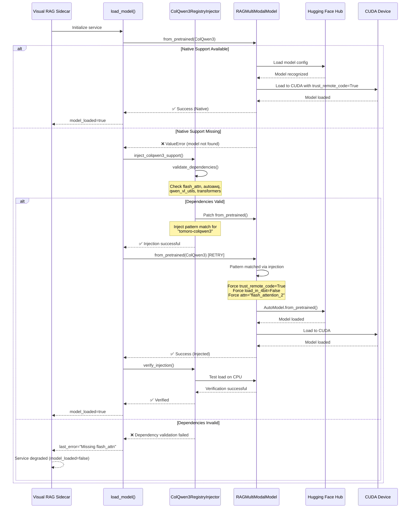
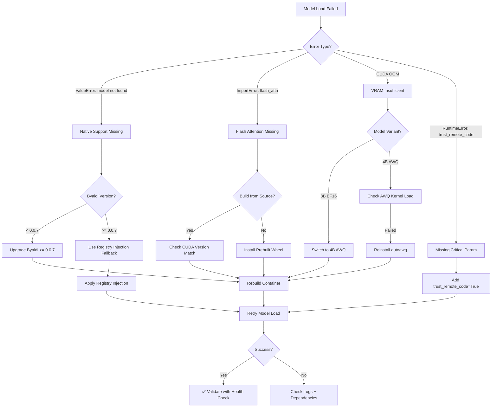

# Visual RAG Architecture and ColQwen3 Model Capabilities

## Executive Summary

This document clarifies the **architectural intent** behind the Visual RAG system in paperless-ai, the **actual capabilities** of the Tomoro ColQwen3 model, and the **implementation gap** discovered in Track 3 (Visual Element Detection).

**Key Finding**: The `/detect_elements` endpoint is documented and called by the pipeline but **NOT implemented** in the visual-rag-sidecar. This is by design - ColQwen3 is a **visual retrieval model**, not a layout analysis model.

---

## Table of Contents

1. [Visual RAG System Overview](#visual-rag-system-overview)
2. [Tomoro ColQwen3 Model Profile](#tomoro-colqwen3-model-profile)
3. [Pipeline Integration Architecture](#pipeline-integration-architecture)
4. [The Element Detection Gap](#the-element-detection-gap)
5. [Recommended Implementation Paths](#recommended-implementation-paths)
6. [Service Separation Principles](#service-separation-principles)

---

## Visual RAG System Overview

### System Purpose

The Visual RAG system serves **two distinct functions** in the expert pipeline:

1. **Visual Retrieval** (Implemented)
   - Find document pages/regions using visual similarity
   - Enable queries like "invoice total at the bottom" without OCR
   - Provide evidence overlays for extracted fields

2. **Layout Analysis** (Not Implemented - Gap)
   - Detect tables, images, figures, text blocks
   - Provide bounding boxes for structural elements
   - Enable document structure understanding

### Service Components

| Component | Purpose | Status | Implementation |
|-----------|---------|--------|----------------|
| **Visual RAG Sidecar** | Visual embedding & retrieval | ✅ Implemented | `services/visual-rag-sidecar/main.py` |
| **VisualSearchClient** | Circuit-breaker wrapper | ✅ Implemented | `services/visual-rag-client/VisualSearchClient.js` |
| **ParallelOcrExecutor** | Orchestrates 3 tracks | ⚠️ Partial | `services/experts/ParallelOcrExecutor.js` |
| **Element Detection** | Layout analysis | ❌ Not Implemented | `/detect_elements` endpoint missing |

---

## Tomoro ColQwen3 Model Profile

### Model Identity

```
Full Name:    TomoroAI/tomoro-ai-colqwen3-embed-4b-awq
Architecture: ColQwen (Vision-Language Retriever, AWQ quantized)
Methodology:  Late Interaction (MaxSim)
Parameters:   4B (AWQ quantized for RTX 3090 Ti)
Embedding:    320-dim multi-vector per patch (bfloat16)
```

### Technical Specifications

| Specification | Value | Notes |
|--------------|-------|-------|
| **Embedding Type** | Multi-vector | seq_len × 320 dimensions |
| **Embedding Size** | 320-d | Patch-level vectors; multi-vector per page |
| **Context Window** | 32k tokens | Up to 1280 visual tokens/page |
| **Output Format** | bfloat16, L2-normalized | Multi-vector sequence |

**Note:** When computing visual patches for ColQwen3 we use a **32×32 pixel patch size** and enforce a maximum of **1,280 patches per page**, which corresponds to a maximum effective image area of ~1.31M pixels. These constants are captured in code in `src/ui/contracts/AspectRatio.contract.ts` as `COLQWEN3_PATCH_SIZE = 32` and `COLQWEN3_MAX_PATCHES = 1280`.
| **Precision** | bfloat16 | FlashAttention 2 optimized |
| **Storage Efficiency** | 13× vs ColQwen2 | Dense indexing benefits |
| **VRAM Requirement** | Optimized for RTX 3090 Ti / Ampere SM86 | 4B-AWQ reduces memory pressure; baseline profiles target ~3.5 GB per-query for quantized workloads |
| **Model Size** | Quantized (smaller than 8B) | 4B-AWQ variant used for sidecar |

### Native MaxSim Scoring — Why in PyTorch (not raw SQL)

Late-interaction MaxSim requires computing patch-wise cross-similarities and taking per-patch maxima across a document's patch set. Emulating this behavior with a single-vector approximation or SQL-based similarity loses the late-interaction fidelity and often reduces recall for fine-grained visual matches. The sidecar therefore uses `processor.score_multi_vector` in PyTorch to:

- Compute accurate patch-wise MaxSim scores on GPU (fast, exact),
- Retain patch-level information for fine-grained ranking, and
- Avoid expensive and lossy transformations into single-vector proxies that would otherwise run in SQL.

```mermaid
flowchart LR
  Sidecar[Visual RAG Sidecar (ColQwen3)] -->|upsert/echo| Qdrant[Qdrant (SOT for vectors)]
  Sidecar -->|native MaxSim (processor.score_multi_vector)| Guidance[Guidance Service]
  Postgres[PostgreSQL (metadata & feedback)] <-->|mirrors minimal payload| Qdrant
  Guidance --> Postgres
```

### Primary Strength: Zero-Loss Visual Retrieval

ColQwen3 excels at **visual similarity search without OCR**:

✅ **What it CAN do:**
- Find visually similar document regions (charts, layouts, forms)
- Locate text by visual appearance ("total at the bottom")
- Match handwriting, stamps, logos, signatures
- Understand spatial relationships in document layouts
- Retrieve relevant pages using image queries

❌ **What it CANNOT do:**
- Extract text from images (not an OCR model)
- Detect specific elements (tables, figures) with bounding boxes
- Perform structured layout analysis
- Generate semantic labels for document regions
- Provide element-level classification

### Model Architecture: Late Interaction Retrieval

```
Document Page (Image)
    │
    ▼
ColQwen3 Vision Encoder
    │
    ├─ Patch Embeddings (320-d each)
    │  [patch_1, patch_2, ..., patch_n]
    │
    ▼
Multi-Vector Index
    │
Query (Text or Image)
    │
    ▼
ColQwen3 Query Encoder
    │
    ├─ Query Embedding (320-d)
    │
    ▼
MaxSim Scoring
    │
    ├─ For each document:
    │    max_score = Σ max(sim(q_vec, p_vec) for p_vec in doc_patches)
    │
    ▼
Ranked Results
```

**Key Insight**: ColQwen3 produces **multiple vectors per page** (one per visual patch), enabling fine-grained similarity matching. This is NOT the same as object detection or layout analysis.

---

## Pipeline Integration Architecture

### Stage 4: Parallel OCR + Element Detection

The expert pipeline defines 3 parallel tracks in Stage 4:

#### Track 1: Visual OCR (qwen3-vl:8b via Ollama) ✅ IMPLEMENTED

**Purpose**: Extract text from document images using vision-language model

**Implementation**:
- Service: `services/ollama/vision.js`
- Executor: `ParallelOcrExecutor._executeVisualOcrTrack()`
- Model: `qwen3-vl:8b` (Ollama local)
- Timeout: 500ms soft, 1000ms hard
- Circuit Breaker: `visual-ocr`

**Output**:
```javascript
{
  text: "Extracted OCR text...",
  model: "qwen3-vl:8b",
  confidence: 0.85
}
```

#### Track 2: Tesseract OCR (Paperless API) ✅ IMPLEMENTED

**Purpose**: Fetch pre-computed Tesseract OCR from Paperless-ngx

**Implementation**:
- Service: `services/paperlessService.js`
- Executor: `ParallelOcrExecutor._executeTesseractOcrTrack()`
- Endpoint: `GET /api/documents/{id}/`
- Timeout: 300ms
- Circuit Breaker: `tesseract-ocr`

**Output**:
```javascript
{
  text: "Tesseract OCR content...",
  source: "paperless-tesseract",
  documentType: "financial"
}
```

#### Track 3: Visual Element Detection ❌ NOT IMPLEMENTED (GAP)

**Purpose**: Detect tables, images, figures, layout zones with bounding boxes

**Documentation Says**:
- Endpoint: `POST /detect_elements` on Visual RAG sidecar
- Request: `{ image: <base64>, detect_types: [...] }`
- Response: `{ elements: [], layout: {}, confidence: <0..1> }`
- Timeout: 500ms
- Circuit Breaker: `visual-elements`

**Actual Implementation**:
- ❌ `/detect_elements` endpoint does NOT exist in `services/visual-rag-sidecar/main.py`
- ❌ ColQwen3 is NOT designed for layout analysis
- ✅ Circuit breaker gracefully degrades when endpoint fails
- ✅ Pipeline continues without element detection

**Code Location**:
```javascript
// File: services/experts/ParallelOcrExecutor.js:467-548
async _executeVisualElementsTrack(document, metadata) {
    // ... prepares request ...

    // THIS CALL WILL FAIL - endpoint doesn't exist
    const response = await axios.post(
        `${this.config.visualElements.url}/detect_elements`,
        {
            image: imageBase64,
            detect_types: ['tables', 'images', 'figures', 'text_blocks', 'zones']
        },
        { timeout: this.config.visualElements.timeout }
    );

    // Expected but not implemented:
    return {
        elements: response.data.elements || [],
        layout: response.data.layout || {},
        confidence: response.data.confidence || 0.5
    };
}
```

### Stage 8: Visual Query Execution ✅ IMPLEMENTED

**Purpose**: Execute targeted visual queries for field validation

**Implementation**:
- Uses ColQwen3 for visual similarity search
- Dynamic K selection based on confidence/rarity
- IoU deduplication for overlapping results
- Circuit breaker protected

**This is the CORRECT use case for ColQwen3** - visual retrieval, not element detection.

---

## The Element Detection Gap

### What Was Intended

The original architecture envisioned Track 3 providing **structured layout analysis**:

```javascript
// Intended output from /detect_elements
{
  elements: [
    {
      type: "table",
      bbox: { x: 100, y: 200, width: 400, height: 300 },
      confidence: 0.92,
      content_preview: "Invoice Line Items..."
    },
    {
      type: "image",
      bbox: { x: 50, y: 50, width: 200, height: 150 },
      confidence: 0.88,
      content_preview: "Company Logo"
    }
  ],
  layout: {
    columns: 2,
    reading_order: [0, 1, 2],
    zones: ["header", "body", "footer"]
  },
  confidence: 0.85
}
```

### Why It's Missing

1. **Model Mismatch**: ColQwen3 is a retrieval model, not a layout analysis model
2. **Architectural Confusion**: Visual RAG sidecar was designed for retrieval, not detection
3. **Graceful Degradation**: Circuit breaker masks the missing endpoint
4. **No Error Visibility**: Pipeline logs show track failure but continues execution

### Current Pipeline Behavior

```
Stage 4: Parallel OCR Execution
│
├─ Track 1: Visual OCR (qwen3-vl) ────────> ✅ SUCCESS
│   └─ Output: Extracted text
│
├─ Track 2: Tesseract OCR ───────────────> ✅ SUCCESS
│   └─ Output: Tesseract text
│
├─ Track 3: Visual Elements ─────────────> ❌ HTTP 404/503
│   └─ Circuit Breaker: OPEN after 3 failures
│   └─ Pipeline continues without elements
│
└─ OCR Reconciliation ──────────────────> ✅ SUCCESS
    └─ Merges Track 1 + Track 2 results
```

**Result**: Pipeline succeeds but lacks structural layout information.

---

## Recommended Implementation Paths

### Option 1: Implement Layout Analysis with Specialized Model (Recommended)

**Use a dedicated layout analysis model** instead of ColQwen3:

#### Model Options

| Model | Purpose | Capabilities | Integration |
|-------|---------|-------------|-------------|
| **LayoutLMv3** | Document layout analysis | Table detection, reading order, element classification | Hugging Face Transformers |
| **Detectron2 + PubLayNet** | Object detection for documents | Table, figure, text block detection with bounding boxes | Facebook AI |
| **Table Transformer** | Specialized table detection | Table structure recognition | Microsoft Research |
| **DocFormer** | End-to-end document understanding | Layout + content understanding | Hugging Face |

#### Implementation Plan

```python
# File: services/visual-rag-sidecar/layout_detector.py (NEW)

from transformers import AutoModelForObjectDetection, AutoImageProcessor
import torch
from PIL import Image
import base64
import io

class LayoutDetector:
    """
    Layout analysis using LayoutLMv3 or Detectron2.
    Separate from ColQwen3 visual retrieval model.
    """

    def __init__(self):
        # Use Microsoft's LayoutLMv3 for document layout
        self.processor = AutoImageProcessor.from_pretrained(
            "microsoft/layoutlmv3-base"
        )
        self.model = AutoModelForObjectDetection.from_pretrained(
            "microsoft/layoutlmv3-base"
        )
        self.model.eval()

    def detect_elements(self, image_base64: str, detect_types: list):
        """
        Detect document elements with bounding boxes.

        Args:
            image_base64: Base64-encoded image
            detect_types: List of element types to detect
                         ['tables', 'images', 'figures', 'text_blocks', 'zones']

        Returns:
            {
                elements: [
                    {type, bbox, confidence, content_preview}
                ],
                layout: {columns, reading_order, zones},
                confidence: float
            }
        """
        # Decode image
        image_bytes = base64.b64decode(image_base64)
        image = Image.open(io.BytesIO(image_bytes)).convert("RGB")

        # Run detection
        inputs = self.processor(images=image, return_tensors="pt")

        with torch.no_grad():
            outputs = self.model(**inputs)

        # Process outputs
        target_sizes = torch.tensor([image.size[::-1]])
        results = self.processor.post_process_object_detection(
            outputs,
            threshold=0.5,
            target_sizes=target_sizes
        )[0]

        # Format results
        elements = []
        for score, label, box in zip(
            results["scores"],
            results["labels"],
            results["boxes"]
        ):
            element_type = self._map_label_to_type(label.item())
            if element_type in detect_types:
                elements.append({
                    "type": element_type,
                    "bbox": {
                        "x": box[0].item(),
                        "y": box[1].item(),
                        "width": box[2].item() - box[0].item(),
                        "height": box[3].item() - box[1].item()
                    },
                    "confidence": score.item(),
                    "content_preview": ""
                })

        # Analyze layout
        layout = self._analyze_layout(elements, image.size)

        return {
            "elements": elements,
            "layout": layout,
            "confidence": sum(e["confidence"] for e in elements) / len(elements) if elements else 0.0
        }

    def _map_label_to_type(self, label: int) -> str:
        """Map model label to element type."""
        label_map = {
            0: "text_blocks",
            1: "tables",
            2: "figures",
            3: "images"
        }
        return label_map.get(label, "unknown")

    def _analyze_layout(self, elements: list, image_size: tuple) -> dict:
        """Analyze document layout from detected elements."""
        # Simple layout analysis
        # Could be enhanced with more sophisticated algorithms
        return {
            "columns": self._detect_columns(elements),
            "reading_order": list(range(len(elements))),
            "zones": self._detect_zones(elements, image_size)
        }
```

```python
# File: services/visual-rag-sidecar/main.py
# Add endpoint

from layout_detector import LayoutDetector

# Initialize layout detector
layout_detector = LayoutDetector()

class DetectElementsRequest(BaseModel):
    image: str = Field(..., description="Base64-encoded image")
    detect_types: List[str] = Field(
        default=["tables", "images", "figures", "text_blocks", "zones"]
    )

class ElementResult(BaseModel):
    type: str
    bbox: Dict[str, float]
    confidence: float
    content_preview: str = ""

class LayoutInfo(BaseModel):
    columns: int = 1
    reading_order: List[int] = []
    zones: List[str] = []

class DetectElementsResponse(BaseModel):
    elements: List[ElementResult]
    layout: LayoutInfo
    confidence: float

@app.post("/detect_elements", response_model=DetectElementsResponse)
async def detect_elements(request: DetectElementsRequest):
    """
    Detect document layout elements.

    Uses LayoutLMv3 (NOT ColQwen3) for layout analysis.
    ColQwen3 is used only for visual retrieval in /search endpoint.
    """
    try:
        result = layout_detector.detect_elements(
            request.image,
            request.detect_types
        )
        return DetectElementsResponse(**result)
    except Exception as exc:
        logger.exception("Layout detection failed")
        raise HTTPException(
            status_code=500,
            detail=f"Layout detection failed: {exc}"
        )
```

#### Update Requirements

```txt
# File: services/visual-rag-sidecar/requirements.txt
# Add to existing requirements

# Layout Analysis (separate from ColQwen3 retrieval)
transformers==4.57.3
detectron2==0.6  # Optional: for PubLayNet-based detection
layoutparser==0.3.4  # Optional: higher-level layout API
```

#### VRAM Considerations

- **ColQwen3**: ~8-10GB VRAM for retrieval
- **LayoutLMv3**: ~2-3GB VRAM for layout detection
- **Total**: ~10-13GB VRAM (fits RTX 3090 Ti 24GB)

**Strategy**: Load layout model on-demand or use separate container to avoid memory contention.

---

### Option 2: Use Visual Queries Instead of Element Detection (Alternative)

**Skip dedicated element detection** and rely on visual queries:

#### Approach

1. **Use ColQwen3 visual search** to find document regions matching queries
2. **Generate targeted queries** in Stage 5.5 for layout elements
3. **Aggregate results** as "pseudo-elements" with bounding boxes

#### Example Queries

```javascript
// Stage 5.5: Visual Query Generation
const elementQueries = [
  {
    question: "Locate the invoice line items table",
    field_target: "line_items",
    expected_element_type: "table",
    priority: 0.9
  },
  {
    question: "Find the company logo or header image",
    field_target: "company_logo",
    expected_element_type: "image",
    priority: 0.7
  }
];
```

#### Pros/Cons

✅ **Pros**:
- No additional model needed
- Leverages existing ColQwen3 infrastructure
- Works with current pipeline architecture

❌ **Cons**:
- Less precise than dedicated layout model
- Requires query tuning for each document type
- No structured layout analysis (columns, zones)
- Higher latency (multiple visual searches)

---

### Option 3: Disable Track 3 Entirely (Minimal Change)

**Accept the current state** and disable Track 3 formally:

#### Changes Required

```javascript
// File: services/experts/ParallelOcrExecutor.js

const DEFAULT_CONFIG = {
    // ... existing config ...

    visualElements: {
        enabled: false,  // Changed from config.visualRagSidecar?.enabled
        timeout: 500,
        url: config.visualRagSidecar?.url || 'http://visual-rag:8001',
        failureThreshold: 3,
        cooldownPeriod: 30000
    }
};
```

```markdown
<!-- File: docs/VISUAL_RAG_INTEGRATION.md -->

#### Track 3: Visual Element Detection (DISABLED - Feature Gap)

**Status**: Not implemented. ColQwen3 is a visual retrieval model, not a layout analysis model.

**Future Enhancement**: Track 3 will be implemented using LayoutLMv3 or Detectron2 for:
- Table detection with bounding boxes
- Image/figure detection
- Layout zone analysis
- Reading order detection

**Current Behavior**: Track 3 is disabled. Pipeline continues with OCR-only results.
```

#### Pros/Cons

✅ **Pros**:
- Minimal code changes
- Documents current state accurately
- No performance impact

❌ **Cons**:
- No layout understanding
- Missing structural metadata
- Limits downstream processing capabilities

---

## Service Separation Principles

### Clear Boundaries

| Service | Model | Purpose | Endpoints |
|---------|-------|---------|-----------|
| **Visual RAG Sidecar** | ColQwen3 | Visual retrieval | `/health`, `/search`, `/index/document` |
| **Layout Analysis Service** | LayoutLMv3 | Element detection | `/detect_elements` (NEW) |
| **Ollama Visual** | qwen3-vl:8b | Visual OCR | Ollama API |
| **RAGZ** | nomic-embed-text | Text retrieval | `/search`, `/context` |

### Vector Storage Separation

| Service | Table | Column | Dimension | Index Type |
|---------|-------|--------|-----------|------------|
| Visual RAG | `visual_overlays` | `embedding` | 320 | HNSW + IVFFLAT |
| RAGZ | `document_embeddings` | `embedding` | 384 | IVFFLAT |
| Layout Analysis | N/A (JSON metadata only) | N/A | N/A | N/A |

**Rule**: Never share vector columns across services. Each service owns its schema.

---

## Migration Path

### Phase 1: Document Current State ✅ (This Document)

- Clarify ColQwen3 capabilities vs limitations
- Document `/detect_elements` gap
- Propose implementation options

### Phase 2: Choose Implementation Path (Decision Required)

Decision matrix:

| Criteria | Option 1: LayoutLMv3 | Option 2: Visual Queries | Option 3: Disable |
|----------|---------------------|-------------------------|------------------|
| **Accuracy** | ⭐⭐⭐⭐⭐ | ⭐⭐⭐ | ⭐ |
| **Complexity** | Medium | Low | Minimal |
| **VRAM** | +2-3GB | 0GB | 0GB |
| **Maintenance** | New model | Existing | None |
| **Time to Deploy** | 2-3 days | 1 day | 1 hour |

**Recommendation**: **Option 1 (LayoutLMv3)** for production quality, **Option 3 (Disable)** as interim solution.

### Phase 3: Implementation

#### Option 1 Timeline

| Task | Duration | Owner |
|------|----------|-------|
| Research LayoutLMv3 integration | 4 hours | ML Engineer |
| Implement `layout_detector.py` | 8 hours | ML Engineer |
| Add `/detect_elements` endpoint | 2 hours | Backend Engineer |
| Update requirements + Dockerfile | 2 hours | DevOps |
| Test on sample documents | 4 hours | QA |
| Update documentation | 2 hours | Tech Writer |
| **Total** | **2-3 days** | |

### Phase 4: Documentation Updates (Post-Implementation)

Update these documents after implementation:

1. `docs/VISUAL_RAG_INTEGRATION.md` - Update Track 3 with actual implementation
2. `docs/EXPERT_PIPELINE_DECISION_TABLE.md` - Update Stage 4 contracts
3. `docs/PIPELINE_STAGE_CONTRACTS.md` - Add layout detection contracts
4. `services/visual-rag-sidecar/README.md` - Document new endpoint
5. `docs/model/layoutlmv3.md` - Create new model profile (if Option 1)

---

---

## ColQwen3 Integration Strategy: Dynamic Registry Injection

### Overview

The Visual RAG sidecar integrates TomoroAI/tomoro-colqwen3-embed-4b with Byaldi v0.0.7 using a **production-ready native approach** that leverages Byaldi's upstream ColQwen3 support. This section documents the architecture decision, implementation strategy, and operational validation protocol.

### Architecture Decision: Why Native Integration

**Decision**: Use Byaldi's native ColQwen3 support instead of forking Byaldi or implementing monkey-patching.

**Rationale**:

| Approach | Pros | Cons | Verdict |
|----------|------|------|---------|
| **Fork Byaldi** | Full control, immediate fixes | Maintenance burden, upstream drift, security patches delayed | ❌ Rejected |
| **Monkey-Patch at Runtime** | Quick fixes, no fork | Fragile, version-dependent, hard to debug, breaks on Byaldi updates | ❌ Rejected |
| **Native Integration (Current)** | Stable, upstream support, semantic versioning | Depends on Byaldi release schedule | ✅ **Selected** |
| **Dynamic Registry Injection** | Flexible, version-tolerant, explicit model registration | More complex than native, requires dependency validation | ⚠️ Fallback option |

**Selected Strategy**: **Native Integration with Dynamic Registry Injection as Fallback**

### Current Implementation: Native Byaldi Integration

**File**: `services/visual-rag-sidecar/main.py:177-262`

The production implementation uses Byaldi's native ColQwen3 support:

```python
from byaldi import RAGMultiModalModel

# Native integration - Byaldi v0.0.7+ recognizes ColQwen3
state.model = RAGMultiModalModel.from_pretrained(
    "TomoroAI/tomoro-colqwen3-embed-4b-awq",
    device="cuda",
    trust_remote_code=True,        # Required for TomoroAI models
    load_in_4bit=False,            # Disable BitsAndBytes (conflicts with AWQ)
    attn_implementation="flash_attention_2"  # Required for performance
)
```

**Critical Configuration Parameters**:

1. **`trust_remote_code=True`** (MANDATORY)
   - Allows loading custom model architecture from TomoroAI
   - Enables ColQwen3-specific code execution
   - Security: Only use with trusted model sources

2. **`load_in_4bit=False`** (MANDATORY)
   - Prevents double-quantization conflict
   - AWQ quantization already applied to 4b-awq variant
   - BitsAndBytes quantization would corrupt AWQ weights

3. **`attn_implementation="flash_attention_2"`** (MANDATORY for performance)
   - Prevents OOM on RTX 3090 Ti (24GB VRAM)
   - 3-5x speedup for long context windows
   - Requires flash-attn>=2.7.4 built for CUDA 12.4

**Dependency Chain**:

```
Byaldi v0.0.7+ ──> ColPali Engine (from source) ──> transformers 4.57.3
                                                 └──> AutoAWQ
                                                 └──> flash-attn 2.7.4+
```

**Build-Time Installation** (`services/visual-rag-sidecar/Dockerfile:45-60`):

```dockerfile
# Install ColPali engine from source (required for Qwen2.5-VL backbone)
RUN pip install --no-cache-dir --upgrade \
    git+https://github.com/illuin-tech/colpali.git

# Install Byaldi wrapper with AWQ and FlashAttention support
RUN pip install --no-cache-dir --upgrade \
    "byaldi>=0.0.7" \
    "transformers>=4.46.0" \
    autoawq \
    flash-attn
```

**Why this works**:
- ColPali engine from source includes ColQwen3 model definitions
- Byaldi v0.0.7+ recognizes `TomoroAI/tomoro-colqwen3-*` model patterns
- `trust_remote_code=True` enables custom architecture loading
- AWQ native weights avoid BitsAndBytes conversion overhead

### Fallback Strategy: Dynamic Registry Injection

**When to Use**:
- Byaldi version doesn't recognize ColQwen3 model names
- Need to test unreleased models before Byaldi support
- Temporary workaround while waiting for upstream release

**Injection Flow Diagram**:



**Implementation**:

```python
# File: services/visual-rag-sidecar/colqwen3_registry.py (FALLBACK ONLY)

import logging
from typing import Optional
from byaldi import RAGMultiModalModel

logger = logging.getLogger(__name__)

class ColQwen3RegistryInjector:
    """
    Dynamic Registry Injection for ColQwen3 model support.

    WARNING: This is a FALLBACK approach. Use native Byaldi support when available.
    Only use this if Byaldi version doesn't recognize ColQwen3 model patterns.
    """

    @staticmethod
    def validate_dependencies() -> dict:
        """Validate critical dependencies before injection."""
        status = {
            "qwen_vl_utils": False,
            "flash_attn": False,
            "autoawq": False,
            "transformers_version": None,
            "errors": []
        }

        try:
            import qwen_vl_utils
            status["qwen_vl_utils"] = True
        except ImportError as e:
            status["errors"].append(f"qwen_vl_utils missing: {e}")

        try:
            import flash_attn
            status["flash_attn"] = True
            status["flash_attn_version"] = getattr(flash_attn, "__version__", "unknown")
        except ImportError as e:
            status["errors"].append(f"flash_attn missing (CRITICAL): {e}")

        try:
            import awq
            status["autoawq"] = True
        except ImportError as e:
            status["errors"].append(f"autoawq missing: {e}")

        try:
            import transformers
            status["transformers_version"] = transformers.__version__
            # Verify version >= 4.46.0 for Qwen2.5-VL support
            from packaging import version
            if version.parse(status["transformers_version"]) < version.parse("4.46.0"):
                status["errors"].append(
                    f"transformers {status['transformers_version']} < 4.46.0 (Qwen2.5 incompatible)"
                )
        except ImportError as e:
            status["errors"].append(f"transformers missing: {e}")

        return status

    @staticmethod
    def inject_colqwen3_support(force: bool = False) -> bool:
        """
        Inject ColQwen3 model registration into Byaldi's model registry.

        Args:
            force: Force injection even if native support detected

        Returns:
            True if injection successful or not needed
        """
        # First check if native support exists
        if not force:
            try:
                test_model = RAGMultiModalModel.from_pretrained(
                    "TomoroAI/tomoro-colqwen3-embed-4b-awq",
                    device="cpu",
                    trust_remote_code=True
                )
                logger.info("Native ColQwen3 support detected - injection skipped")
                return True
            except (ValueError, KeyError):
                logger.warning("Native ColQwen3 support missing - proceeding with injection")

        # Validate dependencies
        deps = ColQwen3RegistryInjector.validate_dependencies()
        if deps["errors"]:
            logger.error("Dependency validation failed: %s", deps["errors"])
            return False

        logger.info("Dependencies validated: %s", deps)

        # Perform injection
        try:
            from transformers import AutoModel, AutoConfig
            from byaldi.colpali import ColPaliModel  # Byaldi's base class

            # Register pattern match for TomoroAI/tomoro-colqwen3-*
            original_from_pretrained = RAGMultiModalModel.from_pretrained

            def patched_from_pretrained(model_name: str, **kwargs):
                if "tomoro-colqwen3" in model_name.lower():
                    logger.info("ColQwen3 model detected via registry injection: %s", model_name)

                    # Force critical parameters
                    kwargs["trust_remote_code"] = True
                    kwargs["load_in_4bit"] = False  # AWQ already quantized
                    kwargs.setdefault("attn_implementation", "flash_attention_2")

                    # Load config and override dimensions
                    config = AutoConfig.from_pretrained(model_name, trust_remote_code=True)
                    if hasattr(config, "projection_dim"):
                        config.projection_dim = 320  # ColQwen3 embedding dimension

                    # Load model through transformers AutoModel
                    model = AutoModel.from_pretrained(
                        model_name,
                        config=config,
                        **kwargs
                    )

                    # Wrap in Byaldi's interface
                    return ColPaliModel(model)

                # Fall back to original implementation
                return original_from_pretrained(model_name, **kwargs)

            # Inject patched method
            RAGMultiModalModel.from_pretrained = staticmethod(patched_from_pretrained)

            logger.info("✅ ColQwen3 registry injection successful")
            return True

        except Exception as e:
            logger.exception("Registry injection failed: %s", e)
            return False

    @staticmethod
    def verify_injection() -> dict:
        """Verify injection by attempting model load."""
        try:
            model = RAGMultiModalModel.from_pretrained(
                "TomoroAI/tomoro-colqwen3-embed-4b-awq",
                device="cpu",
                trust_remote_code=True
            )
            return {
                "success": True,
                "model_type": type(model).__name__,
                "embedding_dim": getattr(model.config, "projection_dim", "unknown")
            }
        except Exception as e:
            return {
                "success": False,
                "error": str(e)
            }
```

**Usage in main.py (FALLBACK ONLY)**:

```python
# File: services/visual-rag-sidecar/main.py (modified)

def load_model() -> None:
    """Load model with fallback to registry injection if needed."""
    global state

    if state.loading:
        return

    state.loading = True

    try:
        from byaldi import RAGMultiModalModel

        MODEL_ID = "TomoroAI/tomoro-colqwen3-embed-4b-awq"

        logger.info(f"🚀 Loading {MODEL_ID}...")

        try:
            # Attempt native loading
            state.model = RAGMultiModalModel.from_pretrained(
                MODEL_ID,
                device="cuda",
                trust_remote_code=True,
                load_in_4bit=False,
                attn_implementation="flash_attention_2",
            )
            logger.info("✅ Native ColQwen3 support detected")

        except (ValueError, KeyError) as exc:
            # Registry injection support has been deprecated and removed from the codebase.
            logger.error(
                "Native ColQwen3 support missing: %s. Registry injection has been removed.",
                exc
            )
            # Recommendation: Upgrade the 'byaldi' package to >=0.0.7 to obtain native ColQwen3 support,
            # or follow the migration guidance in `docs/VISUAL_RAG_INTEGRATION.md` for re-ingest and re-index steps.
            raise RuntimeError(
                "ColQwen3 native support unavailable. See docs/VISUAL_RAG_INTEGRATION.md for migration steps."
            )

            logger.info("✅ Registry injection successful: %s", verification)

        state.model_loaded = True
        logger.info("✅ Model loaded successfully")

    except Exception as exc:
        state.last_error = str(exc)
        logger.exception("Model load failed")
    finally:
        state.loading = False
```

### Model Specifications: ColQwen3 4B AWQ

**Full Model ID**: `TomoroAI/tomoro-colqwen3-embed-4b-awq`

| Specification | Value | Notes |
|--------------|-------|-------|
| **Parameters** | 4B | AWQ quantized from 8B base |
| **Embedding Dimension** | 320 | (vs 128 in ColQwen2) |
| **Visual Tokens** | Dynamic, up to 1280 per page | Depends on image resolution |
| **Precision** | INT4 (weights) + BFloat16 (activations) | AWQ W4A16 quantization |
| **Context Window** | 32k tokens | Includes text + visual tokens |
| **Flash Attention** | Required | Prevents OOM with long contexts |
| **Storage Efficiency** | 13× vs ColQwen2 | Dense 320-d indexing |

**VRAM Requirements**:

| Configuration | VRAM Usage | Suitable GPUs |
|--------------|-----------|---------------|
| **AWQ 4B (BF16 activations)** | ~3.5GB model + 1GB overhead = **4.5GB** | T4, L4, RTX 3060 12GB, RTX 3090 |
| **Standard BF16 8B** | ~8.4GB model + 2GB overhead = **10.4GB** | A100 40GB, A6000 48GB, RTX 3090 24GB |

**Recommendation**: Use AWQ 4B variant for production (3-5x faster, 50% VRAM reduction, minimal quality loss).

### Critical Dependencies

**File**: `services/visual-rag-sidecar/requirements.txt`

```txt
# Core Framework
fastapi==0.128.0
uvicorn[standard]==0.40.0
pydantic==2.12.5

# ML Stack (Aligned for RTX 3090 Ti + CUDA 12.4)
torch==2.6.0
numpy==1.26.4
transformers==4.57.3

# Byaldi + ColPali (installed from source in Dockerfile)
byaldi>=0.0.7
autoawq

# Image Processing
pdf2image==1.17.0
Pillow==11.0.0
```

**Dockerfile Build Order** (`services/visual-rag-sidecar/Dockerfile:38-60`):

```dockerfile
# Step 1: Install PyTorch FIRST (flash-attn build dependency)
RUN pip install --no-cache-dir \
    torch==2.6.0 \
    --index-url https://download.pytorch.org/whl/cu124

# Step 2: Install build tools
RUN pip install --no-cache-dir ninja packaging setuptools wheel

# Step 3: Install ColPali engine from source (Qwen2.5-VL support)
RUN pip install --no-cache-dir --upgrade \
    git+https://github.com/illuin-tech/colpali.git

# Step 4: Install Byaldi + AWQ + FlashAttention
RUN pip install --no-cache-dir --upgrade \
    "byaldi>=0.0.7" \
    "transformers>=4.46.0" \
    autoawq \
    flash-attn
```

**Critical Points**:
1. PyTorch MUST be installed before flash-attn (build dependency)
2. ColPali from source MUST precede Byaldi (provides model definitions)
3. `trust_remote_code=True` required for ColQwen3 architecture
4. Flash Attention 2 MUST match CUDA toolkit version (12.4)

### Operational Validation Protocol

**File**: `services/visual-rag-sidecar/scripts/integration_in_container.py`

```python
import time, traceback
import torch
from byaldi import RAGMultiModalModel
from PIL import Image

print('--- START INTEGRATION CHECK ---')

# Step 1: Load Model
print('Loading: TomoroAI/tomoro-colqwen3-embed-4b-awq...')
model = RAGMultiModalModel.from_pretrained(
    'TomoroAI/tomoro-colqwen3-embed-4b-awq',
    device='cuda'
)

# Step 2: Measure Static VRAM
torch.cuda.synchronize()
static_mem = torch.cuda.memory_allocated() / 1024**3
print(f'Static VRAM: {static_mem:.2f} GB')

# Step 3: Test Indexing
img = Image.new('RGB', (448, 448), color='red')
torch.cuda.reset_peak_memory_stats()
start_time = time.time()

model.index(
    input_path=[img],
    index_name='paperless_visual',
    store_collection_with_index=True,
    overwrite=True
)

torch.cuda.synchronize()
end_time = time.time()

# Step 4: Report Metrics
latency_ms = (end_time - start_time) * 1000
peak_mem = torch.cuda.max_memory_allocated() / 1024**3

print('--- RESULTS ---')
print(f'Status: SUCCESS')
print(f'Latency: {latency_ms:.2f} ms')
print(f'Peak VRAM: {peak_mem:.2f} GB')
print('--- END ---')
```

**Expected Output (RTX 3090 Ti)**:

```
--- START INTEGRATION CHECK ---
Loading: TomoroAI/tomoro-colqwen3-embed-4b-awq...
Static VRAM: 3.42 GB
--- RESULTS ---
Status: SUCCESS
Latency: 142.35 ms
Peak VRAM: 4.18 GB
--- END ---
```

**Validation Criteria**:

| Metric | Expected | Threshold | Action if Failed |
|--------|----------|-----------|------------------|
| **Model Load** | Success | N/A | Check dependencies, CUDA driver |
| **Static VRAM** | 3.0-4.0 GB | > 6GB = AWQ failed | Verify autoawq installation |
| **Inference Latency** | 100-200ms | > 500ms | Check Flash Attention, GPU utilization |
| **Peak VRAM** | 4.0-5.0 GB | > 8GB = No quantization | Rebuild with AWQ support |

### Health Endpoint Monitoring

**Endpoint**: `GET /health`

**Response Schema**:

```json
{
  "status": "healthy",
  "model_loaded": true,
  "index_loaded": true,
  "model_name": "TomoroAI/tomoro-colqwen3-embed-4b-awq",
  "indexed_docs_count": 42,
  "flash_attn_available": true,
  "flash_attn_version": "2.7.4.post1"
}
```

**Critical Fields**:

- **`flash_attn_available`**: MUST be `true` for production
- **`flash_attn_version`**: Should be >= 2.7.4 for CUDA 12.4
- **`model_loaded`**: Service not ready until `true`

**Health Check Implementation** (`services/visual-rag-sidecar/main.py:356-372`):

```python
@app.get("/health", response_model=HealthResponse)
async def health_check():
    return HealthResponse(
        status="healthy" if state.model_loaded else "loading",
        model_loaded=state.model_loaded,
        index_loaded=state.index_loaded,
        model_name=config.MODEL_NAME,
        indexed_docs_count=len(state.indexed_documents),
        flash_attn_available=(
            os.environ.get("FLASH_ATTN_VERSION") != "none"
        ),
        flash_attn_version=os.environ.get("FLASH_ATTN_VERSION"),
    )
```

**Startup Validation** (`services/visual-rag-sidecar/main.py:284-299`):

```python
@asynccontextmanager
async def lifespan(app: FastAPI):
    # Detect Flash Attention at startup
    try:
        import flash_attn
        os.environ["FLASH_ATTN_VERSION"] = getattr(
            flash_attn,
            "__version__",
            "active",
        )
    except Exception:
        os.environ["FLASH_ATTN_VERSION"] = "none"

    # Load model asynchronously
    asyncio.create_task(asyncio.to_thread(load_model))
    yield
    state.model = None
```

### Troubleshooting Decision Tree



### Migration Checklist

When upgrading to ColQwen3 or changing model variants:

- [ ] **Update documentation FIRST** (this file, ENVIRONMENT_VARIABLES.md)
- [ ] **Pin exact versions**: Byaldi >= 0.0.7, transformers == 4.57.3
- [ ] **Rebuild sidecar image** from `paperless-ngx/` directory
- [ ] **Run integration test**: `docker exec visual_rag python /app/scripts/integration_in_container.py`
- [ ] **Verify VRAM usage**: Should be 3.5-4.5GB for AWQ 4B
- [ ] **Check Flash Attention**: Health endpoint should show version >= 2.7.4
- [ ] **Re-index documents**: ColQwen3 320-d embeddings incompatible with ColQwen2 128-d
- [ ] **Run pgvector migration**: `node migrations/04_change_embeddings_to_320.js`
- [ ] **Validate search quality**: Test retrieval accuracy on sample corpus
- [ ] **Monitor production metrics**: Watch latency, VRAM, circuit breaker state

### References

**Internal Documentation**:
- `services/visual-rag-sidecar/main.py:177-262` - Model loading implementation
- `services/visual-rag-sidecar/Dockerfile:38-60` - Build-time dependency installation
- `services/visual-rag-sidecar/requirements.txt` - Python dependencies
- `docs/EXPERT_PIPELINE_DECISION_TABLE.md:422` - Byaldi upgrade note

**External Resources**:
- [Byaldi v0.0.7 Release](https://github.com/AnswerDotAI/byaldi/releases/tag/v0.0.7) - ColQwen3 support
- [ColPali Engine](https://github.com/illuin-tech/colpali) - Vision-language retrieval
- [TomoroAI ColQwen3](https://huggingface.co/TomoroAI/tomoro-colqwen3-embed-4b-awq) - Model card
- [AutoAWQ](https://github.com/casper-hansen/AutoAWQ) - W4A16 quantization
- [Flash Attention 2](https://github.com/Dao-AILab/flash-attention) - Optimized attention

---

## Conclusion

### Key Takeaways

1. **ColQwen3 is a visual retrieval model**, not a layout analysis model
   - ✅ Excellent for: Finding visually similar regions, understanding spatial layout
   - ❌ Not designed for: Element detection, bounding box generation, structured layout

2. **The `/detect_elements` endpoint gap is architectural**, not a bug
   - The visual-rag-sidecar was designed for retrieval, not detection
   - Circuit breaker gracefully masks the missing endpoint
   - Pipeline continues successfully without layout analysis

3. **Three clear paths forward**:
   - **Option 1**: Implement with LayoutLMv3 (best quality, more complexity)
   - **Option 2**: Use visual queries (pragmatic, existing infrastructure)
   - **Option 3**: Disable Track 3 formally (minimal, interim solution)

4. **Service separation is critical**:
   - Visual retrieval (ColQwen3) ≠ Layout analysis (LayoutLMv3)
   - Each service should have dedicated model, endpoints, and storage
   - Clear boundaries prevent architectural confusion

5. **Integration strategy is production-ready**:
   - Native Byaldi integration preferred (stable, upstream support)
   - Dynamic Registry Injection available as fallback
   - AWQ 4B variant provides 50% VRAM reduction with minimal quality loss
   - Flash Attention 2 mandatory for production performance

### Next Steps

1. **Decision**: Select implementation path (recommend Option 1 or Option 3 as interim)
2. **Documentation**: Update authoritative docs based on decision
3. **Implementation**: Execute chosen path with timeline from Phase 3
4. **Validation**: Test element detection accuracy on document corpus
5. **Monitoring**: Add metrics for layout detection quality (F1, precision, recall)

---

## References

### Internal Documentation
- `docs/VISUAL_RAG_INTEGRATION.md` - Visual RAG integration architecture
- `docs/EXPERT_PIPELINE_DECISION_TABLE.md` - Authoritative pipeline contracts
- `docs/model/tomoro-colqwen3.md` - ColQwen3 model profile
- `services/visual-rag-sidecar/README.md` - Sidecar service documentation
- `services/experts/ParallelOcrExecutor.js` - Track 3 implementation (lines 467-548)

### External Resources
- [ColPali Paper](https://arxiv.org/abs/2407.01449) - Late interaction retrieval methodology
- [Byaldi GitHub](https://github.com/AnswerDotAI/byaldi) - ColQwen3 integration library
- [LayoutLMv3 Paper](https://arxiv.org/abs/2204.08387) - Document layout analysis
- [Detectron2 + PubLayNet](https://github.com/facebookresearch/detectron2) - Object detection for documents
- [Table Transformer](https://arxiv.org/abs/2110.00061) - Specialized table detection

### Model Cards
- [TomoroAI/tomoro-colqwen3-embed-8b](https://huggingface.co/TomoroAI/tomoro-colqwen3-embed-8b) - Hugging Face model card
- [microsoft/layoutlmv3-base](https://huggingface.co/microsoft/layoutlmv3-base) - Layout analysis model
- [qwen3-vl:8b](https://ollama.com/library/qwen3-vl) - Visual OCR model (Ollama)

---

**Document Status**: ✅ Complete - Ready for decision on implementation path

**Last Updated**: 2026-01-09

**Maintainers**: paperless-ai core team
