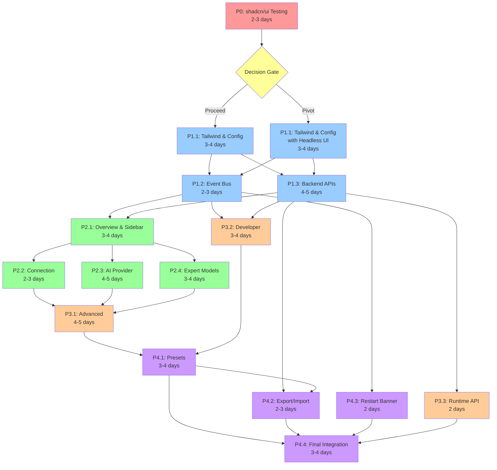

# Implementation Handoff: Settings Page Modernization

## Executive Summary

This document provides complete implementation guidance for modernizing the Settings Page from a 1,477-line EJS template with vanilla JavaScript to a state-of-the-art Islands architecture using shadcn/ui components.

**Project**: Settings Page Modernization with Islands Architecture  
**Epic**: epic:6e0e0983-e5b6-41d3-98e0-9cd4d0ddb783  
**Total Tickets**: 15 tickets across 5 phases  
**Timeline**: 6-7 weeks  
**Status**: Ready for implementation

### Current State → Target State

**Current (Before)**:

- 1,477-line EJS template (file:views/settings.ejs)
- Vanilla JavaScript classes (file:public/js/settings.js)
- Long scrolling form with ~85 settings fields
- All settings require restart
- No developer settings UI
- Tailwind CSS via CDN

**Target (After)**:

- 9 Preact Islands with shadcn/ui components
- Sidebar navigation with hybrid tabs
- Hot reload for non-critical settings
- Developer settings panel (toggle-gated)
- Presets/templates (Development, Production, Medical, Financial, Legal)
- Export/import .env functionality
- Tailwind CSS as build dependency

### Key Objectives

1. **Architectural Consistency**: Align settings page with Alpha-9 Islands architecture (Manual, History, Playground routes)
2. **Developer Experience**: Expose developer settings UI (env vars, feature flags, performance tuning, runtime state)
3. **Modern UX**: Sidebar navigation, real-time validation, auto-save, presets
4. **Hot Reload**: No restart for most settings (token limits, toggles, tags)
5. **Maintainability**: Replace 1,477-line EJS with modular islands

---

## Context & Background

### Alpha-9 Islands Architecture

The codebase has successfully migrated to Preact Islands architecture across 3 major routes:

**Existing Islands** (6 total):

1. **VisualAnnotationIsland** (file:src/islands/VisualAnnotationIsland.tsx) - Red Pen canvas for visual annotation
2. **FeedbackControlsIsland** (file:src/islands/FeedbackControlsIsland.tsx) - Thumbs up/down for AI suggestions
3. **ManualEditorIsland** (file:src/islands/ManualEditorIsland.tsx) - Tabbed metadata editor
4. **HistoryTabsIsland** (file:src/islands/HistoryTabsIsland.tsx) - Text/Metadata/Similar tabs
5. **OverlayViewerIsland** (file:src/islands/OverlayViewerIsland.tsx) - Document preview with Red Pen
6. **PlaygroundIsland** (file:src/islands/PlaygroundIsland.tsx) - Visual debugger with payload inspector

**Islands Pattern**:

- **Runtime**: file:src/islands/runtime.js mounts islands via `data-island` anchors
- **Build**: Vite (file:vite.config.ts) bundles islands to `public/js/*.island.js`
- **Validation**: Zod schemas validate island props
- **Event Bus**: Document-level CustomEvents with both-side validation
- **Hydration**: Islands mount on DOMContentLoaded

### Current Settings Implementation

**Frontend** (file:views/settings.ejs):

- 1,477 lines of EJS template
- Vanilla JavaScript classes: ThemeManager, FormManager, TagsManager, CustomFieldsManager
- SweetAlert2 for modals, Tippy.js for tooltips, Sortable.js for drag-and-drop
- Long scrolling form with collapsible sections

**Backend** (file:routes/setup.js lines 5196-5723):

- POST `/settings` route updates `data/.env` file
- Validates connection to Paperless-ngx
- Triggers restart countdown modal (5 seconds)
- Returns `{ success, restart, message }`

**Configuration** (file:config/config.js):

- Loads ~85 environment variables from `data/.env`
- Nested object structure (e.g., `config.ollama.limits.vision.contextWindow`)
- Static loading at startup (no hot reload)

### Why Modernization Matters

**Architectural Inconsistency**:

- Settings uses vanilla JS while Manual, History, Playground use Islands
- Inconsistent patterns make maintenance harder
- New developers must learn two architectures

**Limited Developer Experience**:

- No UI for developer settings (env vars, feature flags, runtime state)
- Developers must edit .env file manually
- No visibility into circuit breaker, VRAM, Qdrant health

**Suboptimal UX**:

- Long scrolling form (hard to find settings)
- All settings require restart (slow feedback loop)
- No presets for common configurations

---

## Architectural Decisions

All architectural decisions have been validated through stress testing and align with the existing Alpha-9 codebase patterns.

### Decision 1: shadcn/ui with Headless UI Fallback

**Decision**: Test shadcn/ui compatibility with Preact in Phase 0. If non-trivial incompatibilities found, pivot to Headless UI.

**Pivot Criteria** (Combined Rule):

- **Proceed with shadcn/ui if**:
  - At least 80% of intended components work as designed or with minor tweaks, AND
  - All required workarounds fit within 1 engineer-day total for Phase 0 (including tests and docs), AND
  - All critical components (Tabs, Dialog/Sheet, Form controls: Input, Select, Textarea, Switch) are usable in production (no blocking UX bugs)
- **Pivot to Headless UI if any of these fail**:
  - Less than 80% of components are viable
  - Workarounds exceed 1 day or introduce fragile hacks (custom forks, deep Radix internals, etc.)
  - A critical component cannot reach production quality in Phase 0 (e.g., Select cannot be made stable, Dialog cannot be made accessible)

**Rationale**:

- shadcn/ui provides state-of-the-art UI with comprehensive component library
- Headless UI is officially compatible with Preact (proven fallback)
- Phase 0 testing (2-3 days) validates assumptions early
- Clear pivot criteria prevents wasted effort

**Implementation**:

```bash
# Phase 0: Install shadcn/ui
npm install -D tailwindcss postcss autoprefixer
npm install class-variance-authority clsx tailwind-merge
npm install @radix-ui/react-tabs @radix-ui/react-label @radix-ui/react-switch @radix-ui/react-select @radix-ui/react-dialog

# Configure Vite with preact/compat
# vite.config.ts
export default defineConfig({
  resolve: {
    alias: {
      'react': 'preact/compat',
      'react-dom': 'preact/compat',
    }
  }
})

# Test critical components
# Create test file: src/islands/__tests__/shadcn-compat.test.tsx
```

**Fallback Plan**:

```bash
# If pivot to Headless UI
npm uninstall @radix-ui/*
npm install @headlessui/react
# Headless UI works natively with Preact, no compat needed
```

---

### Decision 2: Hot Reload via Hybrid Proxy Pattern

**Decision**: Use Hybrid Proxy pattern (Proxy for nested objects, getters for flat properties) to enable hot reload without breaking existing codebase.

**Problem**: file:config/config.js has deeply nested objects (e.g., `config.ollama.limits.vision.contextWindow` is 4 levels deep). Simple getters don't work for nested access.

**Solution**: Hybrid Proxy Pattern

**Implementation**:

```javascript
// config/config.js (refactored)

// Runtime overrides (in-memory, cleared on restart)
let runtimeOverrides = {};

// Base configuration (loaded from .env)
const baseConfig = {
  paperlessUrl: process.env.PAPERLESS_API_URL || 'http://localhost:8000',
  paperlessToken: process.env.PAPERLESS_API_TOKEN || '',
  tokenLimit: parseInt(process.env.TOKEN_LIMIT, 10) || 128000,
  
  // Nested objects
  ollama: {
    apiUrl: process.env.OLLAMA_API_URL || 'http://localhost:11434',
    visionModel: process.env.OLLAMA_VISION_MODEL || 'qwen3-vl:8b',
    limits: {
      vision: {
        contextWindow: parseInt(process.env.OLLAMA_VISION_CONTEXT_WINDOW, 10) || 32768,
        maxResponseTokens: parseInt(process.env.OLLAMA_VISION_MAX_RESPONSE_TOKENS, 10) || 8192
      }
    }
  },
  
  expertModels: {
    medical: {
      vision: process.env.EXPERT_MEDICAL_VISION || 'qwen3-vl:8b',
      analysis: process.env.EXPERT_MEDICAL_ANALYSIS || 'llama3.2:3b'
    }
  }
};

// Proxy factory for nested objects
const createConfigProxy = (target, overrides) => {
  return new Proxy(target, {
    get(obj, prop) {
      // Convert property name to env var format
      const envKey = prop.toString().toUpperCase();
      
      // Check runtime override first
      if (overrides[envKey] !== undefined) {
        return overrides[envKey];
      }
      
      // Get original value
      const value = obj[prop];
      
      // If nested object, wrap in proxy recursively
      if (typeof value === 'object' && value !== null && !Array.isArray(value)) {
        return createConfigProxy(value, overrides);
      }
      
      return value;
    }
  });
};

// Export proxied config
module.exports = {
  // Flat properties use getters
  get paperlessUrl() {
    return runtimeOverrides.PAPERLESS_URL || baseConfig.paperlessUrl;
  },
  
  get paperlessToken() {
    return runtimeOverrides.PAPERLESS_TOKEN || baseConfig.paperlessToken;
  },
  
  get tokenLimit() {
    return runtimeOverrides.TOKEN_LIMIT || baseConfig.tokenLimit;
  },
  
  // Nested objects use proxy
  get ollama() {
    return createConfigProxy(baseConfig.ollama, runtimeOverrides);
  },
  
  get expertModels() {
    return createConfigProxy(baseConfig.expertModels, runtimeOverrides);
  },
  
  // Runtime override management
  updateRuntime(key, value) {
    runtimeOverrides[key] = value;
  },
  
  clearRuntimeOverrides() {
    runtimeOverrides = {};
  },
  
  getRuntimeOverrides() {
    return { ...runtimeOverrides };
  }
};
```

**Rationale**:

- ✅ Preserves existing codebase access patterns (`config.ollama.apiUrl` still works)
- ✅ Minimal refactoring (only config.js, no changes to hundreds of files using config)
- ✅ Hot reload works for all settings (flat and nested)
- ✅ In-memory overrides cleared on restart (clean state)

**Testing**:

```javascript
// After refactoring, verify existing access patterns work
const config = require('./config/config.js');

// Flat property
console.log(config.tokenLimit); // Should work

// Nested property (2 levels)
console.log(config.ollama.apiUrl); // Should work

// Deeply nested property (4 levels)
console.log(config.ollama.limits.vision.contextWindow); // Should work

// Runtime override
config.updateRuntime('TOKEN_LIMIT', 256000);
console.log(config.tokenLimit); // Should return 256000

// Nested override
config.updateRuntime('OLLAMA_API_URL', 'http://localhost:11435');
console.log(config.ollama.apiUrl); // Should return 'http://localhost:11435'
```

---

### Decision 3: Islands Granularity (9 Islands, One Per Category)

**Decision**: Create one island per category (9 islands total), with tabs handled internally within each island.

**Islands Structure**:

1. **OverviewDashboardIsland** - Summary cards with quick actions
2. **SettingsSidebarIsland** - Navigation with developer mode toggle
3. **ConnectionSettingsIsland** - API URL, token, test connection
4. **AIProviderIsland** - 5 internal tabs (General, OpenAI, Ollama, Custom, Azure)
5. **ExpertModelsIsland** - 3 internal tabs (Medical, Financial, Legal)
6. **AdvancedSettingsIsland** - 4 internal tabs (Processing, Restrictions, Custom Fields, System Prompt)
7. **DeveloperSettingsIsland** - Collapsible sections (Env Vars, Feature Flags, Performance, Runtime State)
8. **PresetsManagerIsland** - Preset loading with diff modal
9. **RestartBannerIsland** - Persistent banner with restart button

**Rationale**:

- ✅ Matches ManualEditorIsland pattern (already has internal tabs)
- ✅ Clear boundaries (one island = one sidebar category)
- ✅ Simpler than 20+ granular islands
- ✅ Each island manages its own state
- ✅ Easier to test in isolation

**Pattern** (from ManualEditorIsland):

```typescript
// AIProviderIsland.tsx (example)
export function AIProviderIsland(props) {
  const [activeTab, setActiveTab] = useState('general');
  const [settings, setSettings] = useState(props);
  
  return (
    <div className="ai-provider-island">
      {/* Tabs */}
      <div className="tabs">
        <button onClick={() => setActiveTab('general')}>General</button>
        <button onClick={() => setActiveTab('openai')}>OpenAI</button>
        <button onClick={() => setActiveTab('ollama')}>Ollama</button>
        <button onClick={() => setActiveTab('custom')}>Custom</button>
        <button onClick={() => setActiveTab('azure')}>Azure</button>
      </div>
      
      {/* Tab Content */}
      {activeTab === 'general' && <GeneralTab settings={settings} onChange={setSettings} />}
      {activeTab === 'openai' && <OpenAITab settings={settings} onChange={setSettings} />}
      {/* ... other tabs */}
    </div>
  );
}
```

---

### Decision 4: RestartBannerIsland (Separate Island)

**Decision**: Implement restart banner as a separate island for architectural consistency.

**Rationale**:

- ✅ Consistent with Islands architecture (not vanilla JS)
- ✅ Manages its own state (visible/hidden, pending settings)
- ✅ Listens to events from other islands
- ✅ Testable in isolation

**Implementation**:

```typescript
// RestartBannerIsland.tsx
import { h } from 'preact';
import { useState, useEffect } from 'preact/hooks';
import { z } from 'zod';

const RestartRequiredEventSchema = z.object({
  settings: z.array(z.string())
});

export function RestartBannerIsland(props) {
  const [visible, setVisible] = useState(false);
  const [pendingSettings, setPendingSettings] = useState(new Set());
  
  useEffect(() => {
    const handler = (e) => {
      try {
        const { settings } = RestartRequiredEventSchema.parse(e.detail);
        setPendingSettings(prev => new Set([...prev, ...settings]));
        setVisible(true);
      } catch (err) {
        console.error('Invalid restart-required event:', err);
      }
    };
    
    document.addEventListener('settings:restart-required', handler);
    return () => document.removeEventListener('settings:restart-required', handler);
  }, []);
  
  const handleRestart = () => {
    window.location.reload();
  };
  
  if (!visible) return null;
  
  return (
    <div className="sticky top-0 z-50 bg-yellow-50 border-b border-yellow-200 p-4">
      <div className="flex items-center justify-between max-w-7xl mx-auto">
        <div className="flex items-center gap-2">
          <span className="text-yellow-800">⚠️</span>
          <span className="text-sm text-yellow-800">
            Restart required for: {Array.from(pendingSettings).join(', ')}
          </span>
        </div>
        <button 
          onClick={handleRestart}
          className="px-4 py-2 bg-yellow-600 text-white rounded hover:bg-yellow-700"
        >
          Restart Now
        </button>
      </div>
    </div>
  );
}
```

**EJS Template**:

```html
<!-- views/settings.ejs -->
<div data-island="restart-banner-island" data-props='{"visible": false}'></div>
```

---

### Decision 5: Auto-save with Flush Debounce on Unmount

**Decision**: Use lodash.debounce with flush() method to ensure auto-save completes before island unmounts.

**Problem**: When user navigates between categories, the island unmounts. If debounce timer is active, save may be lost.

**Solution**: Flush debounce on unmount

**Implementation**:

```typescript
// AIProviderIsland.tsx
import { h } from 'preact';
import { useState, useEffect, useMemo } from 'preact/hooks';
import debounce from 'lodash.debounce';

export function AIProviderIsland(props) {
  const [settings, setSettings] = useState(props);
  
  // Create debounced save function (500ms delay)
  const debouncedSave = useMemo(
    () => debounce(async (settingsToSave) => {
      try {
        const response = await fetch('/api/settings/apply', {
          method: 'POST',
          headers: { 'Content-Type': 'application/json' },
          body: JSON.stringify(settingsToSave)
        });
        
        const result = await response.json();
        
        if (result.requiresRestart) {
          // Dispatch event to show restart banner
          document.dispatchEvent(new CustomEvent('settings:restart-required', {
            detail: { settings: ['AI Provider'] }
          }));
        }
        
        // Show success toast
        document.dispatchEvent(new CustomEvent('settings:saved', {
          detail: { message: 'Settings saved ✓' }
        }));
      } catch (err) {
        console.error('Save failed:', err);
      }
    }, 500),
    []
  );
  
  // Auto-save on settings change
  useEffect(() => {
    if (JSON.stringify(settings) !== JSON.stringify(props)) {
      debouncedSave(settings);
    }
  }, [settings]);
  
  // CRITICAL: Flush debounce on unmount
  useEffect(() => {
    return () => {
      debouncedSave.flush(); // Ensures pending save completes
    };
  }, []);
  
  return (
    <div className="ai-provider-island">
      {/* Island content */}
    </div>
  );
}
```

**Dependencies**:

```bash
npm install lodash.debounce
npm install -D @types/lodash.debounce
```

**Rationale**:

- ✅ Prevents data loss on navigation
- ✅ Simple and reliable (lodash.debounce is battle-tested)
- ✅ No race conditions
- ✅ Minimal overhead (~2KB)

---

### Decision 6: Always Write to .env (Persistent, Single Source of Truth)

**Decision**: All settings (critical and non-critical) are written to `data/.env` file, even if they hot reload.

**Rationale**:

- ✅ Single source of truth (.env file)
- ✅ Settings persist across restarts
- ✅ No confusion about which settings are persisted
- ✅ Consistent behavior

**Implementation**:

```javascript
// Backend: POST /api/settings/apply
router.post('/api/settings/apply', async (req, res) => {
  const settings = req.body;
  
  // 1. Always write to .env file (persistent)
  await setupService.updateEnvFile(settings);
  
  // 2. Determine if restart required
  const criticalSettings = ['PAPERLESS_API_URL', 'PAPERLESS_API_TOKEN', 'AI_PROVIDER', 'OLLAMA_API_URL'];
  const requiresRestart = Object.keys(settings).some(key => criticalSettings.includes(key));
  
  if (requiresRestart) {
    // Critical settings: return restart flag (don't update in-memory)
    return res.json({ success: true, requiresRestart: true });
  }
  
  // 3. Non-critical settings: update in-memory config (hot reload)
  const config = require('../config/config.js');
  for (const [key, value] of Object.entries(settings)) {
    config.updateRuntime(key, value);
  }
  
  return res.json({ success: true, requiresRestart: false });
});
```

**Flow**:

1. User changes setting → Island auto-saves
2. Backend writes to .env file (persistent)
3. Backend checks if restart required
4. If restart required: Return flag, show restart banner
5. If not restart required: Update in-memory config, setting takes effect immediately
6. On restart: .env values become active (in-memory overrides cleared)

---

### Decision 7: Event Bus Pattern (Consistent with Alpha-9)

**Decision**: Use document-level CustomEvents with both-side Zod validation for cross-island communication.

**Rationale**:

- ✅ Consistent with Alpha-9 Islands architecture
- ✅ Decoupled islands (no direct dependencies)
- ✅ Easy to add new islands that listen to events
- ✅ Type-safe with Zod validation

**Events for Settings**:

```typescript
// Event schemas (add to src/islands/runtime.js)

const SettingsChangedEventSchema = z.object({
  category: z.string(),
  settings: z.record(z.any())
});

const SettingsSavedEventSchema = z.object({
  message: z.string(),
  category: z.string().optional()
});

const RestartRequiredEventSchema = z.object({
  settings: z.array(z.string())
});

const PresetLoadedEventSchema = z.object({
  presetName: z.string(),
  changes: z.record(z.any())
});

const DeveloperToggledEventSchema = z.object({
  enabled: z.boolean()
});
```

**Dispatch Pattern** (sender validates):

```typescript
// In AIProviderIsland
const handleSave = async (settings) => {
  // Validate before dispatch
  const validated = SettingsChangedEventSchema.parse({
    category: 'ai-provider',
    settings
  });
  
  // Dispatch event
  document.dispatchEvent(new CustomEvent('settings:changed', {
    detail: validated
  }));
};
```

**Listen Pattern** (receiver validates):

```typescript
// In RestartBannerIsland
useEffect(() => {
  const handler = (e) => {
    try {
      // Validate on receive
      const { settings } = RestartRequiredEventSchema.parse(e.detail);
      setPendingSettings(prev => new Set([...prev, ...settings]));
      setVisible(true);
    } catch (err) {
      console.error('Invalid restart-required event:', err);
    }
  };
  
  document.addEventListener('settings:restart-required', handler);
  return () => document.removeEventListener('settings:restart-required', handler);
}, []);
```

---

## Implementation Phases

### Phase 0: shadcn/ui Compatibility Testing (2-3 days)

**Objective**: Validate shadcn/ui compatibility with Preact and make decision to proceed or pivot to Headless UI.

**Ticket**: P0: shadcn/ui Compatibility Testing

**Tasks**:

1. Install Tailwind CSS as build dependency
2. Install shadcn/ui dependencies (@radix-ui/*, class-variance-authority, clsx)
3. Configure Vite with preact/compat alias
4. Test critical components in isolation:
  - Tabs (for AI Provider, Expert Models, Advanced)
  - Dialog/Sheet (for modals)
  - Form controls (Input, Select, Textarea, Switch, Label)
  - Card (for Overview dashboard)
5. Document compatibility findings
6. Apply pivot criteria (80% + 1 day + critical components)
7. **Decision**: Proceed with shadcn/ui OR pivot to Headless UI

**Deliverables**:

- Compatibility test report
- Working examples of critical components
- Decision documented in Tech Plan
- Updated package.json with chosen UI library

**Success Criteria**:

- All critical components tested
- Pivot decision made with documented rationale
- If proceeding with shadcn/ui: All critical components work in production quality
- If pivoting to Headless UI: Fallback plan activated, Headless UI installed

---

### Phase 1: Infrastructure & Foundation (1.5-2 weeks)

**Objective**: Establish foundation for Islands implementation (Tailwind build, config refactoring, event bus, backend APIs).

#### P1.1: Tailwind Build & Config Refactoring (3-4 days)

**Tasks**:

1. Configure Tailwind CSS build with Vite
2. Refactor file:config/config.js with Hybrid Proxy pattern
3. Install lodash.debounce
4. Test config access patterns (flat and nested)
5. Update Vite config for Tailwind compilation

**Deliverables**:

- Tailwind CSS compiling via Vite
- config.js refactored with Proxy pattern
- All existing config access patterns still work
- lodash.debounce installed

**Testing**:

- Verify `config.ollama.apiUrl` still works
- Verify `config.expertModels.medical.vision` still works
- Test runtime override: `config.updateRuntime('TOKEN_LIMIT', 256000)`
- Verify override persists until restart

#### P1.2: Event Bus & Zod Schemas (2-3 days)

**Tasks**:

1. Add settings event schemas to file:src/islands/runtime.js
2. Create Zod contracts for all 9 islands
3. Test event bus with both-side validation
4. Document event patterns

**Deliverables**:

- 5 event schemas added to runtime.js
- 9 island prop schemas defined
- Event bus integration tested
- Documentation updated

**Testing**:

- Dispatch `settings:changed` event, verify validation
- Dispatch invalid event, verify error caught
- Test both-side validation (dispatch + listen)

#### P1.3: Backend API Endpoints (4-5 days)

**Tasks**:

1. Implement POST `/api/settings/apply` (hot reload endpoint)
2. Implement GET `/api/settings/export` (.env export)
3. Implement POST `/api/settings/import` (.env import with validation)
4. Implement GET `/api/settings/presets` (list available presets)
5. Implement POST `/api/settings/presets/:name` (load preset with diff)
6. Implement GET `/api/runtime/state` (circuit breaker, VRAM, Qdrant, sidecar)
7. Implement POST `/api/settings/restart` (trigger restart)

**Deliverables**:

- 7 new API endpoints functional
- Hot reload logic working (in-memory override)
- Preset diff calculation implemented
- Runtime state aggregation working

**Testing**:

- Test hot reload: Change token limit, verify takes effect without restart
- Test restart required: Change AI provider, verify restart flag returned
- Test .env export: Verify all 85+ settings exported with categories
- Test preset diff: Load preset, verify diff shows correct changes

---

### Phase 2: Core Settings Islands (2-2.5 weeks)

**Objective**: Implement core user-facing islands (Overview, Sidebar, Connection, AI Provider, Expert Models).

#### P2.1: Overview & Sidebar Islands (3-4 days)

**Tasks**:

1. Create OverviewDashboardIsland with summary cards
2. Implement quick actions (Test Connection, Switch Provider, Load Preset, Export Config)
3. Create SettingsSidebarIsland with navigation
4. Implement developer mode toggle in sidebar footer
5. Persist sidebar state (active category, developer mode) to localStorage

**Deliverables**:

- OverviewDashboardIsland rendering with summary cards
- SettingsSidebarIsland with 6 categories (Overview, Connection, AI Provider, Expert Models, Advanced, Developer)
- Developer mode toggle functional (persists across sessions)
- Navigation working (click category → show corresponding island)

**Testing**:

- Verify overview shows current configuration summary
- Verify quick actions trigger correct flows
- Verify sidebar navigation switches islands
- Verify developer mode toggle shows/hides Developer category
- Verify localStorage persistence (reload page, developer mode still enabled)

#### P2.2: Connection Settings Island (2-3 days)

**Tasks**:

1. Create ConnectionSettingsIsland with form fields (API URL, Token, Username)
2. Implement "Test Connection" button with inline validation
3. Implement manual save with restart indication
4. Add success/error feedback

**Deliverables**:

- ConnectionSettingsIsland rendering
- Test Connection button validates Paperless-ngx connection
- Manual save triggers restart
- Inline feedback shows connection status

**Testing**:

- Test valid connection: Enter correct URL/token, click Test, verify success
- Test invalid connection: Enter wrong URL, click Test, verify error message
- Test save: Change URL, save, verify restart prompt appears

#### P2.3: AI Provider Island (4-5 days)

**Tasks**:

1. Create AIProviderIsland with 5 tabs (General, OpenAI, Ollama, Custom, Azure)
2. Implement provider selection in General tab
3. Implement provider-specific settings in dedicated tabs
4. Implement auto-save for token limits (500ms debounce)
5. Implement manual save for provider/credentials
6. Add restart indication badges (⚠️ Restart Required)

**Deliverables**:

- AIProviderIsland with 5 functional tabs
- Provider selection triggers tab visibility
- Token limits auto-save with toast notification
- Provider/credentials require manual save with restart

**Testing**:

- Select OpenAI → verify OpenAI tab appears
- Change token limit → verify auto-save after 500ms
- Change API key → verify manual save required
- Navigate away → verify debounce flushed (no data loss)

#### P2.4: Expert Models Island (3-4 days)

**Tasks**:

1. Create ExpertModelsIsland with 3 tabs (Medical, Financial, Legal)
2. Implement model selection fields (vision, analysis, orchestrator)
3. Implement token limits with auto-save
4. Implement model names with manual save

**Deliverables**:

- ExpertModelsIsland with 3 functional tabs
- Token limits auto-save
- Model names require manual save

**Testing**:

- Switch between tabs → verify settings preserved
- Change token limit → verify auto-save
- Change model name → verify manual save required

---

### Phase 3: Advanced & Developer Settings (1.5-2 weeks)

**Objective**: Implement advanced settings and developer panel with runtime state visibility.

#### P3.1: Advanced Settings Island (4-5 days)

**Tasks**:

1. Create AdvancedSettingsIsland with 4 tabs (Processing, Restrictions, Custom Fields, System Prompt)
2. Implement tags management (add/remove with validation)
3. Implement custom fields drag-and-drop (Sortable.js integration)
4. Implement mixed auto-save (toggles) and manual save (fields, prompt)

**Deliverables**:

- AdvancedSettingsIsland with 4 functional tabs
- Tags management working (add/remove/validate)
- Custom fields drag-and-drop working
- Mixed save behavior (auto for toggles, manual for fields)

**Testing**:

- Add tag → verify validation (no duplicates)
- Drag custom field → verify order saved
- Change system prompt → verify manual save required
- Toggle AI restriction → verify auto-save

#### P3.2: Developer Settings Island (3-4 days)

**Tasks**:

1. Create DeveloperSettingsIsland with collapsible sections
2. Implement Environment Variables section (read-only display with edit capability)
3. Implement Feature Flags section (immediate auto-save on toggle)
4. Implement Performance Tuning section (timeouts, circuit breaker thresholds)
5. Implement Runtime State section (collapsible, auto-refresh when visible)

**Deliverables**:

- DeveloperSettingsIsland rendering (only when developer mode enabled)
- Environment variables editable
- Feature flags toggle immediately (auto-save)
- Runtime state displays circuit breaker, VRAM, Qdrant, sidecar status
- Auto-refresh (10s interval) only when Runtime State section visible

**Testing**:

- Enable developer mode → verify Developer category appears
- Toggle feature flag → verify immediate save (no debounce)
- Expand Runtime State → verify auto-refresh starts
- Collapse Runtime State → verify auto-refresh stops
- Change circuit breaker threshold → verify manual save required

#### P3.3: Runtime State API (2 days)

**Tasks**:

1. Implement GET `/api/runtime/state` endpoint
2. Aggregate metrics from multiple sources:
  - Circuit breaker state (file:services/experts/CircuitBreaker.js)
  - VRAM usage (sidecar `/health` endpoint)
  - Qdrant health (Qdrant client)
  - Sidecar state (200 OK / 503 Initializing)
  - Background sync job (last run, pending events)

**Deliverables**:

- `/api/runtime/state` endpoint functional
- Returns JSON with all runtime metrics
- Handles errors gracefully (e.g., sidecar offline)

**Testing**:

- Call endpoint → verify all metrics returned
- Stop sidecar → verify graceful error handling
- Verify VRAM value matches sidecar `/health`

---

### Phase 4: Presets, Export/Import & Polish (1.5-2 weeks)

**Objective**: Implement productivity features (presets, export/import) and final integration.

#### P4.1: Presets Manager Island (3-4 days)

**Tasks**:

1. Create PresetsManagerIsland with preset selection
2. Implement 5 predefined presets (Development, Production, Medical, Financial, Legal)
3. Implement diff modal with grouped changes (expandable sections)
4. Implement all-or-nothing preset application
5. Store presets in `config/presets/*.json`

**Deliverables**:

- PresetsManagerIsland rendering
- 5 predefined presets available
- Diff modal shows grouped changes (expandable by category)
- Preset application updates all islands
- Auto-save triggers after preset load

**Preset Files**:

```json
// config/presets/development.json
{
  "name": "Development",
  "description": "Local development with Ollama",
  "settings": {
    "AI_PROVIDER": "ollama",
    "OLLAMA_API_URL": "http://localhost:11434",
    "EXPERT_PIPELINE_ENABLED": "false",
    "TOKEN_LIMIT": "128000"
  }
}
```

**Testing**:

- Load Development preset → verify diff modal shows changes
- Apply preset → verify all settings updated
- Verify auto-save triggers
- Verify restart banner appears if needed

#### P4.2: Export/Import .env (2-3 days)

**Tasks**:

1. Implement .env export (all 85+ settings with category comments)
2. Implement .env import with validation
3. Implement import diff review (show what will change)
4. Handle import errors gracefully

**Deliverables**:

- Export button downloads complete .env file
- Import button accepts .env file
- Import validation catches errors
- Diff modal shows import changes

**Export Format**:

```bash
# Connection Settings
PAPERLESS_API_URL=http://localhost:8000
PAPERLESS_API_TOKEN=abc123

# AI Provider Settings
AI_PROVIDER=ollama
OLLAMA_API_URL=http://localhost:11434
OLLAMA_VISION_MODEL=qwen3-vl:8b

# Expert Models
EXPERT_PIPELINE_ENABLED=true
EXPERT_MEDICAL_VISION=qwen3-vl:8b
# ... all 85+ settings
```

**Testing**:

- Export settings → verify .env file contains all settings
- Import valid .env → verify settings updated
- Import invalid .env → verify validation errors shown
- Import with conflicts → verify diff modal shows changes

#### P4.3: Restart Banner Island (2 days)

**Tasks**:

1. Create RestartBannerIsland (already shown in Decision 4)
2. Implement Set-based deduplication for pending settings
3. Implement "Restart Now" button
4. Add dismiss functionality (hide banner, but restart still pending)

**Deliverables**:

- RestartBannerIsland rendering when restart required
- Pending settings deduplicated (no duplicates in display)
- Restart Now button triggers reload
- Banner persists across category navigation

**Testing**:

- Change AI provider → verify banner appears
- Change AI provider again → verify no duplicate in banner
- Click Restart Now → verify page reloads
- Navigate between categories → verify banner persists

#### P4.4: Final Integration & Testing (3-4 days)

**Tasks**:

1. E2E tests for all 8 user flows (Playwright)
2. Accessibility audit (WCAG 2.1 AA)
3. Performance testing (bundle size, auto-save latency)
4. Documentation updates (user guide, developer guide)
5. Migration guide (vanilla JS → Islands)

**Deliverables**:

- E2E test suite passing (all 8 flows)
- Accessibility audit complete (no critical issues)
- Performance benchmarks met (bundle < 150KB, auto-save < 100ms)
- Documentation updated

**Testing**:

- Run full E2E suite → all tests pass
- Run accessibility audit → no critical issues
- Measure bundle size → < 150KB
- Measure auto-save latency → < 100ms (p95)

---

## Ticket Execution Order

### Week-by-Week Breakdown

**Week 1: Phase 0 + Phase 1 Start**

- Days 1-3: P0 (shadcn/ui testing) → **DECISION GATE**
- Days 4-5: P1.1 start (Tailwind build setup)

**Week 2: Phase 1 Completion**

- Days 1-3: P1.1 completion (config refactoring)
- Days 4-5: P1.2 (Event bus) + P1.3 (Backend APIs) **PARALLEL**

**Week 3: Phase 2 Start**

- Days 1-3: P2.1 (Overview + Sidebar)
- Days 4-5: P2.2 (Connection) + P2.3 (AI Provider) start **PARALLEL**

**Week 4: Phase 2 Completion**

- Days 1-3: P2.3 completion (AI Provider)
- Days 3-5: P2.4 (Expert Models) **PARALLEL with P2.3**

**Week 5: Phase 3**

- Days 1-3: P3.1 (Advanced Settings) + P3.2 (Developer Settings) **PARALLEL**
- Days 4-5: P3.3 (Runtime State API) + P3.1/P3.2 completion

**Week 6: Phase 4 Start**

- Days 1-3: P4.1 (Presets Manager) + P4.2 (Export/Import) **PARALLEL**
- Days 4-5: P4.3 (Restart Banner)

**Week 7: Phase 4 Completion**

- Days 1-5: P4.4 (Final Integration & Testing)

### Critical Path

```
P0 → P1.1 → P1.2 → P2.1 → P2.3 → P3.1 → P4.1 → P4.4
```

**Duration**: 6 weeks minimum (critical path)

### Parallel Work Opportunities

- **Week 2**: P1.2 + P1.3 (event bus + backend APIs)
- **Week 3-4**: P2.2 + P2.3 + P2.4 (all core islands after sidebar)
- **Week 5**: P3.1 + P3.2 + P3.3 (advanced + developer + runtime API)
- **Week 6**: P4.1 + P4.2 (presets + export/import)

---

## Code Patterns & Examples

### Pattern 1: Island Base Structure

All islands follow this base pattern:

```typescript
// ExampleIsland.tsx
import { h } from 'preact';
import { useState, useEffect, useMemo } from 'preact/hooks';
import { z } from 'zod';
import debounce from 'lodash.debounce';

// Zod schema for island props
export const ExampleIslandPropsSchema = z.object({
  initialValue: z.string(),
  category: z.string()
});

export function ExampleIsland(props) {
  // Validate props
  const validated = ExampleIslandPropsSchema.parse(props);
  
  // Local state
  const [value, setValue] = useState(validated.initialValue);
  
  // Debounced save
  const debouncedSave = useMemo(
    () => debounce(async (valueToSave) => {
      const response = await fetch('/api/settings/apply', {
        method: 'POST',
        headers: { 'Content-Type': 'application/json' },
        body: JSON.stringify({ EXAMPLE_VALUE: valueToSave })
      });
      
      const result = await response.json();
      
      if (result.requiresRestart) {
        document.dispatchEvent(new CustomEvent('settings:restart-required', {
          detail: { settings: ['Example Value'] }
        }));
      }
      
      document.dispatchEvent(new CustomEvent('settings:saved', {
        detail: { message: 'Settings saved ✓' }
      }));
    }, 500),
    []
  );
  
  // Auto-save on change
  useEffect(() => {
    if (value !== validated.initialValue) {
      debouncedSave(value);
    }
  }, [value]);
  
  // Flush on unmount
  useEffect(() => {
    return () => {
      debouncedSave.flush();
    };
  }, []);
  
  return (
    <div className="example-island">
      <input 
        type="text" 
        value={value} 
        onChange={(e) => setValue(e.target.value)}
      />
    </div>
  );
}
```

### Pattern 2: Event Bus Dispatch (Sender Validates)

```typescript
// Dispatch event with validation
const handleSave = async (settings) => {
  try {
    // Validate before dispatch
    const validated = SettingsChangedEventSchema.parse({
      category: 'ai-provider',
      settings
    });
    
    // Dispatch event
    document.dispatchEvent(new CustomEvent('settings:changed', {
      detail: validated
    }));
  } catch (err) {
    console.error('Invalid settings event:', err);
  }
};
```

### Pattern 3: Event Bus Listen (Receiver Validates)

```typescript
// Listen to event with validation
useEffect(() => {
  const handler = (e) => {
    try {
      // Validate on receive
      const { settings } = RestartRequiredEventSchema.parse(e.detail);
      
      // Handle event
      setPendingSettings(prev => new Set([...prev, ...settings]));
      setVisible(true);
    } catch (err) {
      console.error('Invalid restart-required event:', err);
    }
  };
  
  document.addEventListener('settings:restart-required', handler);
  return () => document.removeEventListener('settings:restart-required', handler);
}, []);
```

### Pattern 4: Tabs Within Island

```typescript
// Island with internal tabs (like ManualEditorIsland)
export function AIProviderIsland(props) {
  const [activeTab, setActiveTab] = useState('general');
  const [settings, setSettings] = useState(props);
  
  return (
    <div className="ai-provider-island">
      {/* Tab Navigation */}
      <div className="tabs border-b">
        <button 
          onClick={() => setActiveTab('general')}
          className={activeTab === 'general' ? 'active' : ''}
        >
          General
        </button>
        <button 
          onClick={() => setActiveTab('openai')}
          className={activeTab === 'openai' ? 'active' : ''}
        >
          OpenAI
        </button>
        {/* ... other tabs */}
      </div>
      
      {/* Tab Content */}
      <div className="tab-content p-4">
        {activeTab === 'general' && (
          <GeneralTab settings={settings} onChange={setSettings} />
        )}
        {activeTab === 'openai' && (
          <OpenAITab settings={settings} onChange={setSettings} />
        )}
        {/* ... other tab content */}
      </div>
    </div>
  );
}
```

### Pattern 5: Auto-save with Toast Notification

```typescript
// Auto-save with subtle toast notification
const debouncedSave = useMemo(
  () => debounce(async (settings) => {
    try {
      const response = await fetch('/api/settings/apply', {
        method: 'POST',
        headers: { 'Content-Type': 'application/json' },
        body: JSON.stringify(settings)
      });
      
      const result = await response.json();
      
      // Show toast notification (bottom-right, fades after 3s)
      const toast = document.createElement('div');
      toast.className = 'fixed bottom-4 right-4 bg-green-500 text-white px-4 py-2 rounded shadow-lg';
      toast.textContent = 'Settings saved ✓';
      document.body.appendChild(toast);
      
      setTimeout(() => {
        toast.style.opacity = '0';
        toast.style.transition = 'opacity 0.3s';
        setTimeout(() => toast.remove(), 300);
      }, 3000);
      
      if (result.requiresRestart) {
        document.dispatchEvent(new CustomEvent('settings:restart-required', {
          detail: { settings: Object.keys(settings) }
        }));
      }
    } catch (err) {
      console.error('Save failed:', err);
      // Show error toast
    }
  }, 500),
  []
);
```

### Pattern 6: Runtime State Auto-refresh

```typescript
// Auto-refresh only when section visible
export function DeveloperSettingsIsland(props) {
  const [runtimeStateExpanded, setRuntimeStateExpanded] = useState(false);
  const [runtimeState, setRuntimeState] = useState(null);
  
  // Auto-refresh when section expanded
  useEffect(() => {
    if (!runtimeStateExpanded) return;
    
    const fetchRuntimeState = async () => {
      const response = await fetch('/api/runtime/state');
      const data = await response.json();
      setRuntimeState(data);
    };
    
    // Initial fetch
    fetchRuntimeState();
    
    // Auto-refresh every 10 seconds
    const interval = setInterval(fetchRuntimeState, 10000);
    
    // Cleanup: stop auto-refresh when section collapsed
    return () => clearInterval(interval);
  }, [runtimeStateExpanded]);
  
  return (
    <div className="developer-settings-island">
      <button onClick={() => setRuntimeStateExpanded(!runtimeStateExpanded)}>
        Runtime State {runtimeStateExpanded ? '▼' : '▶'}
      </button>
      
      {runtimeStateExpanded && (
        <div className="runtime-state">
          <pre>{JSON.stringify(runtimeState, null, 2)}</pre>
        </div>
      )}
    </div>
  );
}
```

---

## Testing Requirements

### Unit Tests (Preact Testing Library + Mocha)

**Test Each Island**:

```javascript
// test/islands/AIProviderIsland.test.js
import { render, fireEvent, waitFor } from '@testing-library/preact';
import { AIProviderIsland } from '../../src/islands/AIProviderIsland';

describe('AIProviderIsland', () => {
  it('should render with initial props', () => {
    const { getByText } = render(
      <AIProviderIsland provider="openai" tokenLimit={128000} />
    );
    expect(getByText('General')).to.exist;
  });
  
  it('should auto-save token limit after 500ms', async () => {
    const { getByLabelText } = render(
      <AIProviderIsland provider="openai" tokenLimit={128000} />
    );
    
    const input = getByLabelText('Token Limit');
    fireEvent.input(input, { target: { value: '256000' } });
    
    // Wait for debounce + save
    await waitFor(() => {
      // Verify fetch called
    }, { timeout: 1000 });
  });
  
  it('should flush debounce on unmount', () => {
    const { unmount } = render(
      <AIProviderIsland provider="openai" tokenLimit={128000} />
    );
    
    // Change value
    // Unmount immediately
    unmount();
    
    // Verify save was flushed
  });
});
```

### Integration Tests (Event Bus)

**Test Cross-Island Communication**:

```javascript
// test/integration/settings-event-bus.test.js
describe('Settings Event Bus', () => {
  it('should trigger restart banner when AI provider changed', async () => {
    // Render AIProviderIsland and RestartBannerIsland
    const { getByText } = render(
      <>
        <AIProviderIsland provider="openai" />
        <RestartBannerIsland />
      </>
    );
    
    // Change provider
    const select = getByText('OpenAI');
    fireEvent.click(select);
    
    // Select Ollama
    const ollama = getByText('Ollama');
    fireEvent.click(ollama);
    
    // Save
    const saveButton = getByText('Save & Restart');
    fireEvent.click(saveButton);
    
    // Verify restart banner appears
    await waitFor(() => {
      expect(getByText(/Restart required/)).to.exist;
    });
  });
});
```

### E2E Tests (Playwright)

**Test Complete User Flows**:

```javascript
// test/e2e/settings-flows.spec.ts
import { test, expect } from '@playwright/test';

test('Flow 1: Initial Settings Access & Overview Dashboard', async ({ page }) => {
  await page.goto('/settings');
  
  // Verify overview dashboard appears
  await expect(page.locator('[data-island="overview-dashboard-island"]')).toBeVisible();
  
  // Verify summary cards
  await expect(page.locator('text=Connection')).toBeVisible();
  await expect(page.locator('text=AI Provider')).toBeVisible();
  
  // Click quick action
  await page.click('text=Test Connection');
  
  // Verify navigates to Connection category
  await expect(page.locator('[data-island="connection-settings-island"]')).toBeVisible();
});

test('Flow 3: AI Provider Configuration', async ({ page }) => {
  await page.goto('/settings#ai-provider');
  
  // Verify AI Provider island appears
  await expect(page.locator('[data-island="ai-provider-island"]')).toBeVisible();
  
  // Change token limit (auto-save)
  await page.fill('input[name="tokenLimit"]', '256000');
  
  // Wait for auto-save (500ms debounce + API call)
  await page.waitForTimeout(1000);
  
  // Verify toast notification
  await expect(page.locator('text=Settings saved ✓')).toBeVisible();
  
  // Change provider (manual save)
  await page.selectOption('select[name="provider"]', 'ollama');
  
  // Verify save button text changed
  await expect(page.locator('text=Save & Restart')).toBeVisible();
  
  // Click save
  await page.click('text=Save & Restart');
  
  // Verify restart banner appears
  await expect(page.locator('text=Restart required')).toBeVisible();
});
```

### Accessibility Tests (WCAG 2.1 AA)

**Requirements**:

- All form controls have labels
- Keyboard navigation works (Tab, Enter, Escape)
- Focus indicators visible
- Color contrast ratio ≥ 4.5:1
- ARIA attributes for dynamic content
- Screen reader compatible

**Testing**:

```bash
# Run accessibility audit
npm run test:a11y

# Or use Playwright
npx playwright test --grep @a11y
```

### Performance Tests

**Benchmarks**:

- Bundle size < 150KB (gzipped)
- Auto-save latency < 100ms (p95)
- Page load time < 2s
- Time to interactive < 3s

**Testing**:

```bash
# Measure bundle size
npm run build
ls -lh public/js/*.island.js

# Measure auto-save latency
# Use browser DevTools Network tab
# Change setting → measure time to API call completion
```

---

## Success Criteria & Verification

### Phase 0 Success Criteria

- [ ] shadcn/ui installed and configured
- [ ] Critical components tested (Tabs, Dialog, Form controls)
- [ ] Compatibility report documented
- [ ] Pivot decision made (proceed with shadcn/ui OR pivot to Headless UI)
- [ ] If proceeding: All critical components work in production quality
- [ ] If pivoting: Headless UI installed and tested

### Phase 1 Success Criteria

- [ ] Tailwind CSS compiling via Vite
- [ ] config.js refactored with Hybrid Proxy pattern
- [ ] All existing config access patterns still work (verified with tests)
- [ ] Event bus schemas added to runtime.js
- [ ] All 9 island prop schemas defined
- [ ] 7 backend API endpoints functional
- [ ] Hot reload working (change token limit, verify takes effect without restart)

### Phase 2 Success Criteria

- [ ] OverviewDashboardIsland rendering with summary cards
- [ ] SettingsSidebarIsland navigation working
- [ ] Developer mode toggle functional (persists across sessions)
- [ ] ConnectionSettingsIsland with test connection button
- [ ] AIProviderIsland with 5 tabs (all functional)
- [ ] ExpertModelsIsland with 3 tabs (all functional)
- [ ] Auto-save working (token limits save after 500ms)
- [ ] Manual save working (provider/credentials trigger restart)
- [ ] No data loss on navigation (debounce flushed)

### Phase 3 Success Criteria

- [ ] AdvancedSettingsIsland with 4 tabs (all functional)
- [ ] Tags management working (add/remove/validate)
- [ ] Custom fields drag-and-drop working
- [ ] DeveloperSettingsIsland rendering (only when developer mode enabled)
- [ ] Feature flags toggle immediately (auto-save)
- [ ] Runtime state displays all metrics (circuit breaker, VRAM, Qdrant, sidecar)
- [ ] Auto-refresh working (only when Runtime State section visible)

### Phase 4 Success Criteria

- [ ] PresetsManagerIsland with 5 predefined presets
- [ ] Diff modal shows grouped changes (expandable sections)
- [ ] Preset application updates all islands (all-or-nothing)
- [ ] Export downloads complete .env file (85+ settings with categories)
- [ ] Import validates and shows diff
- [ ] RestartBannerIsland appears when restart required
- [ ] Pending settings deduplicated (no duplicates in display)
- [ ] All E2E tests passing (8 flows)
- [ ] Accessibility audit complete (no critical issues)
- [ ] Performance benchmarks met (bundle < 150KB, auto-save < 100ms)

### Final Verification Checklist

- [ ] All 15 tickets marked as "Done"
- [ ] All unit tests passing
- [ ] All integration tests passing
- [ ] All E2E tests passing
- [ ] Accessibility audit complete (WCAG 2.1 AA)
- [ ] Performance benchmarks met
- [ ] Documentation updated (user guide, developer guide)
- [ ] Migration complete (vanilla JS removed, Islands architecture throughout)
- [ ] No regressions (all existing settings functionality preserved)

---

## References & Resources

### Epic Specs

- **Epic Brief**: spec:6e0e0983-e5b6-41d3-98e0-9cd4d0ddb783/56121be3-201f-43d2-a410-592c99bbeaa8
- **Core Flows**: spec:6e0e0983-e5b6-41d3-98e0-9cd4d0ddb783/bd31ae96-5cf1-41e5-8a50-c7141a4e5775
- **PRD Validation**: spec:6e0e0983-e5b6-41d3-98e0-9cd4d0ddb783/3d3599d9-b443-4b33-afed-830e1e7aaccd
- **Tech Plan**: spec:6e0e0983-e5b6-41d3-98e0-9cd4d0ddb783/8686d512-5f82-488b-bef0-84cd7493a039
- **Architecture Validation**: spec:6e0e0983-e5b6-41d3-98e0-9cd4d0ddb783/3d3599d9-b443-4b33-afed-830e1e7aaccd

### Tickets (15 Total)

**Phase 0** (1 ticket):

- P0: shadcn/ui Compatibility Testing

**Phase 1** (3 tickets):

- P1.1: Tailwind Build & Config Refactoring
- P1.2: Event Bus & Zod Schemas
- P1.3: Backend API Endpoints

**Phase 2** (4 tickets):

- P2.1: Overview & Sidebar Islands
- P2.2: Connection Settings Island
- P2.3: AI Provider Island
- P2.4: Expert Models Island

**Phase 3** (3 tickets):

- P3.1: Advanced Settings Island
- P3.2: Developer Settings Island
- P3.3: Runtime State API

**Phase 4** (4 tickets):

- P4.1: Presets Manager Island
- P4.2: Export/Import .env
- P4.3: Restart Banner Island
- P4.4: Final Integration & Testing

### Authoritative Documentation

- **AGENTS.md**: file:AGENTS.md - Agent instructions and guardrails
- **Islands Runtime**: file:src/islands/runtime.js - Islands mounting and event bus
- **Existing Islands**: file:src/islands/ - Reference implementations
- **Current Settings**: file:views/settings.ejs, file:public/js/settings.js
- **Config**: file:config/config.js - Configuration structure
- **Setup Route**: file:routes/setup.js - Backend settings handler

### Key Codebase Files

**Frontend**:

- file:views/settings.ejs (1,477 lines) - Current settings template
- file:public/js/settings.js - Vanilla JS classes
- file:src/islands/runtime.js - Islands runtime
- file:src/islands/ManualEditorIsland.tsx - Reference for tabs pattern

**Backend**:

- file:routes/setup.js (lines 5196-5723) - POST /settings route
- file:config/config.js (672 lines) - Configuration loading
- services/setup.js - Setup service (updateEnvFile)

**Build**:

- file:vite.config.ts - Vite configuration
- file:tsconfig.json - TypeScript configuration
- file:package.json - Dependencies

---

## Risk Mitigation

### Risk 1: shadcn/ui Preact Incompatibility

**Mitigation**: Phase 0 decision gate with clear pivot criteria

- Test critical components in isolation (2-3 days)
- Apply objective pivot criteria (80% + 1 day + critical components)
- Fallback to Headless UI if needed (proven Preact compatibility)

### Risk 2: Config Refactoring Breaks Existing Code

**Mitigation**: Incremental refactoring with testing

- Refactor one property at a time
- Test after each change (verify existing access patterns work)
- Use Proxy pattern to preserve nested object access
- No breaking changes to codebase (config.ollama.apiUrl still works)

### Risk 3: Auto-save Data Loss on Navigation

**Mitigation**: Flush debounce on unmount

- Use lodash.debounce with flush() method
- Call flush() in useEffect cleanup
- Test rapid navigation scenarios
- Verify no data loss

### Risk 4: Timeline Slippage

**Mitigation**: Parallel work and buffer

- Identify parallel work opportunities (P1.2+P1.3, P2.2+P2.3+P2.4, etc.)
- 6-7 week estimate includes 1 week buffer
- Phase 0 decision gate prevents wasted effort on shadcn/ui

### Risk 5: Performance Degradation

**Mitigation**: Performance testing and optimization

- Measure bundle size after each phase
- Monitor auto-save latency
- Optimize if benchmarks not met (lazy loading, code splitting)
- Target: Bundle < 150KB, auto-save < 100ms

---

## Common Pitfalls to Avoid

### ❌ DON'T: Flatten Config Structure

**Wrong**:

```javascript
// DON'T change from config.ollama.apiUrl to config.ollamaApiUrl
// This breaks hundreds of existing references
```

**Right**:

```javascript
// DO use Proxy pattern to preserve nested access
const ollama = createConfigProxy(baseConfig.ollama, runtimeOverrides);
```

### ❌ DON'T: Skip Phase 0 Testing

**Wrong**:

```bash
# DON'T assume shadcn/ui works with Preact
npm install @radix-ui/*
# Start building islands immediately
```

**Right**:

```bash
# DO test critical components first
# Create test file, verify compatibility
# Make informed decision based on results
```

### ❌ DON'T: Forget to Flush Debounce on Unmount

**Wrong**:

```typescript
// DON'T just use debounce without flush
const debouncedSave = debounce(saveSettings, 500);
// User navigates → island unmounts → save lost
```

**Right**:

```typescript
// DO flush debounce on unmount
useEffect(() => {
  return () => {
    debouncedSave.flush(); // Ensures save completes
  };
}, []);
```

### ❌ DON'T: Skip .env Writes for Hot-Reload Settings

**Wrong**:

```javascript
// DON'T only update in-memory for hot-reload settings
if (requiresRestart) {
  await updateEnvFile(settings);
} else {
  config.updateRuntime(key, value); // Only in-memory
}
// Settings lost on restart
```

**Right**:

```javascript
// DO always write to .env (persistent)
await updateEnvFile(settings); // Always persist

if (!requiresRestart) {
  config.updateRuntime(key, value); // Also hot-reload
}
```

### ❌ DON'T: Create Per-Request Config Instances

**Wrong**:

```javascript
// DON'T create new config instance per request
router.get('/api/something', (req, res) => {
  const config = require('../config/config.js'); // New instance
});
```

**Right**:

```javascript
// DO use singleton config (loaded once at startup)
const config = require('../config/config.js'); // Top of file

router.get('/api/something', (req, res) => {
  const value = config.ollama.apiUrl; // Use singleton
});
```

### ❌ DON'T: Skip Event Validation

**Wrong**:

```typescript
// DON'T dispatch events without validation
document.dispatchEvent(new CustomEvent('settings:changed', {
  detail: { settings: someData } // Unvalidated
}));
```

**Right**:

```typescript
// DO validate before dispatch
const validated = SettingsChangedEventSchema.parse({
  category: 'ai-provider',
  settings: someData
});

document.dispatchEvent(new CustomEvent('settings:changed', {
  detail: validated
}));
```

---

## Testing Checkpoints

### After P1.1: Config Refactoring

**Verify**:

```javascript
const config = require('./config/config.js');

// Test flat property
console.assert(config.tokenLimit === 128000, 'Flat property failed');

// Test nested property (2 levels)
console.assert(config.ollama.apiUrl === 'http://localhost:11434', 'Nested property failed');

// Test deeply nested property (4 levels)
console.assert(config.ollama.limits.vision.contextWindow === 32768, 'Deep nested property failed');

// Test runtime override
config.updateRuntime('TOKEN_LIMIT', 256000);
console.assert(config.tokenLimit === 256000, 'Runtime override failed');

// Test nested override
config.updateRuntime('OLLAMA_API_URL', 'http://localhost:11435');
console.assert(config.ollama.apiUrl === 'http://localhost:11435', 'Nested override failed');
```

### After P1.2: Event Bus

**Verify**:

```javascript
// Test event dispatch with validation
try {
  const validated = SettingsChangedEventSchema.parse({
    category: 'test',
    settings: { foo: 'bar' }
  });
  document.dispatchEvent(new CustomEvent('settings:changed', { detail: validated }));
  console.log('✓ Event dispatch validation works');
} catch (err) {
  console.error('✗ Event dispatch validation failed:', err);
}

// Test event listen with validation
document.addEventListener('settings:changed', (e) => {
  try {
    const validated = SettingsChangedEventSchema.parse(e.detail);
    console.log('✓ Event listen validation works');
  } catch (err) {
    console.error('✗ Event listen validation failed:', err);
  }
});
```

### After P2.1: Sidebar Navigation

**Verify**:

- Navigate to `/settings` → Overview dashboard appears
- Click "Connection" in sidebar → ConnectionSettingsIsland appears
- Click "AI Provider" in sidebar → AIProviderIsland appears
- Enable developer mode → "Developer" category appears in sidebar
- Disable developer mode → "Developer" category disappears
- Reload page → developer mode state persists (if enabled)

### After Each Island: Auto-save & Manual Save

**Verify**:

- Change auto-save setting (e.g., token limit) → wait 500ms → verify toast notification
- Change manual-save setting (e.g., API key) → verify "Save" button appears
- Navigate away → verify debounce flushed (no data loss)
- Reload page → verify settings persisted

### After P4.4: Full E2E

**Verify**:

- Run full E2E test suite → all 8 flows pass
- Run accessibility audit → no critical issues
- Measure bundle size → < 150KB
- Measure auto-save latency → < 100ms (p95)
- Test all user flows manually → no regressions

---

## Key Principles for Implementation

### 1. Follow Architectural Decisions

**DO NOT deviate** from the 7 architectural decisions without discussion:

1. shadcn/ui with Headless UI fallback (pivot criteria: 80% + 1 day + critical components)
2. Hot reload via Hybrid Proxy pattern (preserves nested object access)
3. 9 Islands (one per category, tabs internal)
4. RestartBannerIsland (separate island, not page shell)
5. Flush debounce on unmount (lodash.debounce)
6. Always write to .env (persistent, single source of truth)
7. Event bus pattern (consistent with Alpha-9)

### 2. Test Incrementally

**DO NOT wait until end** to test:

- Test after each ticket completion
- Verify acceptance criteria before moving to next ticket
- Run regression tests after each phase
- Catch issues early when they're easier to fix

### 3. Preserve Existing Patterns

**DO follow Alpha-9 Islands patterns**:

- Event bus with both-side Zod validation
- Islands runtime mounting via `data-island` anchors
- Vite build to `public/js/*.island.js`
- No breaking changes to existing islands (Manual, History, Playground)

### 4. Prioritize Simplicity

**DO NOT over-engineer**:

- Use lodash.debounce (don't build custom debounce)
- Use Proxy pattern (don't flatten config structure)
- Use Set for deduplication (don't build custom logic)
- Follow existing patterns (don't invent new architectures)

---

## Handoff Checklist

Before passing to implementation agent, confirm:

- [ ] All specs reviewed (Epic Brief, Core Flows, Tech Plan, Validation Summary)
- [ ] All architectural decisions understood
- [ ] All 15 tickets reviewed
- [ ] Execution order clear (P0 → P1.1 → P1.2 → ... → P4.4)
- [ ] Testing requirements understood
- [ ] Success criteria clear
- [ ] Common pitfalls noted
- [ ] References accessible

**Status**: ✅ Ready for implementation agent handoff

---

## Quick Start for Implementation Agent

1. **Read Executive Summary** (5 minutes) - Understand project scope and objectives
2. **Review Architectural Decisions** (15 minutes) - Understand key technical choices
3. **Start with Phase 0** (2-3 days) - Test shadcn/ui compatibility, make pivot decision
4. **Follow Ticket Execution Order** (6-7 weeks) - Execute tickets sequentially with parallel opportunities
5. **Use Code Patterns** (ongoing) - Follow provided patterns for consistency
6. **Verify at Checkpoints** (after each phase) - Ensure success criteria met before proceeding
7. **Reference Specs** (as needed) - Consult Epic Brief, Core Flows, Tech Plan for details

**First Action**: Begin Phase 0 (shadcn/ui Compatibility Testing)

---

## Appendix: Dependency Graph



**Critical Path** (6 weeks minimum):

```
P0 → P1.1 → P1.2 → P2.1 → P2.3 → P3.1 → P4.1 → P4.4
```

**Parallel Opportunities** (reduces to 6-7 weeks total):

- Week 2: P1.2 + P1.3
- Week 3-4: P2.2 + P2.3 + P2.4
- Week 5: P3.1 + P3.2 + P3.3
- Week 6: P4.1 + P4.2

---

## Final Notes

This handoff document is comprehensive and self-contained. The implementation agent should:

1. **Start with Phase 0** - Test shadcn/ui compatibility before proceeding
2. **Follow the patterns** - Use provided code examples as templates
3. **Test incrementally** - Verify after each ticket, don't wait until end
4. **Preserve existing code** - No breaking changes to config access patterns
5. **Stay consistent** - Follow Alpha-9 Islands architecture throughout

**Questions or Issues**: Refer back to Epic Brief, Core Flows, Tech Plan, and Architecture Validation specs for detailed context and rationale.

**Ready to begin**: Phase 0 (shadcn/ui Compatibility Testing) is the first ticket to execute.

---

**Document Version**: 1.0  
**Last Updated**: 2026-01-19  
**Status**: Ready for Implementation

## Phase 5: Backend Route Extraction

### Goal
Reduce backend complexity by modularizing routing while preserving behavior.

### Execution Order
1. Auth
2. Documents
3. Chat
4. History
5. Processing
6. System
7. Final cleanup

### Guardrails
- No refactors
- No renaming
- No logic changes
- One route group at a time
- Validate after each step
