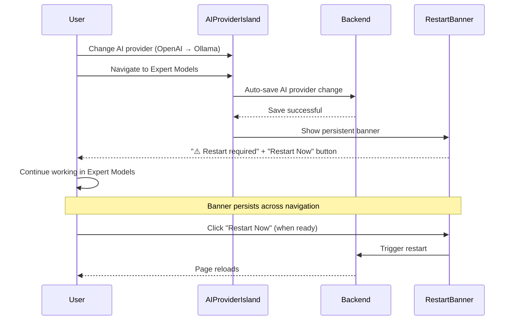
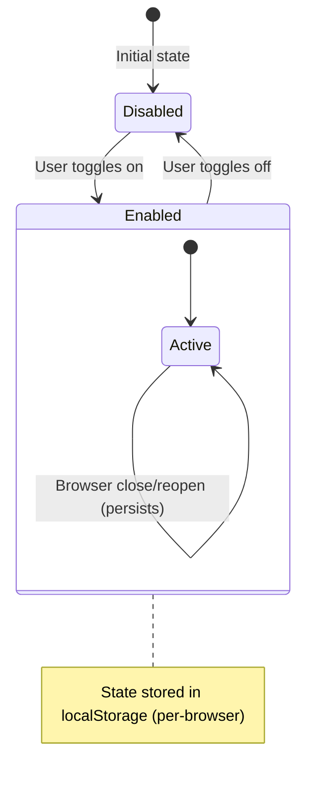
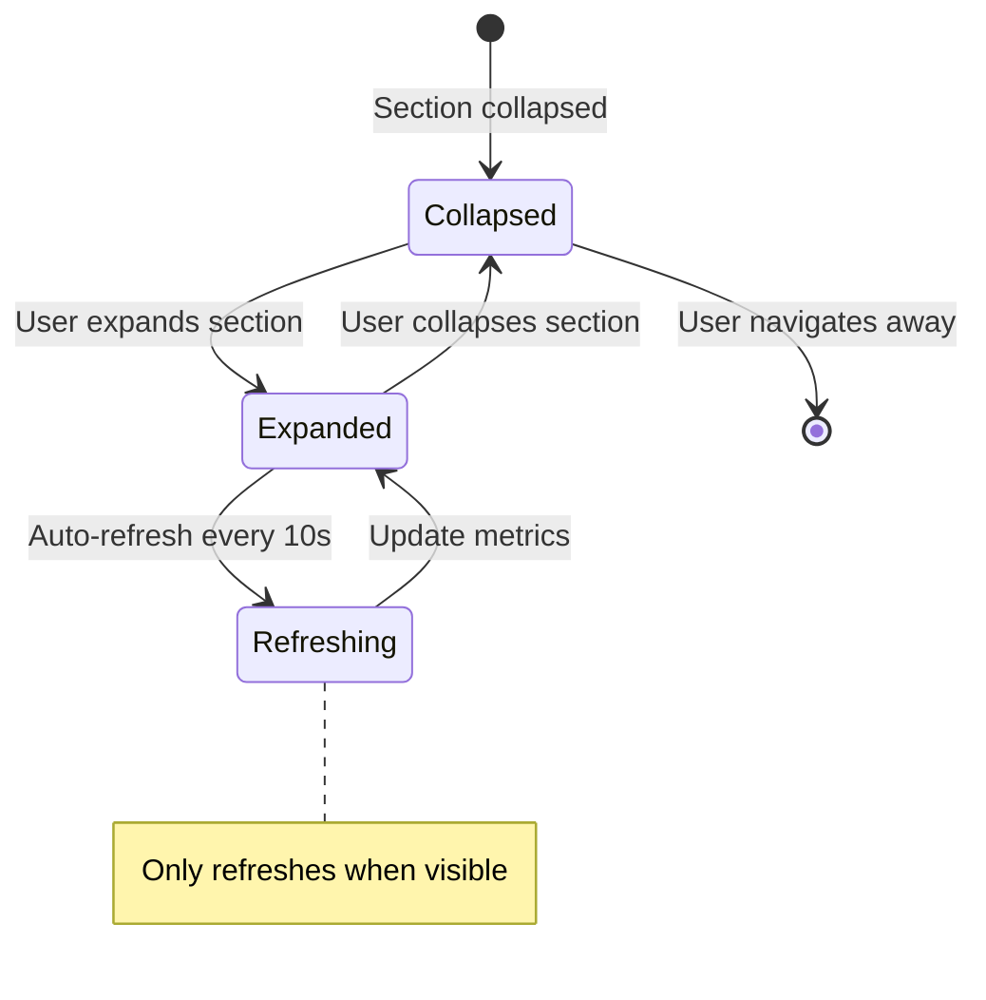

# PRD Validation Summary: Settings Page Clarifications

**Epic**: Settings Page Modernization with Islands Architecture  
**Validation Date**: 2024-01-18  
**Status**: ✅ Complete - All gaps resolved

---

## Validation Process

The Epic Brief (spec:6e0e0983-e5b6-41d3-98e0-9cd4d0ddb783/56121be3-201f-43d2-a410-592c99bbeaa8) and Core Flows (spec:6e0e0983-e5b6-41d3-98e0-9cd4d0ddb783/bd31ae96-5cf1-41e5-8a50-c7141a4e5775) were validated against three dimensions:

1. **Problem Definition & Context** - ✅ Strong
2. **User Experience Requirements** - ✅ Strong (with clarifications)
3. **Functional Requirements Quality** - ✅ Strong

### Validation Results

**Strong Areas**:

- Clear problem articulation (architectural inconsistency, limited developer experience)
- Well-defined stakeholders with specific pain points
- All 8 flows documented with entry/exit points
- Edge cases and error scenarios covered
- Wireframes visualize key UI states

**Gaps Identified**: 5 ambiguities requiring clarification

---

## Gap 1: Auto-save on Navigation for Critical Settings

### The Conflict

**Original Spec Ambiguity**:

- Flow 9 stated "auto-save triggers for unsaved changes" when navigating between categories
- Flows 2-5 described manual save buttons for critical settings (connection, AI provider, model names)
- **Conflict**: If user changes AI provider but doesn't click "Save", then navigates away, what happens?

### Scenario

1. User is in AI Provider category
2. User changes provider from "OpenAI" to "Ollama" (critical setting, requires manual save)
3. User doesn't click "Save & Restart" button
4. User clicks "Expert Models" in sidebar (navigates away)
5. **Question**: Does auto-save trigger and save the AI provider change? Or is the change lost?

### Resolution

**Decision**: Auto-save with deferred restart (accumulate, prompt at end)

**Behavior**:

- Auto-save triggers for **ALL settings** (including critical ones like connection, AI provider, model names)
- Settings are saved to backend immediately
- Restart prompts are **deferred** and accumulated in a **persistent banner** at top of settings page
- Banner shows: "⚠️ Restart required for changes to take effect" + "Restart Now" button
- Banner persists across category navigation within settings
- User can restart anytime or defer until leaving settings page
- No blocking modals during navigation

**Impact on Flows**:

- Flow 9 (Auto-save on Navigation) updated to clarify auto-save applies to all settings
- Flow 10 (Manual Save with Restart) updated to note manual save button is for explicit restart timing
- New pattern: Persistent restart banner (non-blocking, sticky)

**Rationale**: This approach aligns with "auto-save on navigation" decision while respecting restart requirements. Users don't lose data, and navigation isn't blocked by restart prompts.

---

## Gap 2: Developer Mode Persistence Scope

### The Ambiguity

**Original Spec**: Flow 6 stated "State persisted to localStorage" but didn't specify the scope.

**Questions**:

- Is developer mode per-browser, per-user, or per-session?
- Does it persist across browser sessions?
- Does it reset on logout?
- Does it reset on page reload?

### Resolution

**Decision**: Persistent across sessions (per-browser)

**Behavior**:

- User enables developer mode → state saved to localStorage
- User closes browser and reopens → developer mode still enabled
- User logs out and logs back in → developer mode still enabled
- User refreshes page → developer mode still enabled
- Persists until user explicitly disables
- State is per-browser (Chrome vs Firefox have separate states)

**Impact on Flows**:

- Flow 6 (Developer Settings) updated to clarify persistence scope
- Added note: "Does not reset on logout or page reload"

**Rationale**: Persistent across sessions provides maximum convenience for developers who always need dev settings. Security can be added later via password protection if needed.

---

## Gap 3: Preset Diff Modal - Apply Partial Changes

### The Ambiguity

**Original Spec**: Flow 7 described preset diff modal with grouped changes (expandable sections), but didn't specify if users can apply partial changes.

**Question**: Can users selectively apply only some changes from a preset, or is it all-or-nothing?

### Scenario

1. User loads "Medical Workflow" preset
2. Diff modal shows 20 changes across 3 categories (AI Provider, Expert Models, Advanced)
3. User wants to apply Expert Models changes but NOT AI Provider changes
4. **Question**: Can user deselect AI Provider category and apply only Expert Models? Or must they apply all or cancel?

### Resolution

**Decision**: All-or-nothing (apply all or cancel)

**Behavior**:

- User can only "Apply Preset" (all changes) or "Cancel" (no changes)
- No checkboxes for selective application at category or field level
- Simplest implementation, clearest behavior
- If users want partial changes, they can load preset then manually adjust settings afterward

**Impact on Flows**:

- Flow 7 (Preset Loading) updated to clarify all-or-nothing behavior
- Added note: "No selective application - users must apply all changes or cancel"

**Rationale**: All-or-nothing keeps the UX simple and avoids partial state inconsistencies. Users who need customization can load preset then manually tweak settings.

---

## Gap 4: Runtime State Auto-refresh Frequency

### The Ambiguity

**Original Spec**: Flow 6 mentioned "Auto-refresh every 10 seconds (optional)" for runtime state, but didn't specify when auto-refresh is active.

**Questions**:

- Is auto-refresh always on when developer mode is enabled?
- Does it only refresh when Runtime State section is visible?
- Is it user-configurable?
- Does it stop when user navigates away from Developer category?

### Resolution

**Decision**: Only when viewing Runtime State section

**Behavior**:

- Auto-refresh starts when user expands Runtime State section
- Refreshes every 10 seconds while section is expanded
- Stops when user collapses section or navigates away from Developer category
- Manual "Refresh" button always available for on-demand updates
- No user configuration needed (automatic based on visibility)

**Impact on Flows**:

- Flow 6 (Developer Settings) updated to clarify auto-refresh scope
- Added note: "Auto-refresh stops when section collapsed or user navigates away"

**Rationale**: Only refreshing when viewing the section is efficient (no unnecessary polling) and provides fresh data when users need it. Manual refresh button provides control for immediate updates.

---

## Gap 5: Deferred Restart Prompt Location

### The Ambiguity

**Original Spec**: With "auto-save with deferred restart" decision (Gap 1), restart prompts are deferred until user leaves settings page. But where/when should the accumulated restart prompt appear?

**Questions**:

- Should it appear on settings page exit (blocking modal)?
- Should it be a persistent banner within settings?
- Should it be a sidebar indicator?
- Should it combine multiple approaches?

### Resolution

**Decision**: Persistent banner (sticky, non-blocking)

**Behavior**:

- When restart-required changes are saved, banner appears at top of settings page
- Banner shows: "⚠️ Restart required for changes to take effect" + "Restart Now" button
- Banner persists across category navigation within settings
- User can click "Restart Now" anytime or ignore and restart later
- Banner disappears when user restarts or leaves settings page
- Non-blocking: User can continue working in settings

**Impact on Flows**:

- Flow 9 (Auto-save on Navigation) updated to include persistent banner appearance
- Flow 10 (Manual Save with Restart) updated to reference persistent banner
- Flow 6 (Developer Settings - Feature Flags) updated to show banner on flag toggle

**Rationale**: Persistent banner provides continuous awareness of pending restart without blocking workflow. User controls timing of restart, balancing awareness with non-intrusiveness.

---

## Updated Flow Patterns

### Auto-save with Deferred Restart Pattern

### Developer Mode Persistence Pattern

### Runtime State Auto-refresh Pattern

---

## Validation Checklist

### Problem Definition & Context ✅

- [x] Problem clearly articulated (architectural inconsistency, limited developer experience)
- [x] Stakeholders defined (developers, admins, end users)
- [x] Scope appropriate (modernize settings, add developer panel, presets)
- [x] Success criteria defined (architectural consistency, developer settings exposed, modern UX)

### User Experience Requirements ✅

- [x] All 8 flows documented with entry/exit points
- [x] Decision points identified (auto-save vs manual, restart vs hot reload)
- [x] Edge cases covered (validation errors, connection failures, import errors)
- [x] Error scenarios with recovery approaches
- [x] User journey coherent end-to-end
- [x] **All ambiguities resolved** (5 gaps clarified)

### Functional Requirements Quality ✅

- [x] Requirements specific and unambiguous
- [x] Requirements focus on WHAT (behavior) not HOW (implementation)
- [x] Terminology consistent (Islands, shadcn/ui, Zod, auto-save, manual save)
- [x] Complex requirements broken into understandable parts
- [x] Each requirement testable/verifiable

---

## Next Steps

With all gaps resolved and clarifications documented, the specs are ready for:

1. **Tech Plan**: Design high-level technical architecture for Islands, shadcn/ui integration, hot reload, and persistent banner
2. **Ticket Breakdown**: Create implementation tickets organized by phase (Phase 0: shadcn/ui setup, Phase 1-4: Islands implementation)

The validation process has ensured that:

- All requirements are clear and actionable
- No ambiguities remain that could block implementation
- User flows are complete and coherent
- Success criteria are measurable

**Status**: ✅ **Ready for Technical Architecture Phase**

---

## References

- Epic Brief: C:\Users\pwalc\MyApps\paperless-ai\docs\settings\EPIC_BRIEF.md
- Core Flows: C:\Users\pwalc\MyApps\paperless-ai\docs\settings\CORE_FLOWS.md
- Validation Workflow: workflow:271192ed-bf0b-4f43-9915-d77b9e7dbb04/prd-validation

## Additional Scope Validation: Backend Route Modularization

- Scope approved as Phase 5
- Sequential execution confirmed
- Behavior preservation confirmed
- No PRD conflicts introduced
