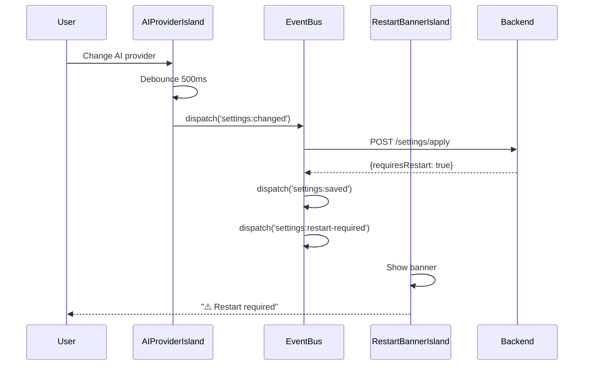
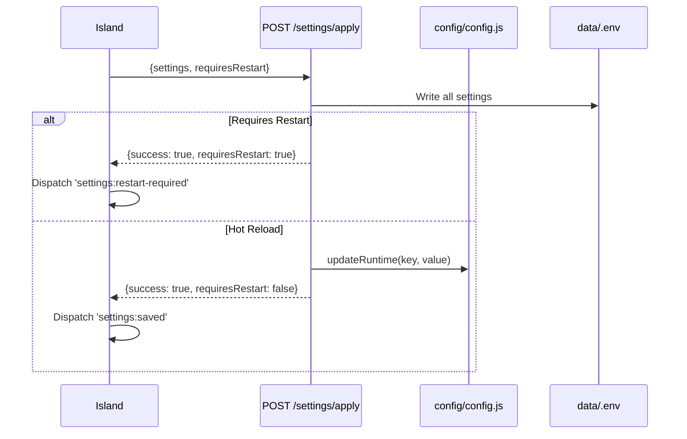

# Tech Plan: Settings Page Islands Architecture with shadcn/ui

**Epic**: Settings Page Modernization with Islands Architecture  
**Status**: Draft  
**Last Updated**: 2024-01-18

---

## 1. Architectural Approach

### 1.1 Islands Architecture Pattern

**Core Principle**: Migrate settings page from vanilla JavaScript to Preact Islands architecture, consistent with Alpha-9 migration (Manual, History, Playground routes).

**Islands Structure** (9 islands total):

1. **OverviewDashboardIsland** - Summary cards with quick actions
2. **SettingsSidebarIsland** - Category navigation with developer mode toggle
3. **ConnectionSettingsIsland** - Paperless-ngx connection configuration
4. **AIProviderIsland** - AI provider selection with internal tabs (General, OpenAI, Ollama, Custom, Azure)
5. **ExpertModelsIsland** - Expert pipeline configuration with internal tabs (Medical, Financial, Legal)
6. **AdvancedSettingsIsland** - Advanced settings with internal tabs (Processing, Restrictions, Custom Fields, System Prompt)
7. **DeveloperSettingsIsland** - Developer settings with collapsible sections (Env Vars, Feature Flags, Performance, Runtime State)
8. **PresetsManagerIsland** - Preset loading/export/import modal
9. **RestartBannerIsland** - Persistent restart notification banner

**Rationale**: One island per category (not per-tab) matches the existing ManualEditorIsland pattern (file:src/islands/ManualEditorIsland.tsx), which already handles internal tabs. This keeps islands manageable while maintaining clear boundaries.

**Trade-off**: Larger islands (~~300-500 lines each) vs. more granular islands (~~20 islands). We choose simplicity and consistency with existing patterns.

---

### 1.2 shadcn/ui Integration (Phase 0 Decision Gate)

**Primary Approach**: shadcn/ui with Radix UI primitives

**Phase 0 Testing Strategy**:

1. Install Tailwind CSS as build dependency (replace CDN)
2. Install shadcn/ui dependencies:
  - `@radix-ui/react-tabs`, `@radix-ui/react-label`, `@radix-ui/react-switch`, `@radix-ui/react-dialog`
  - `class-variance-authority`, `clsx`, `tailwind-merge`
3. Configure Vite with `preact/compat` alias:
  ```typescript
   // vite.config.ts
   resolve: {
     alias: {
       'react': 'preact/compat',
       'react-dom': 'preact/compat'
     }
   }
  ```
4. Test critical components in isolation:
  - Tabs (for AI Provider, Expert Models, Advanced)
  - Card (for Overview dashboard)
  - Form components (Input, Label, Select, Switch)
  - Dialog (for modals)
5. **Decision Point**: If non-trivial incompatibilities → pivot to Headless UI

**Fallback Plan (Headless UI)**:

- Headless UI officially supports Preact
- Components: `@headlessui/react` (Tabs, Dialog, Listbox, Switch)
- Smaller bundle (~30KB vs ~60KB)
- Less comprehensive, but sufficient for settings page
- Manual styling with Tailwind CSS

**Rationale**: shadcn/ui provides state-of-the-art UI with accessible components, but Preact compatibility is unproven. Phase 0 testing validates assumptions early with minimal investment (2-3 days). Fallback ensures timeline safety.

**Trade-off**: Risk of wasted effort (2-3 days) vs. potential for superior UI. We accept the risk with a clear fallback plan.

---

### 1.3 Hot Reload Architecture

**Core Principle**: Non-critical settings apply immediately without restart. Critical settings (connection, AI provider) update .env and trigger restart.

**Implementation Strategy**: In-Memory Config Override

**Current State**:

- file:config/config.js exports static object with environment variables
- Loaded once at startup via `require('dotenv').config()`
- Changes require restart to take effect

**Proposed Refactoring**:

```javascript
// config/config.js
let runtimeOverrides = {};

module.exports = {
  // Convert static properties to getters
  get tokenLimit() {
    return runtimeOverrides.TOKEN_LIMIT || 
           parseInt(process.env.TOKEN_LIMIT, 10) || 
           128000;
  },
  
  get expertPipelineEnabled() {
    return runtimeOverrides.EXPERT_PIPELINE_ENABLED || 
           process.env.EXPERT_PIPELINE_ENABLED || 
           'yes';
  },
  
  // ... all ~85 config properties as getters
  
  // Runtime override methods
  updateRuntime(key, value) {
    runtimeOverrides[key] = value;
  },
  
  clearRuntimeOverrides() {
    runtimeOverrides = {};
  },
  
  getRuntimeOverrides() {
    return { ...runtimeOverrides };
  }
};
```

**Hot Reload API Endpoint**:

```javascript
// routes/setup.js
router.post('/settings/apply', async (req, res) => {
  const { settings, requiresRestart } = req.body;
  
  // Always write to .env file (persistent)
  await setupService.updateEnvFile(settings);
  
  if (requiresRestart) {
    // Critical settings: return restart flag
    return res.json({ success: true, requiresRestart: true });
  }
  
  // Non-critical settings: update in-memory config
  for (const [key, value] of Object.entries(settings)) {
    config.updateRuntime(key, value);
  }
  
  return res.json({ success: true, requiresRestart: false });
});
```

**Settings Classification**:

**Critical (Require Restart)**:

- Connection: `PAPERLESS_API_URL`, `PAPERLESS_API_TOKEN`
- AI Provider: `AI_PROVIDER`, `PAPERLESS_OPENAI_API_KEY`, `OLLAMA_API_URL`, `OLLAMA_MODEL`
- Expert Models: `MEDICAL_VISION_MODEL`, `FINANCIAL_ANALYSIS_MODEL`, etc.
- System Prompt: `SYSTEM_PROMPT`
- Custom Fields: `CUSTOM_FIELDS`

**Non-Critical (Hot Reload)**:

- Token Limits: `TOKEN_LIMIT`, `RESPONSE_TOKENS`, `OLLAMA_CONTEXT_WINDOW`, etc.
- Toggles: `EXPERT_PIPELINE_ENABLED`, `ACTIVATE_TAGGING`, `ACTIVATE_CORRESPONDENTS`, etc.
- Processing: `SCAN_INTERVAL`, `ADD_AI_PROCESSED_TAG`, `AI_PROCESSED_TAG_NAME`
- Restrictions: `RESTRICT_TO_EXISTING_TAGS`, `RESTRICT_TO_EXISTING_CORRESPONDENTS`, etc.
- Feature Flags: All developer settings feature flags

**Rationale**: In-memory override is simple, requires minimal refactoring, and provides immediate feedback. Settings persist to .env file for durability. Critical settings that affect service initialization (AI provider, models) still require restart.

**Trade-off**: Requires converting ~~85 config properties to getters (~~200 lines of refactoring) vs. more complex database-backed approach. We choose simplicity.

---

### 1.4 Event Bus Pattern

**Core Principle**: Use document-level CustomEvents with Zod validation, consistent with Alpha-9 Islands architecture.

**Event Schema**:

```typescript
// Settings events (add to src/islands/runtime.js)
const SettingsChangedEventSchema = z.object({
  category: z.enum(['connection', 'ai-provider', 'expert-models', 'advanced', 'developer']),
  settings: z.record(z.any()),
  requiresRestart: z.boolean()
});

const SettingsSavedEventSchema = z.object({
  category: z.string(),
  success: z.boolean(),
  message: z.string().optional()
});

const RestartRequiredEventSchema = z.object({
  reason: z.string(),
  settings: z.array(z.string())
});

const PresetLoadedEventSchema = z.object({
  presetName: z.string(),
  changedSettings: z.record(z.any())
});

const DeveloperToggledEventSchema = z.object({
  enabled: z.boolean()
});
```

**Event Flow**:



**Rationale**: Event bus provides loose coupling between islands, consistent with Alpha-9 architecture. Both-side Zod validation ensures type safety.

**Trade-off**: More events to manage vs. direct island communication. We choose architectural consistency.

---

## Phase 1 Amendment (short)

Decision: **Proceed with shadcn/ui** (P0.1 Decision Gate — 2026-01-23). Artifacts & report: `test-results/playwright-report/index.html`, `test-results/playwright-shadcn-compat/screenshot-after-interactions.png`. See `docs/settings/tickets/completed/P0.1-shadcn-decision-gate.md` for details.

Phase 1 kickoff tasks (short):
- **P1.0**: Add Zod contracts for Settings domains under `src/ui/contracts/` (Connection, AI Provider, Expert Models, Advanced, Developer). Add unit tests. — Owner: frontend — Est 2-3 days ✅
- **P1.1**: Add settings events to `src/islands/runtime.js` (register `settings:changed`, `settings:saved`, `settings:restart-required`, `preset:loaded`, `developer:toggled`) and add tests. — Owner: frontend — Est 1 day ✅
- **P1.2**: Implement config hot-reload foundations in `config/config.js` (in-memory `runtimeOverrides`, `updateRuntime`) with tests. — Owner: implement — Est 3 days ✅
- **P1.3**: Scaffold base islands (OverviewDashboard, SettingsSidebar, RestartBanner) with placeholder UI and smoke tests. — Owner: frontend — Est 2 days ✅

Notes:
- Playwright E2E for Phase 0 passed; Vitest had environment-related failures that are non-blocking for shadcn adoption. Add test infra remediation tasks to backlog.
- Keep `feature/shadcn-compat-phase0` artifacts attached to P0.0 results.

---

### 1.5 Persistent Restart Banner

**Core Principle**: Non-blocking, sticky banner at top of settings page that accumulates restart-required changes.

**Implementation**:

**RestartBannerIsland State**:

```typescript
interface RestartBannerState {
  visible: boolean;
  pendingSettings: string[]; // List of settings requiring restart
  reason: string;
}
```

**Behavior**:

- Listens to `settings:restart-required` events
- Accumulates pending settings (e.g., ["AI Provider", "Medical Vision Model"])
- Shows banner with "Restart Now" button
- Persists across category navigation within settings
- Hides when user restarts or leaves settings page

**Rationale**: Persistent banner provides continuous awareness without blocking workflow. User controls restart timing.

**Trade-off**: Additional island vs. vanilla JS banner. We choose architectural consistency.

---

### 1.6 Auto-save with Deferred Restart

**Core Principle**: Auto-save triggers on navigation, field blur, and toggle changes. Restart prompts deferred to persistent banner.

**Auto-save Triggers**:

- **Navigation**: User clicks another category → auto-save current island
- **Field Blur**: User tabs away from text input → debounced auto-save (500ms)
- **Toggle Change**: User toggles switch → immediate auto-save (no debounce)
- **Drag-and-Drop**: User reorders custom fields → auto-save on drop

**Debouncing Strategy**: Per-island (not per-field)

- Single debounce timer per island
- Changing any field resets timer
- After 500ms of no changes, save all changed fields in one API call
- Reduces API calls, batches related changes

**Restart Deferral**:

- Critical settings saved → dispatch `settings:restart-required` event
- RestartBannerIsland shows banner
- User continues working, banner persists
- User clicks "Restart Now" when ready → POST `/settings/restart` → `window.location.reload()`

**Rationale**: Auto-save prevents data loss, deferred restart prevents workflow interruption. User controls restart timing.

**Trade-off**: More complex state management vs. simpler blocking restart. We choose better UX.

---

### 1.7 Developer Settings with Runtime State

**Core Principle**: Developer settings toggle-gated, with runtime state visibility via collapsible sections.

**Developer Mode Toggle**:

- Located in SettingsSidebarIsland footer
- State persisted to localStorage (per-browser, across sessions)
- When enabled, "Developer" category appears in sidebar
- Visual indicator (badge) shows developer mode is active

**Runtime State Fetching**:

- Endpoint: `GET /api/runtime/state`
- Returns:
  ```json
  {
    "circuitBreaker": { "state": "CLOSED", "failures": 0 },
    "vram": { "current": 3.5, "total": 24, "unit": "GB" },
    "qdrant": { "status": "healthy", "collections": 3, "points": 15000 },
    "sidecar": { "status": "200 OK", "model": "ColQwen3-4B-AWQ" },
    "backgroundSync": { "lastRun": "2024-01-18T10:30:00Z", "pending": 0 }
  }
  ```
- Auto-refresh every 10 seconds (only when Runtime State section visible/expanded)
- Manual "Refresh" button always available

**Feature Flags Auto-save**:

- Toggle switch → immediate auto-save (no debounce)
- If flag requires restart, dispatch `settings:restart-required` event
- Fastest feedback loop for developers

**Rationale**: Developer settings provide visibility into system state for troubleshooting. Auto-refresh only when visible avoids unnecessary polling.

**Trade-off**: Additional API endpoint vs. embedding state in settings response. We choose dedicated endpoint for separation of concerns.

---

### 1.8 Presets with Diff Review

**Core Principle**: Predefined presets (Development, Production, Medical, Financial, Legal) with diff modal showing changes before applying.

**Preset Storage**:

- Presets stored as JSON files in `config/presets/` directory
- Each preset defines settings to override:
  ```json
  {
    "name": "Medical Workflow",
    "description": "Optimized for medical documents",
    "settings": {
      "EXPERT_PIPELINE_ENABLED": "yes",
      "MEDICAL_VISION_MODEL": "llava-med-v1.6",
      "MEDICAL_ANALYSIS_MODEL": "medtext-llama3",
      "AI_PROVIDER": "ollama"
    }
  }
  ```

**Diff Calculation**:

- Backend compares current settings with preset settings
- Returns grouped changes by category
- Frontend shows diff modal with expandable sections
- All-or-nothing application (no selective changes)

**Rationale**: Presets enable quick configuration for specific workflows. Diff review prevents unintended changes.

**Trade-off**: All-or-nothing vs. selective application. We choose simplicity (all-or-nothing).

---

### 1.9 Export/Import (.env Format)

**Core Principle**: Export all settings (~85+ lines) to .env file for DevOps workflows. Import with validation and diff review.

**Export Implementation**:

- Endpoint: `GET /settings/export`
- Generates .env file with all current settings
- Organized by category with comments:
  ```
  # Connection Settings
  PAPERLESS_API_URL=http://localhost:8000
  PAPERLESS_API_TOKEN=abc123

  # AI Provider Settings
  AI_PROVIDER=ollama
  OLLAMA_API_URL=http://localhost:11434
  ```
- Downloads as `paperless-ai-settings-YYYY-MM-DD.env`

**Import Implementation**:

- Endpoint: `POST /settings/import`
- Parses .env file, validates against Zod schemas
- Returns diff (same format as preset diff)
- User reviews and applies (all-or-nothing)

**Rationale**: .env format is standard for Docker/deployment workflows. Complete export ensures full configuration snapshot.

**Trade-off**: Large file (~85+ lines) vs. selective export. We choose completeness for deployment reliability.

---

### 1.10 Key Architectural Decisions Summary


| Decision             | Choice                                            | Rationale                                | Trade-off                                           |
| -------------------- | ------------------------------------------------- | ---------------------------------------- | --------------------------------------------------- |
| UI Library           | shadcn/ui (Phase 0 test) → Headless UI (fallback) | State-of-the-art UI with fallback safety | Risk of wasted effort vs. superior UI               |
| Hot Reload           | In-memory config override                         | Simple, immediate, no database changes   | Requires getter refactoring vs. database complexity |
| Islands Granularity  | One per category (9 islands)                      | Matches ManualEditorIsland pattern       | Larger islands vs. more islands to manage           |
| Restart Banner       | Separate RestartBannerIsland                      | Architectural consistency                | Additional island vs. vanilla JS simplicity         |
| Auto-save Debouncing | Per-island (500ms)                                | Batches changes, fewer API calls         | Less granular vs. per-field overhead                |
| .env Management      | Always write to .env                              | Persistent, single source of truth       | Frequent writes vs. in-memory only                  |
| Event Bus            | Use event bus pattern                             | Consistent with Alpha-9                  | More events vs. direct communication                |


---

## 2. Data Model

### 2.1 No Database Schema Changes Required

**Key Insight**: Settings page modernization is a **frontend-only migration**. No new database tables or schema changes needed.

**Existing Data Storage**:

- **Primary**: `data/.env` file (environment variables)
- **Runtime**: `config/config.js` in-memory object
- **Client**: localStorage for UI state (theme, developer mode, sidebar state)

**Rationale**: Settings are configuration, not application data. Environment variables are the appropriate storage mechanism for configuration.

---

### 2.2 Configuration Data Model

**Existing Structure** (file:config/config.js):

```typescript
interface AppConfig {
  // Connection (3 fields)
  paperless: {
    apiUrl: string;
    apiToken: string;
  };
  
  // AI Provider (40+ fields)
  aiProvider: 'openai' | 'ollama' | 'custom' | 'azure';
  openai: { apiKey: string };
  ollama: {
    apiUrl: string;
    model: string;
    visionModel: string;
    plannerModel: string;
    routerModel: string;
    orchestratorModel: string;
    limits: { text, vision, planner, expert };
    modelLimits: Record<string, ModelLimit>;
  };
  custom: { apiUrl, apiKey, model };
  azure: { apiKey, endpoint, deploymentName, apiVersion };
  
  // Expert Models (15+ fields)
  expertModels: {
    medical: { vision, analysis, radiology };
    financial: { analysis, vision, vatExpert };
    legal: { vision, analysis, orchestrator };
  };
  expertPipelineEnabled: boolean;
  
  // Advanced (40+ fields)
  scanInterval: string;
  tokenLimit: number;
  responseTokens: number;
  addAIProcessedTag: boolean;
  addAIProcessedTags: string;
  restrictToExistingTags: boolean;
  restrictToExistingCorrespondents: boolean;
  restrictToExistingDocumentTypes: boolean;
  externalApiConfig: { enabled, url, method, headers, body, timeout };
  limitFunctions: { activateTagging, activateCorrespondents, ... };
  customFields: string; // JSON string
  
  // Developer (runtime state - read-only)
  // Fetched from /api/runtime/state, not stored in config
}
```

**No Changes Needed**: Existing config structure already supports all settings. Islands will read from and write to this structure.

---

### 2.3 Runtime Overrides Data Model

**New Structure** (in-memory only):

```typescript
interface RuntimeOverrides {
  [key: string]: any; // Dynamic key-value pairs
}

// Example:
{
  "TOKEN_LIMIT": 256000,
  "EXPERT_PIPELINE_ENABLED": "no",
  "ACTIVATE_TAGGING": "yes"
}
```

**Lifecycle**:

- Created on first hot reload save
- Persists in memory until restart
- Cleared on restart (reverts to .env values)
- Not persisted to disk (only .env file is persistent)

**Rationale**: Temporary overrides for hot reload. .env file remains source of truth.

---

### 2.4 localStorage Data Model

**Existing** (preserved):

```typescript
interface LocalStorageState {
  theme: 'light' | 'dark';
}
```

**New** (added):

```typescript
interface LocalStorageState {
  theme: 'light' | 'dark';
  developerMode: boolean; // Persists across sessions
  lastVisitedCategory?: string; // Optional: remember last category
  sidebarCollapsed?: boolean; // Optional: sidebar state
}
```

**Rationale**: UI state (developer mode, navigation) persists in localStorage for better UX. Settings data persists in .env file.

---

### 2.5 Preset Data Model

**Preset File Structure**:

```typescript
interface Preset {
  name: string;
  description: string;
  icon?: string; // Optional icon name
  settings: Record<string, any>; // Partial config override
}

// Example: config/presets/medical.json
{
  "name": "Medical Workflow",
  "description": "Optimized for medical documents with radiology support",
  "icon": "fa-heartbeat",
  "settings": {
    "EXPERT_PIPELINE_ENABLED": "yes",
    "MEDICAL_VISION_MODEL": "llava-med-v1.6",
    "MEDICAL_ANALYSIS_MODEL": "medtext-llama3",
    "MEDICAL_RADIOLOGY_MODEL": "llava-med-v1.6",
    "AI_PROVIDER": "ollama"
  }
}
```

**Predefined Presets**:

- `config/presets/development.json` - Ollama, local services, debug logging
- `config/presets/production.json` - OpenAI, optimized settings, minimal logging
- `config/presets/medical.json` - Medical experts enabled
- `config/presets/financial.json` - Financial experts enabled
- `config/presets/legal.json` - Legal experts enabled

**Rationale**: JSON files are easy to edit, version control, and share. Partial overrides allow presets to focus on relevant settings.

---

## 3. Component Architecture

### 3.1 Islands Component Structure

**Base Pattern** (consistent with Alpha-9):

```typescript
// src/islands/ConnectionSettingsIsland.tsx
import { h } from 'preact';
import { useState, useEffect } from 'preact/hooks';
import { ConnectionSettingsSchema } from '../ui/contracts/ConnectionSettings.contract';

export function ConnectionSettingsIsland(props) {
  const validated = ConnectionSettingsSchema.parse(props);
  const [settings, setSettings] = useState(validated);
  const [saving, setSaving] = useState(false);
  
  const handleSave = async () => {
    setSaving(true);
    
    // Dispatch event (both-side validation)
    const event = new CustomEvent('settings:changed', {
      detail: { category: 'connection', settings, requiresRestart: true }
    });
    document.dispatchEvent(event);
    
    // API call
    const response = await fetch('/settings/apply', {
      method: 'POST',
      headers: { 'Content-Type': 'application/json' },
      body: JSON.stringify({ settings, requiresRestart: true })
    });
    
    const result = await response.json();
    
    // Dispatch save event
    document.dispatchEvent(new CustomEvent('settings:saved', {
      detail: { category: 'connection', success: result.success }
    }));
    
    if (result.requiresRestart) {
      document.dispatchEvent(new CustomEvent('settings:restart-required', {
        detail: { reason: 'Connection settings changed', settings: ['API URL', 'API Token'] }
      }));
    }
    
    setSaving(false);
  };
  
  return (
    <div className="space-y-4">
      {/* shadcn/ui Form components */}
      <Input label="API URL" value={settings.apiUrl} onChange={...} />
      <Input label="API Token" type="password" value={settings.apiToken} onChange={...} />
      <Button onClick={handleSave} disabled={saving}>
        {saving ? 'Saving...' : 'Save & Restart'}
      </Button>
    </div>
  );
}
```

**Zod Contract** (src/ui/contracts/ConnectionSettings.contract.ts):

```typescript
import { z } from 'zod';

export const ConnectionSettingsSchema = z.object({
  apiUrl: z.string().url(),
  apiToken: z.string().min(1),
  username: z.string().optional()
});
```

**Rationale**: Consistent with existing islands pattern (VisualAnnotationIsland, ManualEditorIsland). Zod validation ensures type safety.

---

### 3.2 Islands Inventory


| Island                   | Responsibility                          | Internal Tabs    | Auto-save                  | Manual Save                     |
| ------------------------ | --------------------------------------- | ---------------- | -------------------------- | ------------------------------- |
| OverviewDashboardIsland  | Summary cards, quick actions            | No               | N/A                        | N/A                             |
| SettingsSidebarIsland    | Navigation, developer mode toggle       | No               | N/A                        | N/A                             |
| ConnectionSettingsIsland | Paperless-ngx connection                | No               | No                         | Yes (restart)                   |
| AIProviderIsland         | AI provider selection, credentials      | Yes (5 tabs)     | Token limits               | Provider, models (restart)      |
| ExpertModelsIsland       | Expert pipeline, domain models          | Yes (3 tabs)     | Token limits               | Models (restart)                |
| AdvancedSettingsIsland   | Processing, restrictions, custom fields | Yes (4 tabs)     | Toggles, restrictions      | Custom fields, prompt (restart) |
| DeveloperSettingsIsland  | Env vars, feature flags, runtime state  | No (collapsible) | Feature flags, perf tuning | Env vars (restart)              |
| PresetsManagerIsland     | Load/export/import presets              | No               | N/A                        | N/A (modal)                     |
| RestartBannerIsland      | Persistent restart notification         | No               | N/A                        | N/A                             |


**Total**: 9 islands

---

### 3.3 Backend API Endpoints

**Existing** (preserved):

- `GET /settings` - Load current settings (file:routes/setup.js line 3404)
- `POST /settings` - Save all settings with restart (file:routes/setup.js line 5196)

**New** (to be created):

- `POST /settings/apply` - Hot reload endpoint (save + optional restart)
- `GET /settings/export` - Export .env file
- `POST /settings/import` - Import .env file with validation
- `GET /settings/presets` - List available presets
- `POST /settings/presets/:name` - Load preset with diff calculation
- `GET /api/runtime/state` - Fetch runtime metrics (circuit breaker, VRAM, Qdrant, sidecar, background sync)
- `POST /settings/restart` - Trigger application restart

**Endpoint Responsibilities**:



**Rationale**: Separate endpoints for different concerns (hot reload vs. full save, export vs. import). Clear responsibilities.

---

### 3.4 Vite Build Configuration

**Current** (file:vite.config.ts):

```typescript
export default defineConfig({
  plugins: [preact()],
  build: {
    lib: {
      entry: {
        'island-runtime': 'src/islands/runtime.js',
        'manual-editor': 'src/islands/ManualEditorIsland.tsx',
        'feedback-controls': 'src/islands/FeedbackControlsIsland.tsx'
      },
      formats: ['es'],
      fileName: (format, entryName) => `${entryName}.island.js`
    }
  }
});
```

**Updated** (add settings islands):

```typescript
export default defineConfig({
  plugins: [preact()],
  css: {
    postcss: {
      plugins: [
        require('tailwindcss'),
        require('autoprefixer')
      ]
    }
  },
  resolve: {
    alias: {
      'react': 'preact/compat',
      'react-dom': 'preact/compat'
    }
  },
  build: {
    lib: {
      entry: {
        'island-runtime': 'src/islands/runtime.js',
        // Existing islands
        'manual-editor': 'src/islands/ManualEditorIsland.tsx',
        'feedback-controls': 'src/islands/FeedbackControlsIsland.tsx',
        // New settings islands
        'overview-dashboard': 'src/islands/OverviewDashboardIsland.tsx',
        'settings-sidebar': 'src/islands/SettingsSidebarIsland.tsx',
        'connection-settings': 'src/islands/ConnectionSettingsIsland.tsx',
        'ai-provider': 'src/islands/AIProviderIsland.tsx',
        'expert-models': 'src/islands/ExpertModelsIsland.tsx',
        'advanced-settings': 'src/islands/AdvancedSettingsIsland.tsx',
        'developer-settings': 'src/islands/DeveloperSettingsIsland.tsx',
        'presets-manager': 'src/islands/PresetsManagerIsland.tsx',
        'restart-banner': 'src/islands/RestartBannerIsland.tsx'
      },
      formats: ['es'],
      fileName: (format, entryName) => `${entryName}.island.js`
    }
  }
});
```

**Rationale**: Each island bundled separately for code splitting. Preact compat alias enables shadcn/ui (Radix UI) compatibility.

---

### 3.5 Event Bus Integration

**Event Registry** (add to file:src/islands/runtime.js):

```typescript
// Settings event schemas
export const settingsEventSchemas = {
  'settings:changed': SettingsChangedEventSchema,
  'settings:saved': SettingsSavedEventSchema,
  'settings:restart-required': RestartRequiredEventSchema,
  'preset:loaded': PresetLoadedEventSchema,
  'developer:toggled': DeveloperToggledEventSchema
};

// Register settings events
for (const [eventName, schema] of Object.entries(settingsEventSchemas)) {
  eventSchemas.set(eventName, schema);
}
```

**Event Dispatch Pattern** (both-side validation):

```typescript
// Dispatch (sender validates)
const event = new CustomEvent('settings:changed', {
  detail: SettingsChangedEventSchema.parse({ category, settings, requiresRestart })
});
document.dispatchEvent(event);

// Listen (receiver validates)
document.addEventListener('settings:changed', (e) => {
  const validated = SettingsChangedEventSchema.parse(e.detail);
  // Handle event
});
```

**Rationale**: Both-side validation (as per Alpha-9 pattern) ensures type safety. Centralized event registry makes events discoverable.

---

### 3.6 Hot Reload Config Refactoring

**Current** (file:config/config.js):

```javascript
module.exports = {
  tokenLimit: parseInt(process.env.TOKEN_LIMIT, 10) || 128000,
  expertPipelineEnabled: parseEnvBoolean(process.env.EXPERT_PIPELINE_ENABLED, 'yes'),
  // ... 85+ static properties
};
```

**Refactored** (with getters):

```javascript
let runtimeOverrides = {};

module.exports = {
  get tokenLimit() {
    return runtimeOverrides.TOKEN_LIMIT || 
           parseInt(process.env.TOKEN_LIMIT, 10) || 
           128000;
  },
  
  get expertPipelineEnabled() {
    return runtimeOverrides.EXPERT_PIPELINE_ENABLED || 
           parseEnvBoolean(process.env.EXPERT_PIPELINE_ENABLED, 'yes');
  },
  
  // ... all properties as getters
  
  updateRuntime(key, value) {
    runtimeOverrides[key] = value;
  },
  
  clearRuntimeOverrides() {
    runtimeOverrides = {};
  }
};
```

**Migration Strategy**:

1. Convert one property at a time (incremental)
2. Test after each conversion
3. Prioritize hot-reload settings first (token limits, toggles)
4. Critical settings can remain static (will restart anyway)

**Rationale**: Incremental refactoring reduces risk. Hot-reload settings converted first for immediate value.

---

### 3.7 Integration Points

**Settings Islands → Backend**:

- Islands call `/settings/apply` for hot reload
- Islands call `/settings` for full save with restart
- Islands call `/api/runtime/state` for developer metrics

**Settings Islands → Event Bus**:

- Islands dispatch events on save, navigation, preset load
- RestartBannerIsland listens to `settings:restart-required`
- SettingsSidebarIsland listens to `developer:toggled`

**Settings Islands → localStorage**:

- SettingsSidebarIsland persists developer mode state
- Theme toggle persists theme preference (existing)

**Backend → .env File**:

- All settings written to `data/.env` via `setupService.updateEnvFile()`
- Existing mechanism preserved

**Backend → config/config.js**:

- Hot reload settings update via `config.updateRuntime()`
- Critical settings require restart (reload .env file)

---

### 3.8 Component Reuse Strategy

**shadcn/ui Components** (if Phase 0 succeeds):

- Tabs: AI Provider, Expert Models, Advanced categories
- Card: Overview dashboard summary cards
- Form components: Input, Label, Select, Switch, Textarea
- Dialog: Preset diff modal, import validation modal
- Button: Save buttons, quick actions
- Badge: Restart required indicators

**Shared Preact Components** (create in `src/components/`):

- `SettingsCard.tsx` - Reusable card for Overview dashboard
- `SettingsInput.tsx` - Wrapper for shadcn/ui Input with validation
- `SettingsSelect.tsx` - Wrapper for shadcn/ui Select with validation
- `SettingsSwitch.tsx` - Wrapper for shadcn/ui Switch with auto-save
- `DiffViewer.tsx` - Reusable diff display for presets and imports

**Rationale**: Shared components reduce duplication and ensure consistency. Wrappers add validation and auto-save logic.

---

### 3.9 Testing Strategy

**Unit Tests** (Mocha + Node assert):

- Test each island in isolation with JSDOM
- Test Zod schema validation
- Test event dispatch/listen
- Test auto-save debouncing
- Test hot reload config override

**Integration Tests**:

- Test island-to-island communication via event bus
- Test hot reload API endpoint
- Test preset loading with diff calculation
- Test export/import with validation

**E2E Tests** (Playwright):

- Test complete user flows (Flow 1-12 from Core Flows)
- Test navigation with auto-save
- Test preset loading end-to-end
- Test developer mode toggle and runtime state

**Rationale**: Comprehensive testing ensures quality. Matches Alpha-9 testing approach.

---

### 3.10 Migration Path

**Phase 0: shadcn/ui Setup** (2-3 days)

- Install Tailwind CSS as build dependency
- Install shadcn/ui dependencies
- Configure Vite with preact/compat
- Test key components in isolation
- **Decision Gate**: Continue with shadcn/ui or pivot to Headless UI

**Phase 1: Infrastructure** (Week 1)

- Create Zod schemas for all settings islands
- Refactor config.js with getters (hot reload support)
- Create base islands (OverviewDashboard, SettingsSidebar, RestartBanner)
- Implement hot reload API endpoint
- Set up event bus for settings events

**Phase 2: Core Islands** (Week 2-3)

- ConnectionSettingsIsland
- AIProviderIsland (with tabs)
- ExpertModelsIsland (with tabs)
- AdvancedSettingsIsland (with tabs)

**Phase 3: Developer Settings** (Week 4)

- DeveloperSettingsIsland (toggle-gated)
- Runtime state API endpoint
- Feature flags auto-save
- Performance tuning UI

**Phase 4: Presets & Polish** (Week 5)

- PresetsManagerIsland
- Predefined presets (Development, Production, Medical, Financial, Legal)
- Export/import functionality
- Animations and transitions
- Accessibility improvements

**Rationale**: Phased approach allows incremental validation. Phase 0 decision gate protects timeline.

---

## Summary

**Key Architectural Decisions**:

1. ✅ shadcn/ui with Phase 0 testing and Headless UI fallback
2. ✅ In-memory config override for hot reload
3. ✅ One island per category (9 islands total)
4. ✅ Separate RestartBannerIsland for architectural consistency
5. ✅ Per-island debouncing (500ms, batched saves)
6. ✅ Always write to .env (persistent, single source of truth)
7. ✅ Event bus pattern (consistent with Alpha-9)

**Data Model**:

- No database schema changes required
- In-memory runtime overrides for hot reload
- localStorage for UI state (developer mode, theme)
- Preset files in `config/presets/` directory

**Component Architecture**:

- 9 islands following Alpha-9 pattern
- Zod schemas for validation
- Event bus for cross-island communication
- Hot reload API endpoint for non-critical settings
- Runtime state API for developer visibility

**Timeline**: 6-7 weeks (including Phase 0 testing)

**Risk Mitigation**: Phase 0 decision gate, fallback plan, incremental migration

---

## References

- Epic Brief: spec:6e0e0983-e5b6-41d3-98e0-9cd4d0ddb783/56121be3-201f-43d2-a410-592c99bbeaa8
- Core Flows: spec:6e0e0983-e5b6-41d3-98e0-9cd4d0ddb783/bd31ae96-5cf1-41e5-8a50-c7141a4e5775
- PRD Validation: spec:6e0e0983-e5b6-41d3-98e0-9cd4d0ddb783/3d3599d9-b443-4b33-afed-830e1e7aaccd
- Existing Islands Runtime: file:src/islands/runtime.js
- Current Config: file:config/config.js
- Current Settings Route: file:routes/setup.js
- Vite Config: file:vite.config.ts


## Phase 5: Backend Route Extraction (NEW)

### Objective
Modularize backend routing by extracting all remaining route groups from `routes/setup.js` into focused route modules, preserving exact behavior.

### Files to Extract

| File | Responsibility |
|----|---------------|
| routes/auth.js | Login, logout, JWT, sessions |
| routes/documents.js | Thumbnails, PDFs, sample docs |
| routes/chat.js | Chat UI, streaming, Ollama |
| routes/history.js | History UI & API |
| routes/processing.js | Scan, reset, pipelines |
| routes/system.js | Health, webhook, debug |

### Constraints
- No logic changes
- No refactors
- No behavior changes
- Incremental extraction with validation

### Integration
- server.js imports all route modules
- setup.js reduced to bootstrap + shared middleware

### Validation
- Manual smoke testing after each extraction
- Full regression testing at phase end
