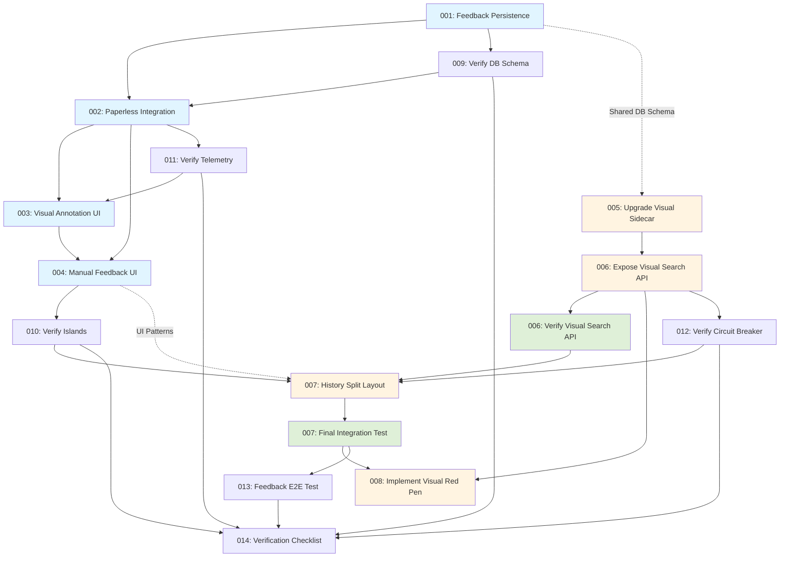

# Prompt Execution Order and Dependencies

## Overview
This document defines the authoritative execution order for implementation prompts 001-007, including dependencies, parallel execution opportunities, and integration checkpoints.

## Dependency Graph



## Execution Phases

### Phase 1: Backend Foundation (Sequential)
**Prompts:** 001 → 002
**Duration:** ~2-3 days
**Blocking:** Must complete before Phase 2

**001: Implement Feedback Persistence**
- **Dependencies:** None (foundation)
- **Outputs:** Database migration, FeedbackService, API endpoint
- **Verification:** Run migration, execute tests, verify schema
- **Blocks:** 002, 003, 004

**002: Enhance Paperless Integration**
- **Dependencies:** 001 (requires FeedbackService)
- **Outputs:** Updated PaperlessService, orchestrator route
- **Verification:** Test custom fields update, orchestration flow
- **Blocks:** 003, 004

### Phase 2: Manual Route UI (Parallel Possible)
**Prompts:** 003 + 004 (can start 003 early, but 004 depends on 003)
**Duration:** ~3-4 days
**Blocking:** Independent from History Route (Phase 3)

**003: Implement Visual Annotation UI**
- **Dependencies:** 002 (requires orchestrator route)
- **Outputs:** Updated manual.ejs, annotation JavaScript
- **Verification:** Test drawing, coordinate capture, modal display
- **Blocks:** 004
- **Parallel Opportunity:** Can start while 002 is in verification

**004: Implement Manual Feedback UI**
- **Dependencies:** 002, 003 (requires orchestrator + annotation state)
- **Outputs:** Updated manual.ejs, form logic, unified payload
- **Verification:** Test payload structure, feedback controls, save flow
- **Blocks:** None (end of Manual Route sequence)

### Phase 3: History Route Enhancement (Parallel with Phase 2)
**Prompts:** 005 → 006 → 006-verify → 007 → 007-final-test → 008
**Duration:** ~3-5 days
**Blocking:** Independent from Manual Route (can run in parallel)

**005: Upgrade Visual Sidecar**
- **Dependencies:** None (independent Python service)
- **Outputs:** Updated main.py, image search endpoint
- **Verification:** Test image query endpoint, verify results
- **Blocks:** 006
- **Parallel Opportunity:** Can execute simultaneously with 003-004

**006: Expose Visual Search API**
- **Dependencies:** 005 (requires sidecar image search)
- **Outputs:** Updated VisualSearchClient, API route
- **Verification:** Test API endpoint, proxy to sidecar
- **Blocks:** 006-verify

**006-verify: Verify Visual Search API (Standalone Verification Prompt)**
- **Dependencies:** 006 (implementation)
- **Outputs:** Contract tests, scripts, verification summary
- **Verification:** Run `006-verify-existing-logic.md` verification steps
- **Blocks:** 007

**007: Implement History Split Layout**
- **Dependencies:** 006-verify (requires verified API)
- **Outputs:** Updated history-document.ejs, layout CSS
- **Verification:** Test split pane, image loading, tab navigation
- **Blocks:** 007-final-test

**007-final-test: Final Integration Test (Standalone Verification Prompt)**
- **Dependencies:** 007 (implementation), 006-verify, 008 (Red Pen) ideally available
- **Outputs:** E2E test artifacts, verification summary
- **Verification:** Run `007-final-integration-test.md` verification steps
- **Blocks:** 008 (if not yet executed) or Completion

**008: Implement Visual Red Pen**
- **Dependencies:** 006 (API) and 007 (layout)
- **Outputs:** `history-document` client-side drawing, search trigger, results UI
- **Verification:** Test drawing to search flow and results rendering
- **Blocks:** None (end of History Route sequence)

## Parallel Execution Strategy

### Optimal Parallelization
```
Timeline:
Day 1-2:   001 (Sequential - Foundation)
Day 2-3:   002 (Sequential - Orchestration)
Day 3-5:   003 + 005 (Parallel - Independent tracks)
Day 5-7:   004 + 006 (Parallel - Independent tracks)
Day 7-8:   007 (Final - History Route completion)
```

### Team Assignment (if multiple developers)
- **Developer A (Backend Focus):** 001 → 002 → Support 003/004
- **Developer B (Python/Sidecar):** 005 → 006 → 007
- **Developer C (Frontend):** 003 → 004 (starts after 002)

## Integration Checkpoints

### Checkpoint 1: Database Schema Validation
**After:** 001
**Verify:**
- PostgreSQL migration successful
- `feedback_events` table exists with correct schema
- `visual_overlays` table supports manual annotations
- Indexes created correctly

### Checkpoint 2: Orchestration Flow
**After:** 002
**Verify:**
- PaperlessService custom fields logic functional
- Orchestrator route handles unified payload
- Feedback recording integrated with Paperless updates
- Error handling for partial failures

### Checkpoint 3: Manual Route UI Complete
**After:** 004
**Verify:**
- Visual annotation drawing works end-to-end
- Feedback controls capture user input
- Unified payload sent to orchestrator
- Database records created correctly

### Checkpoint 4: Visual Search Pipeline
**After:** 006
**Verify:**
- Sidecar accepts image queries
- Node.js API proxies correctly
- Results returned with proper format
- Circuit breaker integration (if applicable)

### Checkpoint 5: Full Integration
**After:** 007
**Verify:**
- Manual Route: Complete feedback loop (UI → API → DB → Paperless)
- History Route: Visual search functional (UI → API → Sidecar → Results)
- Cross-route consistency (shared components, styling)
- No regressions in existing functionality

## Rollback Procedures

### Database Rollback (001)
If migration fails or schema issues detected:
1. Create rollback migration: `migrations/002_rollback_feedback_events.sql`
2. Drop tables: `DROP TABLE IF EXISTS feedback_events;`
3. Remove indexes
4. Document rollback in summary

### Service Rollback (002, 005, 006)
If service changes cause issues:
1. Revert file changes via git
2. Restart affected services
3. Verify existing functionality restored
4. Document issues in summary

### UI Rollback (003, 004, 007)
If UI changes cause issues:
1. Revert EJS template changes
2. Remove new JavaScript files
3. Clear browser cache
4. Verify existing UI functional

## Verification Checklist

### Per-Prompt Verification
- [ ] All inline `<verification>` steps completed
- [ ] Tests passing (if applicable)
- [ ] Manual testing confirms expected behavior
- [ ] No console errors or warnings
- [ ] Summary document generated

### Integration Verification
- [ ] Database schema matches documentation
- [ ] API endpoints respond correctly
- [ ] UI components render without errors
- [ ] Feedback loop complete (Manual Route)
- [ ] Visual search functional (History Route)
- [ ] No performance regressions

## Next Steps After Completion

### Documentation Updates
- Update `docs/FEEDBACK_PERSISTENCE_STRATEGY.md` with actual implementation details
- Update `docs/VISUAL_RAG_INTEGRATION.md` with new API contracts
- Update `docs/FRONTEND_ARCHITECTURE.md` if UI patterns changed

### Testing
- Add integration tests for feedback flow
- Add E2E tests for visual search
- Update test documentation

### Monitoring
- Verify telemetry hooks emitting events
- Check Prometheus metrics recording
- Validate structured logging

## References
- Enhancement Plans: `planning/MANUAL-ROUTE-UI-ENHANCEMENT-PLAN.md`, `planning/HISTORY-ROUTE-ENHANCEMENT-PLAN.md`
- Architecture: `docs/FRONTEND_ARCHITECTURE.md`, `docs/FEEDBACK_PERSISTENCE_STRATEGY.md`
- Prompt Structure: `README.md` (this directory)
