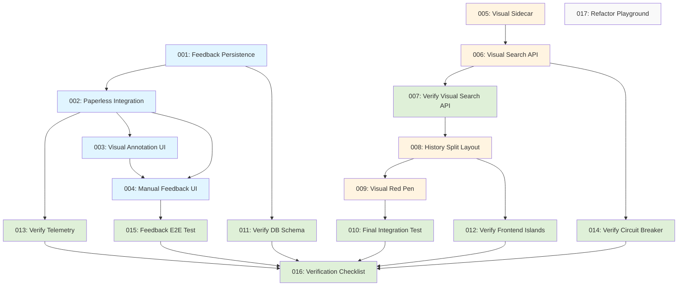

# Prompt Execution Order and Dependencies

## Overview
This document defines the authoritative execution order for implementation and verification prompts 001-017, including dependencies, parallel execution opportunities, and integration checkpoints.

## Dependency Graph

## Execution Phases

### Phase 1: Backend Foundation (Sequential)
**Prompts:** 001, 011, 002, 013
**Blocking:** Must complete before Phase 2

- **001: Implement Feedback Persistence** (Foundation)
- **011: Verification: Database Schema** (Verifies 001)
- **002: Enhance Paperless Integration** (Depends on 001)
- **013: Verification: Telemetry** (Verifies 002/System)

### Phase 2: Manual Route UI (Parallel Possible)
**Prompts:** 003, 004, 015
**Blocking:** Independent from History Route (Phase 3)

- **003: Implement Visual Annotation UI** (Depends on 002)
- **004: Implement Manual Feedback UI** (Depends on 003)
- **015: Integration Feedback E2E** (Verifies 004 + 001 flow)

### Phase 3: History Route Enhancement (Parallel with Phase 2)
**Prompts:** 005, 006, 007, 014, 008, 012, 009, 010

- **005: Upgrade Visual Sidecar** (Independent Python service)
- **006: Expose Visual Search API** (Depends on 005)
- **007: Verify Visual Search API** (Standalone verification for 006)
- **014: Verification: Circuit Breaker** (Verifies 006 resilience)
- **008: Implement History Split Layout** (Depends on 007)
- **012: Verification: Frontend Islands** (Verifies 008/Islands architecture)
- **009: Implement Visual Red Pen** (Depends on 008)
- **010: Final Integration Test** (Verifies History Route E2E)

### Phase 4: Final Verification & Cleanup
**Prompts:** 016, 017

- **016: Verification Checklist** (Consolidated gates for all previous steps)
- **017: Refactor Playground** (Cleanup task, can be done anytime, ideally after core features)

## Integration Checkpoints

### Checkpoint 1: Database & Telemetry
**After:** 001, 011, 002, 013
**Verify:** Schema correct, Telemetry propagating.

### Checkpoint 2: Manual Feedback Loop
**After:** 004, 015
**Verify:** Full E2E flow from Manual UI to DB to Paperless.

### Checkpoint 3: Visual Search Pipeline
**After:** 006, 007, 014
**Verify:** Sidecar integration, API contracts, Circuit Breaker.

### Checkpoint 4: History Route & Islands
**After:** 008, 009, 012, 010
**Verify:** Split layout, Islands architecture, Red Pen interaction.

## Rollback Procedures
See individual prompts for specific rollback steps. Generally:
- **DB:** Run rollback migrations.
- **Code:** Revert git commits.
- **Services:** Restart services.