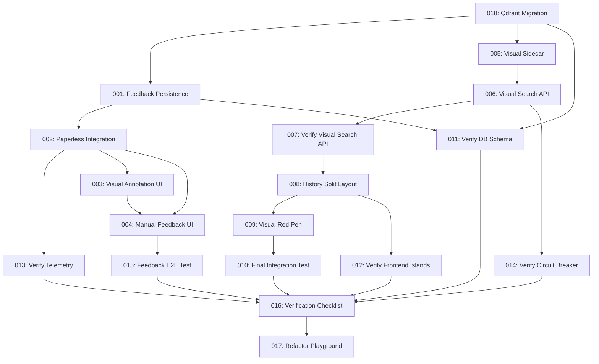

# Prompt Execution Order and Dependencies

## Overview
This document defines the authoritative execution order for implementation and verification prompts 001-018. Under the **Native Protocol Alpha-9**, Phase 5 (Qdrant Migration) is the mandatory root for all subsequent development.

**Policy:** All agents must read `docs/AGENT_READ_POLICY.md` before executing any prompt.

## Dependency Graph

## Execution Phases

### Phase 5: Qdrant Migration (BREAKING CHANGE)

**Prompt:** 018

* Establishes the **Hybrid SOT** architecture.
* Implements 320D/384D collections with **Distance Metric Locks** (Dot Product for MaxSim).

### Phase 1: Backend Foundation

**Prompts:** 001, 011, 002, 013

* Implements the RLHF feedback persistence and Paperless-ngx metadata sync.
* Verifies the **"Detoxed"** PostgreSQL schema (0 vector columns).

### Phase 2: Manual Route UI

**Prompts:** 003, 004, 015

* Implements Preact Islands for visual annotations and metadata editing.
* Validates the **Payload Mirroring** from UI to Qdrant.

### Phase 3: History Route Enhancement

**Prompts:** 005, 006, 007, 014, 008, 012, 009, 010

* Upgrades the Python Sidecar to **ColQwen3-4B-AWQ** for the RTX 3090 Ti.
* Implements the **503 Initializing** handshake and Red Pen visual search.

### Phase 4: Final Verification

**Prompts:** 016, 017

* Consolidated CI/CD gating and Playground refactor.