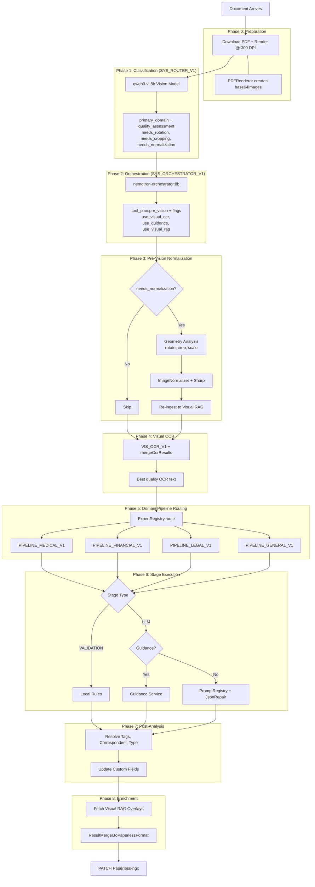
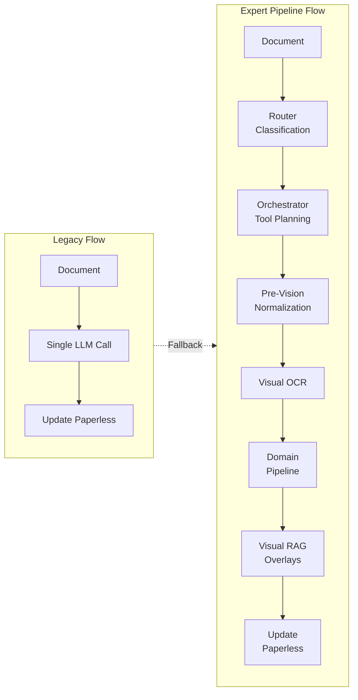
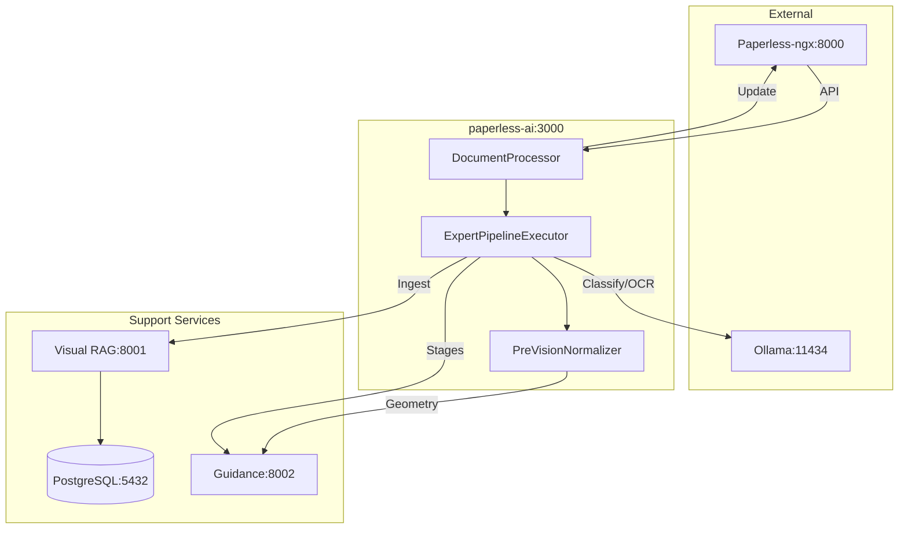

# Expert Pipeline Executor

A stage-by-stage pipeline execution engine that orchestrates documents through classification, analysis, and integration stages using multimodal language models (vision + language).

---

## 📋 Quick start

### Installation

```bash
npm install
npm run lint --fix # Fix any linting issues
```

### Basic usage

```js
const { processDocument } = require('./ExpertPipelineExecutor');
const ollamaService = require('../ollama/OllamaService');

const document = {
  id: 123,
  filename: 'invoice.pdf',
  ocr_text: 'Invoice details...',
  base64Images: ['base64_encoded_page1', 'base64_encoded_page2'],
  source: 'paperless-ngx'
};

const result = await processDocument(document, ollamaService, {
  enableVisualRag: true,
  guidanceEnabled: true,
  timeout: 60000
});

console.log(result.status); // 'success' | 'partial' | 'failed'
console.log(result.result.primary_output);
console.log(result.metadata.execution_time_ms);
```

### Create an executor instance

```js
const { ExpertPipelineExecutor } = require('./ExpertPipelineExecutor');

const executor = new ExpertPipelineExecutor(ollamaService, {
  defaultTimeout: 60000,
  maxRetries: 2,
  enableVisualRag: true,
  // prefer concrete embedding tags: nomic-embed-text-v1.5 or tomoro-colqwen3-embed-8b
  embeddingModel: 'nomic-embed-text-v1.5'
});

const result = await executor.execute('PIPELINE_FINANCIAL_V1', document, classificationResult);
```

---

## 📁 Directory structure

```
services/experts/
├── README.md
├── ExpertPipelineExecutor.js      # Main execution engine
├── ExpertRegistry.js              # Pipeline registry & routing
└── index.js                       # (removed) previously module exports — import specific modules directly
├── context/
│   ├── index.js
│   └── ExecutionContext.js        # Execution context management
├── evaluation/
│   ├── index.js
│   ├── ConditionEvaluator.js      # Condition evaluation engine
│   └── ValidationEngine.js        # Validation rules engine
├── normalization/
│   ├── README.md
│   ├── tools.js                   # Normalization tool wrapper
│   └── PreVisionNormalizer.js     # AI-driven normalization service
├── pipelines/
│   ├── index.js
│   ├── constants.js               # Pipeline constants
│   ├── models.js                  # Pipeline models
│   ├── GeneralPipeline.js
│   ├── MedicalPipeline.js
│   ├── FinancialPipeline.js
│   └── LegalPipeline.js
├── routing/
│   ├── index.js
│   └── SemanticRouter.js          # Semantic routing logic
├── translation/
│   ├── index.js
│   └── LocalTranslator.js         # Multi-language translation
└── utils/
    ├── index.js                   # Central export point
    ├── normalizers.js             # Data normalization utilities
    ├── toolingConfig.js           # Tool configuration resolver
    ├── toolingExecution.js        # Tool execution orchestration
    ├── toolingHelpers.js          # Tool helper functions
    ├── toolCalls.js               # Tool call parsing & validation
    ├── guidance.js                # Guidance template resolution
    ├── ocrQuality.js              # OCR quality scoring
    ├── ocrMetadata.js             # OCR metadata builders
    └── visualRagLoader.js         # Visual RAG lazy loader
```

---

> **Note:** The previous compatibility aggregator `index.js` has been removed to avoid hidden circular
> dependencies. Import modules directly, for example:
>
>- `const { expertRegistry } = require('./services/experts/ExpertRegistry');`
>- `const { ExpertPipelineExecutor } = require('./services/experts/ExpertPipelineExecutor');`


## 🏗️ Architecture

The pipeline follows a multi-stage flow: preparation → classification → orchestration → normalization → visual OCR → domain routing → stage execution → post-analysis → enrichment.

### High-Level Flow



### Legacy vs Expert Pipeline Comparison



### Service Coordination



### Detailed Documentation

For comprehensive flow documentation including:
- Pre-Vision Normalization Layer details
- Visual RAG Integration architecture
- Guidance vs Prompt execution paths
- Pipeline stage maps per domain

See: [`.prompts/EXPERT_PIPELINE_FLOW.md`](../../.prompts/EXPERT_PIPELINE_FLOW.md)

---

## Model configuration

Below are the commonly used model tags and the related environment variables used across the repo (defaults shown where applicable):

| Role | Env var(s) | Example tag(s) |
|------|------------|----------------|
| Router / Vision | `ROUTER_MODEL`, `OLLAMA_VISION_MODEL` | `qwen3-vl:8b` |
| Medical (radiology/vision) | `MEDICAL_RADIOLOGY_MODEL` | `llava-med-v1.6` |
| Medical (text analysis) | `MEDICAL_ANALYSIS_MODEL` | `medtext-llama3` |
| Guidance / General LLM | `GUIDANCE_MODEL`, `GENERAL_MODEL` | `sauerkraut-llama3.1:8b` |
| Orchestrator / Planner | `ORCHESTRATOR_MODEL` (optional) | `nemotron-orchestrator:8b` |
| Financial (vision) | `FINANCIAL_VISION_MODEL` | `llm-pro-finance-8b` |
| Financial (calculator) | `FINANCIAL_ANALYSIS_MODEL` | `fino1-8b` |
| Legal (vision) | `LEGAL_VISION_MODEL` | `qwen3-vl:8b` |
| Legal (analysis / expert) | `LEGAL_EXPERT_MODEL`, `LEGAL_ANALYSIS_MODEL` | `gpt-oss` (20B) or `sauerkraut-llama3.1:8b` |
| Visual RAG Sidecar | `VISUAL_RAG_MODEL` (visual-rag-sidecar) | `TomoroAI/tomoro-colqwen3-embed-8b` |
| Embeddings | `OLLAMA_EMBEDDING_MODEL`, `EMBEDDING_MODEL` | `nomic-embed-text-v1.5`, `tomoro-colqwen3-embed-8b` |

Example configuration object used by the executor:

```js
const MODELS = {
  router: 'qwen3-vl:8b',                // Router / vision LLM
  medical_imaging: 'llava-med-v1.6',    // Medical vision/radiology
  medical_text: 'medtext-llama3',       // Medical text extraction
  financial_vision: 'llm-pro-finance-8b',
  financial_analysis: 'fino1-8b',
  legal_vision: 'qwen3-vl:8b',
  legal_analysis: 'gpt-oss', // or 'sauerkraut-llama3.1:8b' (20B recommended for deep legal reasoning)
  general: 'sauerkraut-llama3.1:8b',    // Guidance / fallback
  orchestrator: 'nemotron-orchestrator:8b' // Orchestrator (optional)
};
```

Notes:
- The Visual-RAG sidecar runs a dedicated visual retrieval model (`TomoroAI/tomoro-colqwen3-embed-8b`) and is configured separately in `services/visual-rag-sidecar`. Legacy `vidore/colqwen2-v1.0` is deprecated.    
- Embedding models are pluggable; the codebase currently prefers `nomic-embed-text-v1.5` or `tomoro-colqwen3-embed-8b` where available.
- In many places defaults are read from environment variables (e.g., `process.env.ROUTER_MODEL`), check `docker-compose.env` and `test/setup-env.js` for repo defaults.

---

## 🛠️ Key components

### 1) ExpertPipelineExecutor (main class)

Core responsibilities:

- Orchestrate pipeline stages and error recovery
- Expose methods such as `execute`, `classifyDocument`, `getVisualOverlays`, `ingestDocument`, `visualSearch`, `getStats`, `resetStats`

### Pre-Vision Normalization (normalization/)

A dedicated pre-vision normalization module performs geometry analysis and image transformations before Visual OCR or Visual RAG ingestion. Key points:

- Implementation: `services/experts/normalization/PreVisionNormalizer.js` — analyzes the first page (default 150 DPI), calls the Guidance template `normalization_geometry` (or falls back to Ollama vision), validates geometry (rotation, crop_box, confidence), and constructs normalization actions (rotate/crop/scale).
- Template: `.prompts/templates/normalization_guidance.md` provides the Guidance instruction and strict JSON output format for `normalization_geometry`.
- Tooling: Normalization actions are executed via the `paperless.normalize_images` / `paperless.normalize_images_ai` tools and may trigger re-ingestion when changes are applied.
- Configuration: Controlled by `ORCHESTRATOR_PREVISION_NORMALIZATION_ENABLED` (see below).

**Telemetry & observability**: The normalization workflow emits structured telemetry and logs for observability. The `TelemetryCollector` exposes `setNormalization(metadata)` to attach normalization metadata (fields: `requested`, `executed`, `succeeded`, `changes_detected`, `reingested`, `actions_applied`, `warnings`) and getters `getNormalizationRate()` and `getChangeDetectionRate()` for quick rates. When normalization output is applied, `ExpertPipelineExecutor` emits a `normalization_metrics` event with metrics: `normalization_rate`, `change_detection_rate`, `actions_count`, `reingested`, and `confidence`.

### 2) Utility modules (`utils/`) 

Examples:

- `normalizers.js` — language/boolean normalization, document image resolution
- `toolingConfig.js` — resolve tool allowlists and orchestration config
- `ocrQuality.js` — OCR scoring and merging
- `guidance.js` — guidance template resolution
- `toolingExecution.js` — tool call execution and summaries
- `ocrMetadata.js` — build OCR metadata and custom fields

### 3) ExecutionContext (`context.js`)

Use to store and query stage outputs, timings, and recovery attempts.

```js
const { ExecutionContext } = require('./context');
const context = new ExecutionContext(document, classificationResult, options);
context.setStageOutput('financial_extraction', extractionResult, timingMs);
const output = context.getStageOutput('financial_extraction');
```

### 4) Stage execution modes

- `STANDARD` — run unconditionally
- `CONDITIONAL` — run when conditions match (e.g., confidence > 0.8)
- `PARALLEL` — run alongside siblings (future)
- `FALLBACK` — recovery-only stages

---

## 🔧 Configuration

### Environment variables (examples)

```
OLLAMA_HOST=http://localhost:11434
OLLAMA_MODEL=llama2
GUIDANCE_SERVICE_URL=http://localhost:8000
GUIDANCE_TAG_SCHEMA_VERSION=v2
VISUAL_RAG_SIDECAR_ENABLED=yes
VISUAL_RAG_DB_HOST=localhost
VISUAL_RAG_DB_PORT=5432
ORCHESTRATION_TOOLS_ENABLED=yes
ORCHESTRATION_PRE_VISION_TOOLS_ENABLED=yes
ORCHESTRATION_FAIL_ON_TOOL_ERROR=no
VISUAL_OCR_ENABLED=yes
VISUAL_OCR_MIN_QUALITY=0.6
VISUAL_OCR_MAX_PAGES=20
VISUAL_OCR_TIMEOUT=60000
```

### Configuration file (snippet)

```js
module.exports = {
  ollama: {
    apiUrl: process.env.OLLAMA_HOST || 'http://localhost:11434',
    model: process.env.OLLAMA_MODEL || 'llama2',
    limits: { text: { contextWindow: 4096, maxResponseTokens: 512 }, imageTokenOverhead: 1024 }
  },
  guidanceService: { enabled: true, tagSchemaVersion: 'v2' },
  visualRagSidecar: { enabled: 'yes', dbHost: 'localhost', dbPort: 5432 },
  orchestration: { toolsEnabled: true, preVisionToolsEnabled: true, toolAllowlist: ['paperless.normalize_images_ai', 'paperless.normalize_images', 'paperless.update_document', 'paperless.resolve_tags'] },
  visualOCR: { enabled: true, minQuality: 0.6, timeout: 60000 }
};
```

---

## 📊 Result structure

All pipeline executions return a standard result object. Example:

```json
{
  "success": true,
  "pipeline_id": "PIPELINE_FINANCIAL_V1",
  "pipeline_name": "Financial Extractor",
  "status": "success",
  "result": { "outputs": {}, "primary_output": {}, "classification": {} },
  "metadata": { "execution_time_ms": 3421, "stages_executed": ["classification","analysis","integration"], "confidence": 0.87 },
  "quality": { "error_count": 0, "warning_count": 0 }
}
```

---

## ✅ Tests & development

- Unit tests are in `__tests__/` and `utils/__tests__/`.
- Run the test suite and linters before submitting changes.

Recommended tests to add when touching normalization or guidance templates:

- **Normalization**: tests for `PreVisionNormalizer._parseGeometryAnalysis`, `_denormalizeCoordinates`, and `_buildNormalizationActions`; ensure `.prompts/templates/normalization_guidance.md` is loadable and parseable.
- **Guidance fallback verification**: add a unit or CI check that asserts `services/guidance/GuidanceClient.js` contains the expected fallback mappings (e.g., `normalization_geometry` -> `SYS_ROUTER_V1`). Consider `scripts/verify-guidance-fallbacks.js` for automated verification.
- **Telemetry**: add tests for `TelemetryCollector.setNormalization()` and the getters `getNormalizationRate()` / `getChangeDetectionRate()` to validate observed metrics and edge cases.


---

## Contributing

Please follow project guidelines (linting, tests, PR process). See the repo `CONTRIBUTING.md` for details.

Compatibility note

<!-- legacy shim removed; import directly from `services/experts/ExpertPipelineExecutor.js` -->

---

## License

This project is available under the terms of the repository license.

}


🧪 Testing

Run Tests

# All tests
npm test

# Watch mode
npm test:watch

# Specific test file
npm test ExpertPipelineExecutor.test.js

# With coverage
npm test -- --coverage


Mock Fixtures

Located in tests/fixtures/mock-documents.js:

createMockDocument: (overrides = {}) => ({
    id: 123,
    filename: 'document.pdf',
    ocr_text: 'Sample text content...',
    base64Images: ['iVBORw0KGgoAAAANS...'],
    source: 'paperless-ngx',
    language: 'de',
    ...overrides
})


🔍 Debugging

Enable Debug Logging

const logger = require('../logger');
logger.level = 'debug';

// Or via environment
process.env.LOG_LEVEL = 'debug';


Common Issues

Model Not Found (Model qwen3-vl:8b not found)

Solution: Ensure model is pulled in Ollama: ollama pull qwen3-vl:8b

Timeout Errors (LLM call timed out)

Solution: Increase timeout in execution options: { timeout: 120000 }

Context Window Exceeded

Solution: Check logs for prompt_truncated event. Input is automatically truncated if it exceeds limits.

Tool Execution Failed

Solution: Check toolAllowlist in configuration and verify Paperless API availability.

📈 Performance Optimization

Lazy Loading: Visual RAG components are only initialized when _initVisualRag() is called.

Caching: Resolved tag names are cached in context to prevent repeated lookups.

Parallel Processing: (Future) Support for parallel stage execution modes.

Token Budgeting: Automatic text truncation metrics are recorded when approaching limits.

📚 Additional Documentation

ARCHITECTURE.md - Detailed system design

PIPELINE_CONFIGURATION.md - How to define pipelines

API_REFERENCE.md - Complete API documentation

EXAMPLES.md - Usage examples and recipes

🤝 Contributing

Code Style:

npm run lint:check

npm run lint --fix

npm run format

Pull Request Process:

Create feature branch: git checkout -b feature/my-feature

Run tests: npm test

Commit & Push

Create PR and update documentation

📞 Support

For issues or questions:

Check TROUBLESHOOTING.md

Review test examples in __tests__/

Check debug logs with LOG_LEVEL=debug

Open issue with: Error message, Document type, Configuration used, Debug logs.

📄 License

Proprietary - Internal Use Only

🗺️ Roadmap

[ ] Parallel stage execution

[ ] Streaming response support

[ ] Multi-language pipeline variants

[ ] Dynamic pipeline generation

[ ] Advanced caching layer

[ ] Distributed execution

[ ] Real-time monitoring dashboard

Version History

v1.0.0 (Current): Initial modularized release, 9 utility modules, Full ESLint compliance, Comprehensive testing, Documentation complete.
