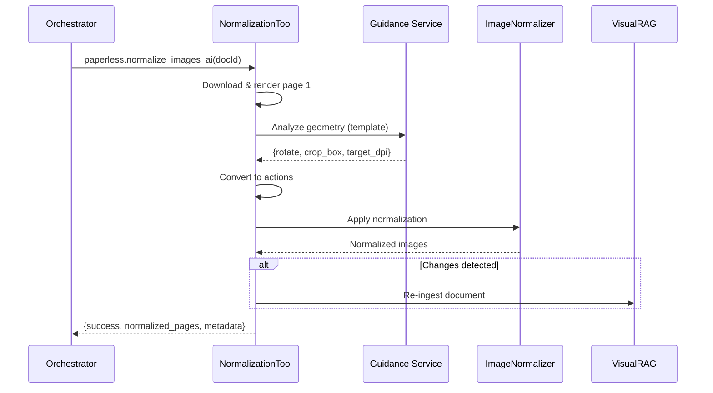

# Pre-Vision Normalization Module

AI-driven document normalization for the Expert Pipeline.

## Overview

This module provides intelligent document normalization before vision analysis:
- **Rotation Detection**: Automatically detects and corrects document orientation
- **Smart Cropping**: Identifies and crops small documents on large backgrounds
- **DPI Optimization**: Adjusts resolution for optimal OCR/vision quality

## Architecture



## Tool Definition

**Name**: `paperless.normalize_images_ai`

**Input**:
```json
{
  "document_id": 1234
}
```

**Output**:
```json
{
  "success": true,
  "document_id": 1234,
  "normalized_pages": [
    {
      "page": 1,
      "base64": "iVBORw0KG...",
      "width": 2480,
      "height": 3508
    }
  ],
  "metadata": {
    "actions_applied": [
      {"type": "rotate", "degrees": 90},
      {"type": "crop", "box": {...}}
    ],
    "changes_detected": true,
    "reingested": true,
    "warnings": []
  }
}
```

## Configuration

Set in `config/config.js`:

```javascript
{
  visualRag: {
    visionRenderDpi: 300,
    maxVisionPages: 4
  },
  ollama: {
    visionModel: 'qwen3-vl:8b'
  }
}
```

## Usage in Pipeline

The orchestrator can call this tool during PRE_VISION phase:

```javascript
{
  "tool": "paperless.normalize_images_ai",
  "parameters": {
    "document_id": 1234
  }
}
```

## Guidance Template

Located at `.prompts/templates/normalization_guidance.md`

Uses 0-1000 normalized coordinate system for crop boxes:
- (0, 0) = top-left
- (1000, 1000) = bottom-right

## Dependencies

- `file:services/visual-rag/PDFRenderer.js` - PDF rendering
- `file:services/visual-rag/ImageNormalizer.js` - Image transformations
- `file:services/guidance/GuidanceClient.js` - Structured LLM extraction
- `file:services/visual-rag/IngestionManager.js` - Visual RAG re-ingestion

## Error Handling

- Template not found → Skip normalization (no-op)
- Guidance service unavailable → Fallback to direct Ollama (future)
- Low confidence analysis (<0.5) → Skip normalization
- Re-ingestion failure → Log warning, continue
- Invalid crop box → Skip crop action, apply other actions
